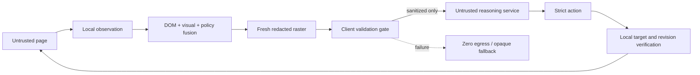
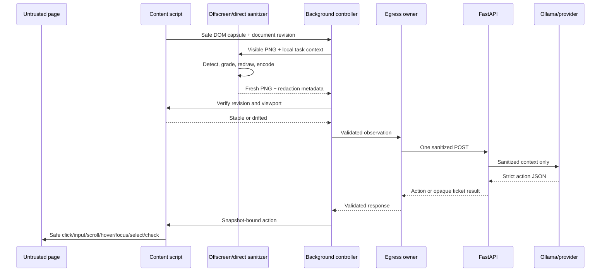
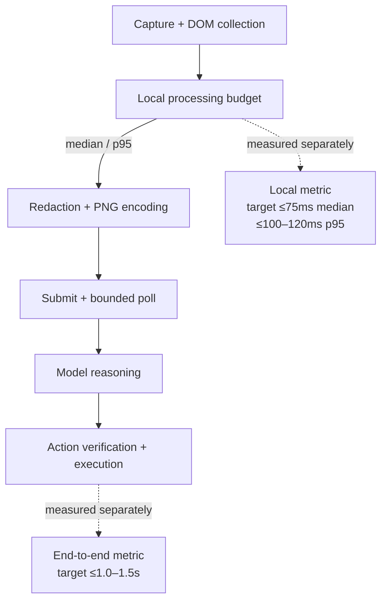
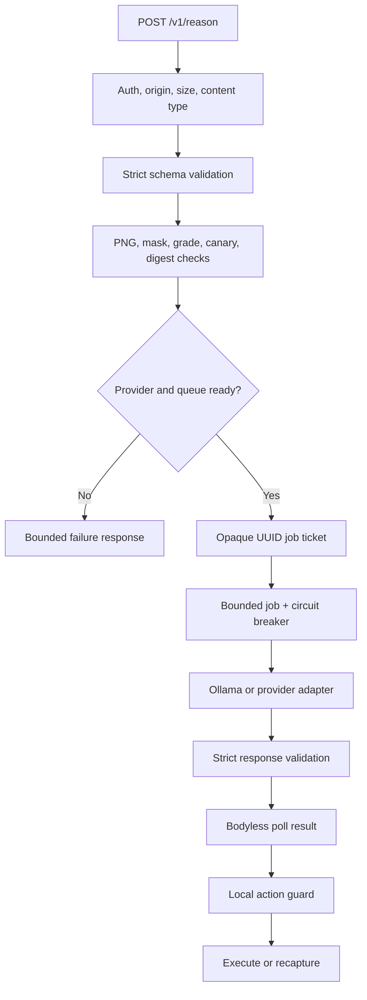
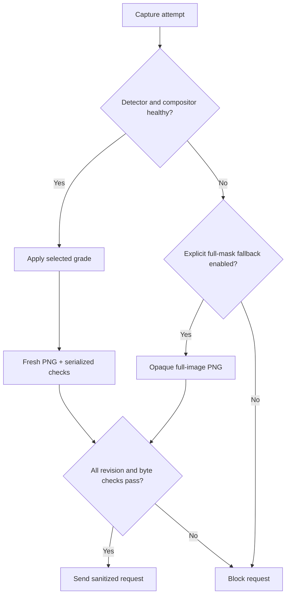

# Architecture and threat boundary

## Security objective

The reasoning service is outside the trusted client boundary. A compromise, logging mistake, or third-party model behind that service must expose at most the sanitized protocol object. Raw browser state must not be needed to plan or execute an action.

The browser and extension runtime are trusted for this prototype. A malicious website is treated as untrusted input: its text cannot alter the server system prompt or the local action policy. The operating system, browser itself, extension signing pipeline, and dependencies are outside the threat model and need separate supply-chain controls before deployment.

## Architecture at a glance

The critical architectural property is the direction of the arrows: the reasoning service is downstream of local classification and redaction, never upstream of them.

## Client pipeline

1. The panel reads active-tab metadata and validates the HTTP(S) origin. The Chrome manifest declares `<all_urls>` because Chrome's screenshot API explicitly requires `activeTab` or that grant; Firefox declares equivalent HTTP(S) host patterns. This enables local DOM/pixel capture only and does not send data. The panel separately requests optional access to the configured reasoning origin for agent runs.
2. The content script collects visible actionable elements, local bounding boxes, safe labels, form sensitivity signals, text findings, frames, and visually uninspectable regions. It creates random element IDs and retains the ID-to-node map locally.
3. A local policy engine applies the selected cumulative privacy grade. It classifies findings into always-protected, Grade 2, or Grade 3 categories; it never declassifies a high-impact finding. Grade 3 is the fail-safe default. The complete matrix is in [PRIVACY_LEVELS.md](PRIVACY_LEVELS.md).
4. The background captures the visible tab and checks that the active tab did not change.
5. The local visual detector is asset-gated: the unified YOLOv8n/v10n multi-class path runs with WebGPU first and WASM fallback when `yolo-privacy-v1.onnx` is packaged; otherwise the checked-in UltraFace adapter provides the fallback face path. The default repository build therefore does not claim document-ID model coverage.
6. Canvas-app elements (Google Docs, Figma) are handled by a 3-tier privacy strategy: standard visual redaction, opt-in DBNet detection-only blind text masking, or manual escalation. Canvas-rendered text is not visible to DOM-based detection.
7. DOM/text and vision-detector boxes are scaled into screenshot pixels. Every policy-approved rectangle is expanded to integer pixel coverage and replaced on a new canvas with a neutral card and an italic category-only marker such as `[REDACTED:EMAIL]`.
8. The canvas is freshly encoded as PNG, discarding source metadata. Labels, title, and task use the same grade-aware sanitizer. The real page origin becomes a keyed, session-scoped `.invalid` alias.
9. A second revision check verifies document ID, DOM generation, origin, viewport size, and scroll position. Any drift discards the observation.
10. The egress gateway enforces exact keys, types, ranges, the integer `privacy.grade`, unsafe-key exclusions, endpoint policy, payload size, and caller-supplied canaries over the final serialized bytes. It submits that body once with `Prefer: respond-async`; subsequent authenticated polls contain only the server-generated UUID job ID.
11. Short submit/poll requests avoid Chrome MV3's long-fetch service-worker limit. Each poll waits on the server for at most 10 seconds and returns immediately on completion, reducing wakeups without approaching the browser limit. A bounded extension-API heartbeat runs only while one reasoning operation is active, and the entire operation expires after 100 seconds.
12. The returned action must echo the current snapshot ID and match its exact action-specific schema. The content script verifies the live document again immediately before acting. The safe broker supports click, input, scroll, wait, done, hover, focus, doubleClick, explicit checkbox check/uncheck, and native select; it does not expose arbitrary JavaScript, selectors, URLs, keyboard injection, cookies, storage, downloads, or uploads.

### Client trust-boundary sequence

## Architecture decision: direct capture and sanitization with per-step snapshots

The extension captures one observation for each reasoning step, fuses DOM and local-vision findings, and builds a sanitized raster in a separate canvas buffer. It does not reconstruct a webpage or maintain a second DOM. The user can inspect that exact raster in the privacy preview; the reasoning service receives the same representation. The term "mirror" below means this sanitized image only.

See [the architecture review](ARCHITECTURE_REVIEW.md) for the comparison with continuous streams, verified external-consumer constraints, and the acceptance conditions for a future stream adapter.

| Approach | Privacy boundary | Browser/resource fit | Decision |
| --- | --- | --- | --- |
| Paint masks over the live webpage | An external screen sharer may see the masks, but overlays can change page behavior and cannot protect other windows or prove what another application captured | Cross-browser, but intrusive and difficult to make atomic with arbitrary screen capture | Do not use for the primary agent |
| Continuous sanitized `tabCapture` stream | Strong when a cooperating consumer explicitly selects the transformed stream | Chrome-specific extension API, persistent capture/GPU cost, and unnecessary frame processing for step-based actions | Keep as a future external-agent experiment |
| Per-step sanitized mirror plus safe DOM capsule | The only reasoning request is created after local fusion, redaction, fresh encoding, and validation | Chrome and Firefox compatible; work occurs only when the agent needs a new observation | **Primary architecture** |

`captureVisibleTab` is rate-limited to one reservation every 550 ms, below Chrome's two-calls-per-second ceiling. Captures are demand-driven rather than a polling video loop. A complete run remains pinned to the original tab, window, origin, and update/activation generations, including while the server is reasoning.

Chrome's offscreen document is used only for local screenshot decoding, ONNX inference, redaction, and fresh PNG encoding. The service worker owns the audited reasoning egress because extension service workers can use the granted reasoning-server origin consistently across Chrome and Firefox. The server converts slow Ollama work into a bounded asynchronous job, so no individual extension fetch waits for model inference.

An external product such as Copilot Vision cannot be silently redirected to this mirror through a browser-extension API. Supporting that use case requires an explicit sanitized surface or virtual-camera/display integration and is a separate product boundary, not part of the SIH prototype claim.

## Agent workflow orchestration

The live controller uses a LangGraph.js `StateGraph` with explicit `observe → reason → verify → dispatch → settle` nodes. Only counters and route decisions are graph state; the sanitized observation, private capture, model response, and opaque DOM map stay in local callback closures. Scroll drift routes back to a bounded fresh observation, deadline and cancellation guards surround every callback, and an ambiguous browser side effect is never automatically replayed. The graph intentionally runs without a checkpointer in this release; durable resume is a future deployment gate.

## Approach B architectural additions

The following controls were added during the Approach A → B migration to resolve measured bottlenecks:

### Unified vision detector

Approach A used separate inference paths (UltraFace + separate document detectors). Approach B introduces a unified YOLOv8n/v10n multi-class detector interface that runs face, aadhaar_card, pan_card, voter_id, driving_license, passport, and signature detection in a single forward pass. The implementation is present and selected automatically when its ONNX asset is packaged; the checked-in default build uses the UltraFace adapter until that asset is supplied.

### Step 0 Abort Gate (scroll-drift guard)

Approach A had no protection against viewport changes between VLM target resolution and click dispatch. If a user scrolled during the reasoning network call, the returned action targeted DOM elements at their old viewport positions, potentially clicking the wrong element. The Step 0 Abort Gate is a passive debounced scroll listener (300-350ms) that invalidates the SoM registry and forces a re-capture when viewport drift is detected.

### Canvas-app privacy mitigation

Approach A classified canvas-rendered content as uninspectable and covered it entirely. Approach B adds a 3-tier strategy: (1) standard visual-object redaction, (2) opt-in DBNet detection-only blind text masking that covers detected text regions without performing OCR, (3) user-initiated manual escalation. This closes the largest privacy gap for canvas-heavy applications.

### Dual-metric latency budget

Approach A reported a single flat `<75ms` ceiling. Approach B decouples local processing latency (median ≤75ms, p95 ≤100-120ms) from end-to-end agent step latency (≤1.0-1.5s including model inference), making performance claims defensible under technical evaluation.

## Server pipeline

1. ASGI boundary middleware limits the body before JSON parsing and enforces content type, configured API-key authentication, and the browser Origin policy.
2. Pydantic models reject unknown properties and invalid values.
3. Image validation performs strict base64 decoding, PNG chunk inspection, decompression/dimension limits, metadata/animation rejection, and Pillow verification.
4. The server decodes the new PNG and verifies every declared semantic redaction rectangle contains the compositor's neutral placeholder background. A declared full-mask fallback must cover an entirely black image.
5. A grade-aware defense-in-depth text scan rejects high-confidence classes that the selected grade requires to be absent. It never uses a lower grade to permit credentials, government/financial identifiers, faces, or uninspectable content.
6. A request with `Prefer: respond-async` receives a random UUID ticket after validation and readiness checks. A bounded single-process job store permits at most 16 retained jobs, runs at most two model calls concurrently, expires entries after five minutes, and cancels pending work during shutdown.
7. Ollama receives only the validated protocol context and sanitized image. Its client is pinned to the configured endpoint, disables environment proxies, and does not follow redirects.
8. Structured model output is parsed through the same strict response schema and checked against the supplied elements before return. A narrow semantic grounding guard may redirect a high-confidence terminal form action to an enabled required consent checkbox or unique submit-like control; it uses only sanitized metadata and preserves ambiguity or fill-oriented tasks.
9. Poll endpoints enforce the same API-key and Origin boundary as submission. Pending responses contain only schema version, snapshot ID, random job ID, and status; completed responses contain the ordinary strict action. Dynamic job IDs are normalized out of access logs.

### Server admission and action flow

## Data inventory

| Data | Client memory | Reasoning request | Logs |
| --- | ---: | ---: | ---: |
| Original screenshot | transient | no | no |
| Fresh masked PNG | yes | yes | no |
| Real URL/hostname | yes | no | no |
| Session site alias | yes | yes | no content logging |
| DOM/HTML/attributes | yes | no | no |
| Form values/passwords | page only | no | no |
| Sanitized labels and roles | yes | yes | no content logging |
| Opaque element IDs/bounds | yes | yes | no content logging |
| ID-to-DOM mapping | yes | no | no |
| API key | popup/background memory and local runtime file | request header | no |
| Redaction kind/bounds | yes | yes | no content logging |

## Fail-closed decisions

No request is emitted following capture failure, page drift, missing DOM data, unapproved endpoint, ONNX failure without explicit full-mask mode, invalid detection output, mask/encoding failure, schema failure, unsafe-key detection, or canary detection. The system does not retry with a less-sanitized payload.

Visible pixels that v1 cannot inspect reliably are fully covered at every grade. This includes frames, canvas, video, SVG, images, object/embed content, CSS backgrounds, pseudo-element generated content, and custom or shadow-root hosts. This is deliberately conservative and is exposed in redaction metadata for measurement.

## Extension versus a custom browser

The problem statement asks for client-side extension/JavaScript in Chrome and Firefox. A browser fork would add a large Chromium maintenance and distribution burden without improving the evaluated privacy boundary for the prototype. The extension is therefore the main product. The guarded `browser-use` integration remains available as an experimental Python comparison path, while BrowserOS remains a design reference.

## Validation status

The current evidence is summarized in [VALIDATION_REPORT.md](VALIDATION_REPORT.md). The current source suites pass 92 extension tests, 157 server tests and 32 evaluation tests. The deterministic isolated Chrome flow completed three sanitized requests through the WASM path and finished the synthetic enrollment task. A fresh authenticated local Ollama smoke test returned a valid structured action. The recorded full browser task completed three reasoning requests and submitted the synthetic enrollment after the grounding guard. Grade-specific disclosure behavior is covered by monotonic policy, server and receiver tests.

## Appendix A: MV3 vs. Native Daemon Tradeoff Analysis

The browser extension (Chrome MV3) form factor is deliberately chosen over a native OS daemon. While a native daemon has deeper system access, an MV3 extension provides superior isolation for this specific threat model:
1. **Sandboxing**: The extension runs within the browser's sandbox, inheriting its memory protections and IPC restrictions.
2. **Context**: DOM access is reliable via content scripts, avoiding brittle accessibility-tree scraping across OS boundaries.
3. **Distribution**: Extensions avoid OS-level installer friction and do not require elevated privileges (Admin/root), drastically reducing the risk of systemic compromise.

## Appendix B: CNN vs. ViT Mathematical Justification

The decision to retain a CNN (YOLOv8n/v10n) for per-frame dense prediction (bounding boxes) over a Vision Transformer (ViT) is driven by the strict local processing budget on integrated GPUs (iGPUs). 

Vision Transformers scale quadratically with sequence length (image resolution). For a $640 \times 640$ input, the number of patches $N$ is large, making self-attention $O(N^2 \cdot d)$ prohibitively slow on shared-memory iGPUs. CNNs scale linearly $O(H \cdot W \cdot C)$ with resolution. On consumer hardware (e.g., Intel Iris Xe, AMD 600M), the buffer-mapping stall from a ViT's memory-bandwidth demands easily violates the $\le 100-120\text{ms}$ p95 local processing budget. Therefore, a small ViT is reserved exclusively for the rare scene-gating task, while the unified YOLO CNN handles the per-frame PII redaction pipeline.

