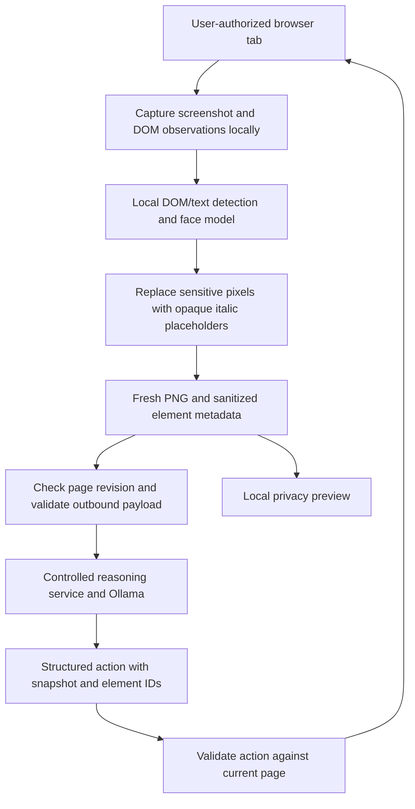

# Architecture review: sanitized frames versus external screen sharing

Reviewed on 15 September 2026 against the supplied proposal and the current extension source.

## Decision

Keep the extension, local privacy engine, and controlled reasoning service as the SIH implementation. Adopt direct capture-and-sanitize terminology. The current implementation already processes captured pixels; it does not reconstruct a second webpage. A sanitized canvas is an output image buffer, not a duplicate DOM.

Do not replace the action loop with a continuous stream to Copilot. That would introduce a separate consumer-integration problem without improving detection recall or completing the required browser action loop. No runtime pivot is needed for the direct-frame design.

The server connection crosses the client trust boundary only after sanitization. Local inference and compositing are separate from transmission. The same sanitized PNG is used for the preview and reasoning request. This is the useful property of the proposal, already present in the code.

## Comparison

| Option | Main benefit | Limitation | Decision |
| --- | --- | --- | --- |
| Reconstructed sanitized webpage | Could expose an alternate interactive page | Maintaining DOM behavior and layout creates another synchronization problem | Unnecessary for this prototype |
| Sanitized frames plus structured elements | Controlled input to the model, precise local action targets, work only when a new observation is needed | Detection coverage and capture consistency still require evaluation | Primary implementation |
| Continuous sanitized stream to our own consumer | Useful for tasks that actually need motion | More frame processing; stale detections can expose newly appearing PII | Future measured experiment |
| Sanitized stream to an external assistant | Potentially reusable beyond our agent | Consumer must accept the stream or the user must explicitly share a supported sanitized surface; action integration is separate | Do not promise universal protection |

## Corrections to the proposal

1. `tabCapture` provides authorized access to a tab stream. It does not redirect another application's capture. Chrome documents both the user-gesture requirement and restrictions on stream consumers. This is also not a drop-in replacement for the existing two-browser capture path. [Chrome tabCapture documentation](https://developer.chrome.com/docs/extensions/reference/api/tabCapture)
2. `HTMLCanvasElement.captureStream()` returns a JavaScript `MediaStream`. It does not register an OS virtual camera or add an arbitrary stream to another application's display picker. A cooperating consumer can explicitly use that track. [Canvas capture documentation](https://developer.mozilla.org/en-US/docs/Web/API/HTMLCanvasElement/captureStream)
3. Display capture asks the user to choose a display surface. A dedicated window showing only sanitized canvas output is a possible integration experiment, subject to the target application's available sources. It still needs an explicitly selected surface, but does not need to recreate the original DOM. This is an architectural inference from the API, not a verified Copilot integration. [Display capture documentation](https://developer.mozilla.org/en-US/docs/Web/API/MediaDevices/getDisplayMedia)
4. The particular Microsoft Vision documentation cited in the proposal describes screen understanding and states that it cannot directly manipulate screen items. It therefore cannot replace our executor without a separate action integration. It can also use Microsoft 365 work data: filtering one visual input would not sanitize that independent data source. [Microsoft Vision capabilities](https://support.microsoft.com/en-us/microsoft-365-copilot/how-vision-microsoft-365-works)
5. A fast GPU masking operation does not establish a safe video frame rate. Detection must cover the frame being released. Reusing yesterday's bounding boxes on today's pixels can expose content even when the renderer is fast. Measure the complete detection-and-release path before making frame-rate claims.

## What is implemented

| Responsibility | Source |
| --- | --- |
| Capture orchestration, pinned tab, revision checks, observation construction | `extension/src/background.ts` |
| DOM fields, text findings, conservative coverage of uninspectable regions | `extension/src/content.ts`, `extension/src/privacy.ts` |
| Local face inference | `extension/src/face-detector.ts` |
| Opaque pixel replacement, italic markers, fresh PNG encoding | `extension/src/image-redactor.ts` |
| Chrome offscreen processing and Firefox document-backed processing | `extension/src/sanitizer-offscreen.ts`, `extension/src/sanitizer-direct.ts` |
| Validated reasoning submission and opaque job polling | `extension/src/egress.ts` |

The compositor uses a canvas 2D context. The model attempts WebGPU and has a WASM fallback. Do not describe the compositor as a custom WebGPU shader pipeline: that is not what is implemented.

Generic visual markers such as `[REDACTED:PII]` are intentional. Public field labels provide additional meaning. Italics help people inspect the image; explicit redaction metadata and the server's protocol establish that content was altered. Do not invent replacement names or email addresses that the model could mistake for real values.

## Improvements with the highest value for SIH

These are follow-up engineering priorities, not claims of features delivered by this review.

1. **Detection coverage:** evaluate names in free text, multilingual PII, and sensitive text inside images. The current face model and DOM rules are not a general OCR/NER system. Benchmark a local OCR/text detector before replacing conservative media masks with narrower ones.
2. **Frame consistency:** test CSS-only movement, animations, zoom, scrolling, and rapid content changes. DOM revision checks and scale validation do not by themselves prove that every composited pixel corresponds to the DOM measurements. Keep uncertain areas covered or reject the capture.
3. **Semantic utility:** retain safe field roles, labels, checked/disabled states, bounds, and opaque element IDs. Measure task completion with these metadata and placeholders against opaque masks. Add finer PII categories only when reliably detected and appropriate to disclose.
4. **Evidence:** collect PII recall/precision, sensitive-pixel coverage, excess masked area, task success, peak client memory, and p50/p95 capture-to-action latency. Report hardware and actual WebGPU/WASM backend. Stream frame rate is not a substitute for the supplied SIH metrics.

## Conditions for a later stream adapter

The privacy engine can eventually support a second output consumer without changing the primary server protocol. A stream adapter must consume only fully sanitized output; it must not receive raw frames as a fallback.

- Capture and inference operate on private buffers. An exported canvas must never temporarily contain original pixels, even between drawing the source image and drawing its masks.
- Each released output has matching frame identity, geometry, and completed detection. On overload, drop incoming frames rather than pair them with stale boxes.
- Publish only after sanitization finishes. `captureStream(0)` and manual `requestFrame()` may help control emission where supported, but do not replace private-buffer isolation or validation.
- On initialization, failure, resize, source switch, or stop, publish a fully opaque unavailable frame or end the stream. A retained previous sanitized frame is visually safe only to the extent it was originally sanitized; it is stale and must never authorize a new UI action.
- Disable audio unless a separate audio privacy pipeline is provided.
- Test the exact consumer and explicitly selected source. A successful local canvas-stream demo is not evidence of Copilot compatibility, desktop-wide protection, or protected DOM access in another agent.

Do not add this adapter to the SIH critical path until it has a concrete consumer and an observed task benefit.

## Limits of the privacy claim

The gateway restricts this agent's reasoning payload. It does not intercept ordinary website traffic, another extension's DOM access, another application's direct screen capture, or unrelated data sources available to an external assistant.

The absence of canaries in a request and the presence of expected placeholder colors are useful regression checks. They do not prove that every sensitive region was detected or that the surrounding context is unidentifiable. Privacy claims must remain tied to measured detection coverage and the stated trust boundary.
