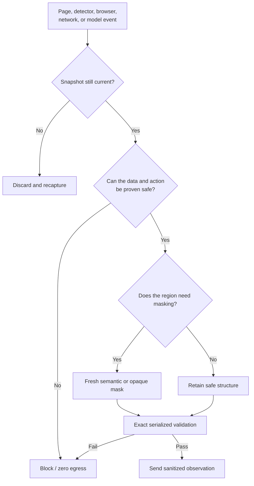

# Edge-case and failure matrix

Protocol and policy version: **1.0**. Changes require the migration and release
checks in `governance/PROTOCOL_MIGRATIONS.md`.

This matrix defines the behavior of the privacy firewall at the boundaries that
matter for the SIH26171 prototype. “Handled” means the implementation either
sanitizes the case or blocks the request. It does not mean universal PII
detection.

## Universal failure decision

Every row in the matrix should terminate in one of four observable outcomes:
recapture, local redaction, zero egress, or a validated sanitized request.

| Edge case | Required behavior | Current implementation / test location |
| --- | --- | --- |
| Password, OTP, payment, email, phone, address, or identity fields | Mask locally; never serialize the value | DOM sensitivity rules and local text rules in `extension/src/content.ts` and `extension/src/privacy.ts`; egress tests |
| PII in a page title, label, task, attribute, URL, or known canary | Replace with typed placeholder or block the final body | `sanitizeText`, keyed origin alias, `assertNoCanaries`, server defense-in-depth scan |
| Face in an inspectable screenshot | Detect locally and redact before encoding | Bundled UltraFace ONNX in `extension/src/face-detector.ts`; WebGPU/WASM tests |
| Face detector missing, model corrupt, adapter unavailable, or inference error | Send no request unless the user explicitly enables full-image fallback | `image-redactor.ts`, `sanitizer-direct.ts`, `sanitizer-offscreen.ts`; unavailable-detector schema invariant |
| Canvas, video, SVG, image, CSS background, pseudo-element, custom element, or inaccessible frame | Mask the uninspectable region conservatively | `collectMediaRedactions`, `collectFrameRedactions`, and full-mask fallback |
| Closed shadow DOM or pixels rendered by a plugin | Treat as uninspectable; do not guess | Documented limitation; no raw visual fallback |
| Fractional device scale, zoom, clipped element, or detector box at an image edge | Clamp and integer-expand the local mask; reject out-of-image declarations | `scaleBounds`, `integerMaskBounds`, `expandedSemanticMaskBounds`; extension/server bounds tests |
| Semantic placeholder raster has rounding or antialiasing at its border | Ensure the declared region has been replaced before the request | Fresh PNG composition plus receiver-side semantic-region verification |
| Original PNG contains EXIF, text chunks, ICC data, animation, or malformed bytes | Re-encode locally; server rejects metadata-bearing or invalid PNGs | Fresh `OffscreenCanvas` PNG and `server/app/validation.py` |
| Oversized screenshot, too many elements, or too many redactions | Block before model invocation | Client and server size/count limits |
| DOM changes, navigation, tab switch, origin change, resize, or scroll during capture or server reasoning | Discard the snapshot; never send or execute against a changed context | Document revision, pinned tab/window/origin, update generation, activation generation, viewport, and scroll checks in `background.ts`, `context-guard.ts`, and `content.ts` |
| Agent steps or preview requests arrive faster than the browser screenshot quota | Queue capture slots locally; never retry by using an older or unsanitized frame | `CaptureRateGate` enforces a 550 ms minimum start interval before `captureVisibleTab` |
| Model returns an unknown ID, stale snapshot, disabled target, invalid action shape, or PII in input text | Reject the response; never execute it | `validation.ts`, `egress.ts`, and `server/app/validation.py` |
| Model repeats a checked consent click or chooses an unrelated control in a high-confidence submit task | Use the sanitized structural guard or stop safely | `server/app/action_guard.py` and `server/tests/test_action_guard.py` |
| Multiple possible submit controls or a fill-oriented task | Preserve model choice; do not invent a target | Ambiguity and fill-task guard tests |
| Popup closes, Ollama has a cold start, or MV3 pressures the service worker during inference | Keep Chrome raster inference in the offscreen document; use short asynchronous submit/poll requests plus a bounded extension-API heartbeat | `sanitizer-offscreen.ts`, `egress.ts`, `background.ts`, and async transport tests |
| Endpoint is non-HTTPS, redirects, has credentials/query strings, or is not explicitly granted | Reject the endpoint; no request | `validateReasoningEndpoint`, permission request, and server CORS/auth boundary |
| Server or Ollama unavailable, times out, or returns malformed JSON | Fail closed; never retry with raw or less-sanitized data | `OllamaReasoner`, `sendSanitizedObservation`, and transport tests |
| Poll ticket is malformed, belongs to another snapshot/job, expires, or disappears after server restart | Reject it and stop safely; never accept or execute a cross-job result | Strict client ticket parsing and `ReasoningJobStore` tests |
| Too many reasoning jobs arrive together | Bound retained work and model concurrency; reject excess submissions before model execution | Server queue-limit test; defaults are 16 retained and two concurrent jobs |
| Access logging receives a dynamic job URL | Record only `/v1/reason/{jobId}` so the random capability-like identifier is not persisted | `SafeAccessLogMiddleware` and log-redaction test |
| Malicious page text attempts prompt injection | Treat page text as untrusted data; server system rules remain authoritative | Strict model prompt, unknown-field rejection, action allowlist, and injection tests |
| Website itself submits data or makes third-party requests | Keep this outside the reasoning-channel claim | Explicitly documented in `README.md` and `ARCHITECTURE.md` |

## Gaps before real-data deployment

The prototype still needs a larger multilingual, held-out corpus; local OCR for
visual text; measurements on real Chrome and Firefox hardware; independent
extension and dependency review; signed release artifacts; and confirmation that
browser policy, OS telemetry, other extensions, and page traffic are within the
deployment threat model. These are follow-up controls, not reasons to bypass the
local gate.

## Acceptance rule

Every new capture source or action type must add one positive test, one malformed
input test, one page-drift test, and one serialized-body leak assertion before it
can be enabled by default.
