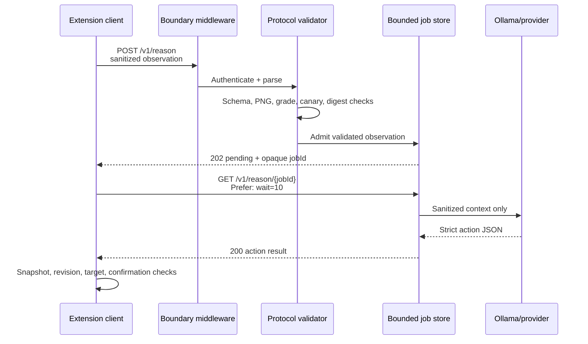
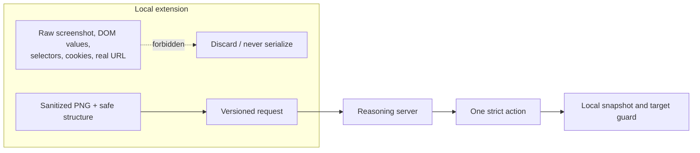
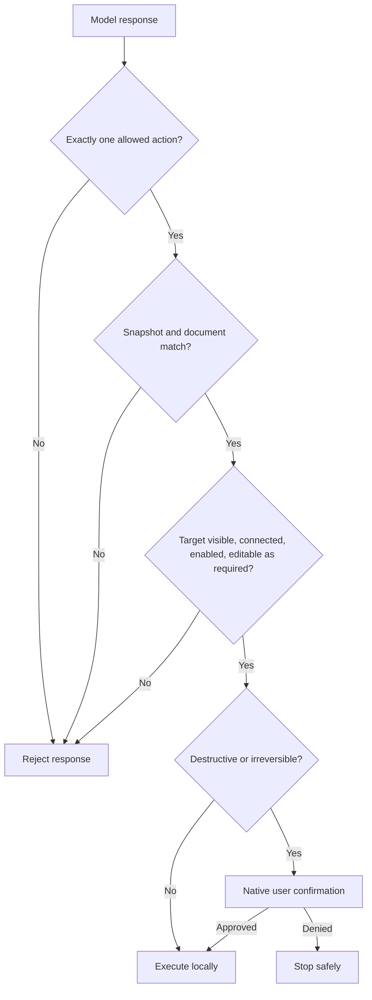
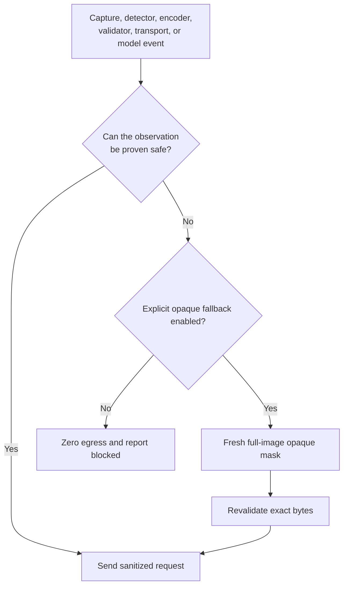

# Privacy reasoning protocol v1.0

The extension is the trusted privacy boundary. The server is treated as an untrusted recipient that is allowed to see only the schema below.

## Protocol lifecycle



Only the first request carries an observation body. Polling is a capability lookup by opaque UUID; it is not another channel for page data.

## Request

`POST /v1/reason` with `Content-Type: application/json` and an `X-Privacy-Agent-Key` header whenever server authentication is configured.

The extension also sends `Prefer: respond-async`. After the complete observation is validated, the server normally returns `202` immediately:

```json
{
  "schemaVersion": "1.0",
  "snapshotId": "123e4567-e89b-42d3-a456-426614174000",
  "jobId": "f9a15cf1-6946-4128-a096-5ac4ba20f052",
  "status": "pending"
}
```

The extension polls `GET /v1/reason/{jobId}` with the same authentication and `Prefer: wait=10`. The server holds that read for at most 10 seconds and returns sooner when the job changes, keeping every MV3 fetch bounded while avoiding one request per second during model inference. A pending poll returns the same exact four-field object with `202`; completion returns the ordinary action response below with `200`. Only the initial POST contains the sanitized observation. Polls contain no screenshot, DOM capsule, task, labels, or body. Job IDs are random UUIDv4 values, are bound to the original snapshot, expire after five minutes by default, and are omitted from access logs. A server may return the completed action directly with `200` for synchronous compatibility.

```json
{
  "schemaVersion": "1.0",
  "snapshotId": "123e4567-e89b-42d3-a456-426614174000",
  "documentId": "a7b2c3d4-e5f6-47a8-9123-456789abcdef",
  "page": { "origin": "https://site-a1b2c3d4e5f60718293a.invalid", "title": "Sanitized title" },
  "task": "Sanitized user goal",
  "elements": [
    {
      "id": "e_8Kf3rT1nV6pQ2xZ9",
      "role": "button",
      "label": "Submit",
      "bounds": { "x": 10, "y": 20, "width": 100, "height": 32 },
      "state": {
        "disabled": false,
        "checked": false,
        "editable": false,
        "required": false
      }
    }
  ],
  "image": {
    "mime": "image/png",
    "dataBase64": "freshly-encoded-masked-pixels",
    "width": 1280,
    "height": 720
  },
  "redactions": [
    {
      "kind": "pii-text",
      "source": "regex",
      "bounds": { "x": 20, "y": 80, "width": 220, "height": 20 }
    }
  ],
  "privacy": {
    "detectorBackend": "webgpu",
    "visualFallback": "none",
    "rawImageRetained": false,
    "redactionMode": "semantic",
    "grade": 3
  }
}
```

No other properties are permitted. `state.required` is structural form metadata only; it never carries a field value. `redaction.source` is one of `dom`, `regex`, `onnx`, `unified-detector`, `dbnet`, `ocr`, or `fallback`; `ocr` means a local credential-only document OCR pass emitted category and bounds without sending OCR text. `redactionMode: "semantic"` means each sensitive rectangle is replaced locally with a neutral background and an italic category-only marker such as `[REDACTED:EMAIL]`; `redactionMode: "opaque"` is reserved for the explicit full-mask fallback. Older clients may omit `redactionMode` and the server treats it as `opaque`. Older clients may omit `grade` and the server treats it as the fail-safe Grade 3. Older clients may omit `state.required` and the server treats it as `false`. Clients may send `privacy.registryDigest` as `sha256:` plus 64 lowercase hex characters; when present the server requires an exact match with the compiled detector-registry digest, and when absent the server keeps the existing invariant-floor scan. `page.origin` is a keyed, session-scoped alias with the exact shape `https://site-<20 lowercase hex>.invalid`; it does not reveal the visited hostname and deliberately contains no path, query, fragment, credentials, or full URL. Values, HTML, selectors, DOM attributes, cookies, local file paths, original image bytes, OCR text, and secret maps are forbidden. The HTTP `Origin` header used for server CORS is separate from this aliased observation field.

When the user enables high-assurance structure-only mode, the same schema is
used with an all-black freshly encoded PNG, `visualFallback: "full-mask"`,
`redactionMode: "opaque"`, and `detectorBackend: "missing"`. The accompanying
DOM capsule is still grade-sanitized. This mode deliberately avoids local
visual interpretation for that capture so the remote model receives
structure only.

The extension maintains a local outbound privacy receipt for every preview or
accepted request. The receipt is UI-only and is never added to this protocol.
It contains aggregate category counts, mask area, detector/mode, a hash of the
sanitized PNG, a request count, and sent/not-sent state; it never contains raw
labels, OCR tokens, field values, or original pixels.

### What crosses the boundary



The diagram is a data-flow constraint, not just a component diagram: the forbidden raw branch ends before request construction.

## User-selected privacy grade

`privacy.grade` is a cumulative local disclosure policy. It controls which otherwise-useful context the local classifier may retain in the sanitized DOM capsule and raster. The classifier applies the selected grade before encoding or network transport; the server receives the grade only to interpret the remaining context and to apply a defense-in-depth text check. A grade never authorizes the client or server to reconstruct a placeholder, read a hidden value, or send a private form value to the reasoning model. The value is an integer `1`, `2`, or `3`; an omitted value is interpreted as `3`, while any other type or value is rejected.

| Grade | User-facing meaning | Redact locally | Context that may remain visible |
| --- | --- | --- | --- |
| **1 — Essential** | Keep ordinary profile context usable while protecting high-impact secrets | Passwords, passphrases, PINs, OTPs, recovery/security answers, API/access/session tokens, private keys, government IDs (Aadhaar, PAN, passport and future ID detectors), payment cards and detected bank/payment credentials, faces/biometrics, known test canaries, and every uninspectable frame/media/fallback region | Names, usernames, email, phone, address, date of birth, IP/device context, professional context, and ordinary populated controls when the local classifier can identify them as non-essential |
| **2 — Balanced** | Hide direct contact and location identifiers as well as Grade 1 data | Everything in Grade 1, plus email addresses, phone numbers, postal/home addresses, dates of birth, IP/device identifiers, and detected account/customer identifiers | Names, usernames, professional context, and ordinary non-sensitive controls |
| **3 — Strict (default)** | Minimize personal context aggressively | Everything in Grades 1 and 2, plus names, usernames, employee/staff identifiers, and ambiguous or unknown populated editable/contenteditable fields | Only task-relevant public labels and structural UI state; values are retained only when the local policy classifier has a high-confidence non-sensitive classification |

The invariant floor applies at every grade: credentials and secrets, government/financial identifiers, face/biometric regions, known canaries, and uninspectable visual content are always redacted. Grade 1 intentionally permits names and contact context because some workflows require the reasoning model to distinguish a person or reachability field; this is an explicit user choice, not a server-side exception. A detector failure never downgrades the grade: the extension uses the full-image opaque fallback or sends no request.

The current prototype has high-confidence pattern coverage for email, Indian phone, PAN, Aadhaar, cards, SSNs, IFSC, labeled passports, labeled bank-account numbers, OTPs, common token prefixes, IP addresses, labeled dates of birth, labeled addresses, customer/account IDs, and labeled names. Face detection and inaccessible-region handling are local visual invariants. This list is a policy contract and an evaluation target, not a claim of universal PII recognition; adding a new detector must preserve the invariant floor.

Medical/health records, arbitrary free-form biometric descriptions, and every possible bank/UPI/official-ID format
are not reliably recognized by this prototype's current rule set. A workflow that may contain them should run Grade 3,
add the exact values as local known-private values, or add and evaluate a dedicated detector before using a lower grade.

## Response

```json
{
  "schemaVersion": "1.0",
  "snapshotId": "123e4567-e89b-42d3-a456-426614174000",
  "action": {
    "type": "click",
    "elementId": "e_8Kf3rT1nV6pQ2xZ9"
  }
}
```

Exactly one action is returned. Allowed actions and their complete field sets are:

- `click`: `type`, `elementId`
- `input`: `type`, `elementId`, `text` (public text only)
- `scroll`: `type`, `direction`, `amount`, with optional `elementId` for a scroll region
- `wait`: `type`, `milliseconds`
- `done`: `type`, with optional `message`
- `hover`: `type`, `elementId`
- `focus`: `type`, `elementId`
- `doubleClick`: `type`, `elementId`
- `check`: `type`, `elementId` for a checkbox
- `uncheck`: `type`, `elementId` for a checkbox
- `select`: `type`, `elementId`, `option` (an exact public native-select label/value)

No other action properties are permitted. The extension rejects a mismatched snapshot, changed document or viewport, missing element, disallowed field, invalid range, or stale DOM target. Version 1.0 does not support inserting private values: private form values remain local and are never requested from the reasoning server. `select` is resolved locally against the current native `<select>` and its option is rejected by the server if it resembles protected PII. `hover`, `focus`, `check`, and `uncheck` do not grant script, selector, URL, cookie, storage, download, upload, or keyboard privileges.

### Action grammar



## Failure behavior

Capture, inference, decoding, redaction, validation, encoding, final-DLP, or
transport preparation failure produces no reasoning request. Uninspectable
visual regions receive semantic placeholders when local detection is
available. If detection is unavailable, the explicit full-image opaque
fallback is required. The sanitized image is encoded into a new PNG; an
overlay on top of the original pixels is not a valid outbound artifact. The
final local DLP gate scans the serialized task, labels, and metadata and
rejects suspicious values before the POST is constructed.

The guarantee applies to reasoning-server traffic. Normal traffic between the visited page and its own servers remains visible to that site and is governed separately.

### Failure contract



The client never retries by relaxing the privacy grade or sending the original pixels.
