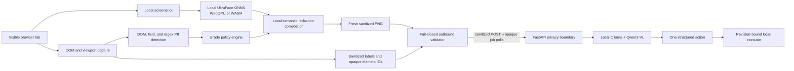

# SIH26171 Private Browser Agent

A working, privacy-first browser-agent prototype for **SIH26171 — On-device Visual Perception for Light-weight Browser Agents**. The primary implementation is a Chrome/Firefox extension plus a strict FastAPI reasoning service backed by the open-weight `qwen3-vl:2b-instruct` model through local Ollama.

The extension captures the visible page only after a user gesture, derives an actionable DOM view, runs a bundled UltraFace ONNX model through WebGPU or WASM, classifies findings locally, applies the user's cumulative Grade 1/2/3 policy, masks sensitive pixels, creates a fresh PNG, and validates the exact serialized request. Only then can its single audited egress function contact the reasoning service. Returned actions are schema-checked and bound to the same snapshot, document revision, tab, scroll position, origin, and opaque element mapping.

This is a production-oriented hackathon prototype with reproducible tests. It is not a claim of universal PII detection or certified anonymization; the exact detection limits are documented in [the extension guide](extension/README.md).

Sensitive pixels are replaced locally with neutral cards and italic category-only markers such as `[REDACTED:PII]`, `[REDACTED:PASSWORD]`, and `[REDACTED:FACE]`. The marker never contains the source value. The explicit full-mask fallback remains available when local inference fails.



## What is included

| Path | Purpose |
| --- | --- |
| `extension/` | One TypeScript source tree producing reproducible Chrome MV3 and Firefox packages, local vision/redaction, popup preview, single egress gateway, and browser action executor. |
| `server/` | Strict FastAPI receiver, authentication/CORS/size controls, PNG and mask verification, local Ollama integration, and synthetic demo portal. |
| `evaluation/` | Synthetic Indian PII corpus, exact receiver-body verifier, precision/recall and pixel-area scorer, schemas, and security test plan. |
| `browser-use/` | Optional local comparison baseline; excluded from this Git repository because it is a nested upstream checkout. |
| `BrowserOS-reference/` | Optional upstream design reference; excluded from this Git repository. |
| `PROTOCOL.md` | Frozen v1 request and action contract. |
| `PRIVACY_LEVELS.md` | Detailed Grade 1/2/3 category matrix, invariants, detector mapping, and known gaps. |
| `IMPLEMENTATION_PLAN.md` | Scope, phases, trust boundary, and acceptance criteria. |
| `EDGE_CASE_MATRIX.md` | Required fail-closed behavior and known gaps for capture, redaction, model, browser, and network edge cases. |
| `TEAM_HANDOFF.md` | Current implementation inventory, architecture, team work split, production roadmap, and release definition of done. |
| `CONTRIBUTING.md` | Setup, privacy rules, testing, and pull-request checklist for collaborators. |
| `SECURITY.md` | Reporting guidance and the exact scope of the prototype's security claim. |
| `evidence/` | Checked-in aggregate synthetic validation summaries; raw screenshots and runtime captures stay local and ignored. |

You do not need to build or fork an entire browser engine for this problem statement. The extension supplies the required client-side browser component and works against ordinary browser tabs; the server supplies the larger reasoning model.

## Run it on this machine

Open PowerShell in this directory:

```powershell
Set-Location 'path\to\privacy-focused-browser-agent'
.\Setup-Prototype.ps1
.\Start-Prototype.ps1
```

`Start-Prototype.ps1` starts Ollama on loopback when needed, checks that the
selected model is installed, warms it with a fixed local-only prompt when it is
not resident, launches the API on `127.0.0.1:8765`, generates a random session
API key, and stores that key in `.runtime\api-key.txt`. It does not print the
key or page data into service logs.

Build and validate both extension packages:

```powershell
.\Test-Prototype.ps1
```

In Chrome, open `chrome://extensions`, enable Developer mode, choose **Load unpacked**, and select:

```text
<repo>\extension\dist\chrome
```

For Firefox, open `about:debugging#/runtime/this-firefox`, choose **Load Temporary Add-on**, and select `extension\dist\firefox\manifest.json`.

Then:

1. Open `http://127.0.0.1:8765/demo`.
2. Open the extension and enter: `Check the confirmation checkbox, then submit the enrollment.`
3. Paste the contents of `.runtime\api-key.txt` into **Optional API key**.
4. Add the fictional demo values to **Known private values** if you want strict receiver canaries.
5. Select **Privacy preview** and inspect the sanitized image. This step sends no request.
6. Choose a privacy grade. Grade 3 is the default and strictest; the popup explains what Grade 1 or Grade 2 may intentionally leave visible.
7. Select **Start agent**. Approve access to the local reasoning endpoint when the browser asks.
8. Confirm the page reaches `Enrollment submitted successfully.`

Stop the API when finished:

```powershell
.\Stop-Prototype.ps1
```

Ollama is left running so the model remains warm for another demonstration.

## Privacy guarantees implemented by the prototype

- Raw screenshots, DOM nodes, form values, cookies, storage, selectors, page URLs, the real hostname, and the opaque-ID mapping are excluded from the reasoning protocol.
- The local classifier assigns each finding to an always-protected class, a Grade 2 class, or a Grade 3 class. The selected grade gates the result before any pixels or text are serialized. Credentials, government/financial identifiers, faces, user-declared private values, and uninspectable content remain protected at every grade; Grade 2 adds contact/location identifiers; Grade 3 adds names and ambiguous populated fields. See [the full matrix](PRIVACY_LEVELS.md).
- Protected regions receive neutral placeholder cards with italic category markers. The marker contains only a class such as `[REDACTED:PII]` or `[REDACTED:FACE]`, never the source value. The same grade-aware sanitizer is applied to the task, title, labels, field metadata and fresh raster.
- The original screenshot is never used as the outbound image. A new PNG is encoded after composition, and the server independently checks semantic placeholder backgrounds or the explicit opaque full-mask fallback.
- The face model and its WebGPU/WASM runtimes are bundled with the extension. Model initialization or inference failure blocks egress unless the user explicitly enables a fully black visual fallback.
- The endpoint must use HTTPS, except for loopback development. The extension submits the sanitized body once, then polls with only a random job ID; each request omits cookies/referrers, rejects redirects, and stays short enough for Chrome MV3. The complete operation has a 100-second deadline.
- The server does not log request content and will not forward malformed, oversized, metadata-bearing, visibly unmasked, or obvious-PII payloads to Ollama.
- Reasoning jobs are authenticated, origin-checked, concurrency-limited, bounded in memory, and expired after five minutes. Access logs normalize job URLs so opaque IDs are not recorded.
- Browser actions use an exact allowlist and cannot execute against a changed page or stale snapshot.

Normal traffic made by the website itself is outside the reasoning-channel guarantee. For example, submitting the synthetic demo form sends its normal request to the demo site; the privacy layer controls only what is sent to the configured AI reasoning endpoint.

## Evidence and next work

The automated suites cover the wire contract, cumulative privacy grades, fail-closed egress, PII rules, mask geometry, ONNX post-processing, server authentication and validation, Ollama output handling, action freshness, receiver canaries, and evaluation mathematics. See [the evaluation guide](evaluation/README.md) and [security test plan](evaluation/SECURITY_TEST_PLAN.md).

The measured validation snapshot is in [VALIDATION_REPORT.md](VALIDATION_REPORT.md). It records the deterministic Chrome flow, the local Ollama API smoke test, and the full live Ollama browser task separately. The server also applies a narrow semantic grounding guard after model output: it uses only sanitized task, role, label, state, and bounds metadata to honor required consent steps and prevent unsafe repeated toggles.

For the complete team handoff—including the current implementation state, privacy-grade contract, ownership suggestions, production backlog, reliability gates, and edge-case definition of done—read [TEAM_HANDOFF.md](TEAM_HANDOFF.md). Generated screenshots, packages, and run summaries are kept in the local ignored `artifacts/` directory; reproduce them with [VALIDATION_REPORT.md](VALIDATION_REPORT.md) rather than committing machine-specific output.

Before any real-data deployment, add and label a much larger multilingual corpus, evaluate a local OCR/NER model, conduct an independent extension/security review, sign the browser packages, and set deployment-specific HTTPS origins and secrets. Media is intentionally masked as a whole until local OCR is measured; that choice protects the demo boundary but lowers visual utility and redaction precision.

The UltraFace model attribution is shipped in `extension/models`. The upstream `browser-use` and BrowserOS repositories keep their original license files and attribution.

The optional upstream references can be cloned separately from [browser-use](https://github.com/browser-use/browser-use) and [BrowserOS](https://github.com/browseros-ai/BrowserOS). They are comparison material only; the SIH implementation in this repository is the extension/server path above.
