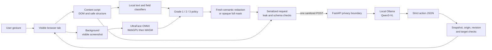

# Privacy Focused Browser Agent

An SIH26171 prototype for **On-device Visual Perception for Light-weight Browser Agents**.

This project gives a browser agent enough context to understand and operate a web page while keeping sensitive page data on the user's machine. A Chrome or Firefox extension captures one task step, detects sensitive content locally, applies the user's privacy grade, creates a new sanitized image, and checks the exact serialized request. Only that sanitized observation can reach the reasoning service. The service returns one strict browser action, and the extension checks that the action still belongs to the same page before executing it.

The prototype uses a local Ollama server with `qwen3-vl:2b-instruct` for reasoning. The design can be adapted to a hosted or self-hosted open-weight model, but the privacy boundary remains on the client.

> **Prototype status:** ready for controlled synthetic demonstrations and team development. It is not a certification of universal PII detection or anonymization. The known detection gaps and production gates are documented below and in [TEAM_HANDOFF.md](TEAM_HANDOFF.md).

## Why browser agents need a privacy boundary

Most browser agents send a screenshot, DOM tree, accessibility tree, or extracted text to a remote model. That gives the model useful context, but it can also expose passwords, names, email addresses, identity numbers, faces, account details, cookies, and the exact page a person is using. A server may retain that data, log it accidentally, or expose it through a compromised model or integration.

This project changes the order of operations:

1. The browser captures the current page locally.
2. Local detectors classify text, fields, unknown visual regions, and faces.
3. A cumulative privacy grade decides which categories must be removed.
4. Sensitive pixels are replaced in a fresh image with category-only placeholders.
5. The sanitized labels, coarse element structure, and image are checked as serialized bytes.
6. A single audited egress function sends the sanitized observation.
7. The response is reduced to one schema-validated action and checked against the live page.

The reasoning service never needs the original screenshot, raw DOM, form values, cookies, real URL, selectors, or the local mapping from opaque element IDs to DOM nodes.

## A concrete use case

Imagine a user asking:

> “Check the confirmation box and submit my enrollment.”

The page contains a name, email address, phone number, Aadhaar-like value, password field, a face image, a consent checkbox, and a submit button.

At Grade 3, the extension keeps the public labels, roles, bounds, checkbox state, and submit control available to the model. It replaces personal values and the face with neutral cards such as `[REDACTED:PII]`, `[REDACTED:PASSWORD]`, and `[REDACTED:FACE]`. The server can therefore identify the consent checkbox and submit control without receiving the enrollment data. It returns an action such as `{"schemaVersion":"1.0","snapshotId":"…","action":{"type":"click","elementId":"opaque-id"}}`. The extension resolves that opaque ID locally, verifies the page has not changed, clicks the checkbox, captures a new observation, and continues to the submit step.

The synthetic demo at `http://127.0.0.1:8765/demo` exercises this flow with Indian PII, sensitive field attributes, a face image, a required consent checkbox, asynchronous reasoning, and a final successful submission.

## Architecture



### Client side

The extension is the trusted privacy boundary in this prototype.

- `extension/src/content.ts` collects visible actionable structure, safe labels, local bounds, field sensitivity signals, text findings, frame and media coverage, and document generations. Raw values are used transiently for classification and are not placed in the element list.
- `extension/src/privacy.ts` applies deterministic DOM, field, regex, and known-private-value detection.
- `extension/src/privacy-policy.ts` maps detector categories to the selected cumulative grade. A detector or model cannot downgrade an always-protected category.
- `extension/src/face-detector.ts` runs the bundled UltraFace ONNX model locally, preferring WebGPU and falling back to single-threaded WASM when WebGPU initialization is unavailable. An inference failure fails closed (or requires the explicit full-mask fallback).
- `extension/src/image-redactor.ts` maps DOM and face boxes into screenshot pixels, merges overlaps, and draws neutral category cards onto a new canvas. The original screenshot is never the outbound image.
- `extension/src/sanitizer-offscreen.ts` moves decoding, inference, composition, and PNG encoding off the service worker in Chrome. Firefox uses the compatible local runtime path.
- `extension/src/egress.ts` is the only reasoning endpoint caller. It validates the final serialized bytes, sends one sanitized request, and polls using only an opaque UUID job ticket.
- `extension/src/background.ts` pins the tab, window, origin, document generations, and operation deadline. It executes only the allowlisted action schema.

### Server side

The server is an untrusted recipient of the sanitized protocol object and provides reasoning orchestration.

- `server/app/boundary.py` enforces request-size, content-type, authentication, origin, and safe access-log controls. The extension's endpoint validator enforces HTTPS outside loopback; the server's default launcher binds the API to loopback.
- `server/app/schemas.py` rejects unknown fields and invalid protocol values.
- `server/app/validation.py` checks base64 and PNG structure, dimensions, metadata, animation, declared placeholder regions, opaque fallback pixels, bounds, canaries, and grade-aware text rules.
- `server/app/ollama.py` sends only validated sanitized context to the local model and parses strict structured output.
- `server/app/action_guard.py` uses sanitized task, role, label, state, and bounds metadata to guard high-confidence consent and submit prerequisites without seeing raw values.
- `server/app/jobs.py` turns slow model work into a bounded asynchronous queue with expiry, concurrency limits, and cancellation during shutdown. Synchronous compatibility requests share the same model-admission gate and time out with a controlled capacity error. The current store is in memory and single process; replicated production deployment needs a protected shared store or sticky routing.
- The container profile requires `PRIVACY_AGENT_API_KEY` at startup; local development can use the loopback launcher, which generates a session key automatically.

### Threat model and scope

For this prototype, the extension runtime and local canvas compositor are trusted to enforce the boundary. Page content is untrusted input, and the reasoning server, model output, and model provider are treated as untrusted recipients. The operating system, browser implementation, extension signing pipeline, and third-party dependencies are outside this prototype's trust claim and require separate supply-chain review. The guarantee covers the configured reasoning endpoint only; it does not intercept ordinary website requests, other extensions, other applications, external screen sharing, or products such as Copilot Vision.

### One reasoning step

Each step follows the same sequence:

```text
user gesture
  → capture DOM and viewport
  → classify text, fields, unknown regions, and faces locally
  → apply the selected privacy grade
  → compose a fresh sanitized PNG
  → sanitize task, title, labels, and metadata
  → verify page revision and exact serialized bytes
  → one sanitized POST
  → bodyless opaque-ticket polls
  → strict action validation
  → live-page and snapshot checks
  → one browser action
```

The extension does not maintain a continuous screen stream and does not reconstruct a second webpage. It captures only when the agent needs a new observation, which reduces resource use and limits the amount of data that must be inspected.

## Privacy grades

Grades are cumulative and selected locally. Grade 3 is the default and the fail-safe value for missing or invalid settings. Choosing Grade 1 is an explicit decision to disclose more context to the configured reasoning service; it never disables the invariant protection floor.

| Grade | Intended use | Additional categories redacted | Context that may remain when safe |
| --- | --- | --- | --- |
| **1 — Essential** | Personalised tasks that need ordinary identity context | Credentials, government IDs, payment data, faces, user-declared values, and uninspectable content | Names, usernames, ordinary email/phone/location context, professional context, and safe non-sensitive fields |
| **2 — Balanced** | Useful assistance with direct contact details hidden | Grade 1 plus email, phone, address, precise location, date of birth, device identifiers, and non-financial account identifiers | Names, public handles, professional context, and safe controls |
| **3 — Maximum** | Minimum personal context; default mode | Grades 1 and 2 plus detected names, usernames, employee/student IDs, and ambiguous populated fields | Public labels, roles, bounds, state, and task-relevant structure |

Every grade protects passwords and secrets, government and financial identifiers, faces, user-declared private values, and regions the client cannot inspect reliably. The full category matrix, detector signals, and current gaps are in [PRIVACY_LEVELS.md](PRIVACY_LEVELS.md).

### What the local policy does

1. It reads structural DOM signals without putting form values in the outbound element list.
2. It detects high-confidence patterns such as email, Indian phone, Aadhaar, PAN, card-like numbers, IP addresses, labelled names and addresses, sensitive field metadata, and exact user-declared values.
3. It runs face detection locally.
4. It assigns each finding to an invariant, Grade 2, or Grade 3 category.
5. It applies the selected grade and merges protected rectangles.
6. It replaces protected pixels with category-only markers; markers never contain source values.
7. It applies the same policy to the task, page title, labels, and field metadata.
8. It blocks transmission if capture, inference, masking, encoding, validation, canary, or revision checks fail.

### Why this addresses the common browser-agent privacy failure

Typical agent pipelines decide what is sensitive after the screenshot or DOM has already reached a server. At that point the server has already received the secret. Here, classification and redaction happen before serialization and before the only network call. The server also performs independent checks, so a client bug cannot silently turn a raw screenshot into a valid reasoning request.

The server receives:

- a newly encoded PNG containing semantic placeholders or an explicit opaque full mask;
- sanitized labels and task text;
- coarse roles, bounds, state, and opaque element IDs;
- a versioned privacy grade and redaction metadata;
- a keyed, session-scoped site alias and random snapshot revision.

The server does not receive:

- the original screenshot or decoded source pixels;
- raw HTML, DOM attributes, selectors, form values, cookies, or storage;
- the real URL or hostname;
- the ID-to-DOM mapping;
- the known-private-value list or its HMAC key;
- page content in access logs or model prompts beyond the sanitized protocol.

Normal website traffic remains the website's own responsibility. The guarantee covers the configured AI reasoning channel; it does not claim to control unrelated requests made by the page itself.

## Features implemented today

- One TypeScript source tree builds Chrome MV3 and Firefox-compatible extension packages.
- User-selectable cumulative Grade 1/2/3 privacy levels with Grade 3 default and fail-safe handling.
- Local DOM, field metadata, regex, known-private-value, and face detection.
- Bundled UltraFace ONNX model with WebGPU first and WASM fallback. WebGPU uses the browser API; the model and WASM assets are packaged locally.
- Privacy preview that performs local capture and redaction without a reasoning request.
- Semantic redaction cards with category-only placeholders.
- Explicit fully opaque full-image fallback when local inference cannot inspect the page and the user enables it.
- Fresh PNG generation, metadata and animation rejection, declared-region placeholder checks, and obvious-PII checks on the server.
- Sanitized task, page title, labels, field metadata, and image bounds.
- A single audited reasoning egress path with exact serialized-body checks.
- HTTPS enforcement outside loopback, no redirects, short requests, and bodyless UUID polling.
- FastAPI authentication, CORS/origin checks, request limits, safe logs, bounded jobs, and local Ollama integration.
- Strict action types: `click`, `input`, `scroll`, `wait`, and `done`.
- Revision-bound action execution that rejects stale pages, changed origins, changed tabs, changed scroll state, and unknown targets.
- Synthetic demo portal containing password, Indian PII, links, a face image, consent state, and terminal submission.
- Evaluation corpus, receiver-body verifier, precision/recall scorer, pixel-area metrics, and security test plan.
- CI workflow, contribution guide, pull-request checklist, issue templates, model attribution, and aggregate synthetic evidence.

## Current validation

The checked-in [VALIDATION_REPORT.md](VALIDATION_REPORT.md) records the evidence snapshot. The current source suites report:

- **73 extension tests passed**;
- **126 server tests passed**;
- **28 evaluation tests passed**;
- Ruff clean;
- Chrome and Firefox packages built;
- UltraFace checksum verified;
- source-level single-egress invariant passed;
- deterministic synthetic browser flow completed through the WASM path;
- authenticated local Ollama smoke test returned valid structured action;
- GitHub Actions extension, server, lint, and evaluation jobs passed.

The bundled face model is `extension/models/version-RFB-320.onnx` with SHA-256 `34CD7E60AEFF28744C657DE7A3DC64E872D506741DE66987F3426F2B79F88017`. Its attribution and license are shipped beside the asset. Package checksums are recorded in the validation report because generated archives are build-specific.

The checked-in [evidence summaries](evidence/) contain aggregate synthetic results only. Raw screenshots, runtime logs, browser profiles, API keys, model caches, and generated packages stay ignored by Git.

## Run the prototype

### Requirements

- Windows PowerShell for the supplied scripts;
- Node.js 20 or newer;
- Python 3.11 or newer;
- Git;
- Ollama with a machine capable of running `qwen3-vl:2b-instruct`.

### Setup and tests

```powershell
git clone https://github.com/Rohinth-S/privacy-focused-browser-agent.git
Set-Location privacy-focused-browser-agent
.\Setup-Prototype.ps1
ollama pull qwen3-vl:2b-instruct
.\Test-Prototype.ps1
```

The setup script creates local environments and installs dependencies into ignored directories. The test script checks the extension, server, evaluation harness, model checksum, and source-level egress invariant.

### Start the local service

```powershell
.\Start-Prototype.ps1
```

The launcher keeps Ollama and the API on loopback, verifies the selected model, and reuses or creates a random session API key in `.runtime\api-key.txt`. The first multimodal request may take longer while Ollama loads the model; later requests use the resident model.

### Load the extension

For Chrome:

1. Open `chrome://extensions` and enable **Developer mode**.
2. Choose **Load unpacked**.
3. Select `extension\dist\chrome`.

For Firefox:

1. Open `about:debugging#/runtime/this-firefox`.
2. Choose **Load Temporary Add-on**.
3. Select `extension\dist\firefox\manifest.json`.

### Run the synthetic task

1. Open `http://127.0.0.1:8765/demo`.
2. Use the popup's **Quick start** menu to choose **Review and submit a form**, or enter `Check the confirmation checkbox, then submit the enrollment.` yourself. The generated task remains editable and is filled locally.
3. Open `.runtime\api-key.txt`, copy its contents, and paste that value into **Optional API key**. Paste the key value, not the file path.
4. Optionally add the fictional demo values under **Known private values** to exercise canary checks.
5. Select **Privacy preview** and inspect the locally generated image. Use **Expand** and then **Open full view** for a fit-to-screen viewer in a separate extension tab. Enter a task as usual; preview still makes no reasoning request.
6. Select Grade 1, Grade 2, or Grade 3 and review its disclosure description.
7. Select **Start agent** and approve the local endpoint if the browser asks.
8. Confirm the page reaches `Enrollment submitted successfully.`

If the popup reports `Local offscreen sanitization failed; transmission
blocked`, the request was stopped before the reasoning server and the API key
is not the cause. Rebuild the extension, open `chrome://extensions`, click
**Reload** for **SIH Private Browser Agent**, then reload the demo page and
run **Privacy preview** again. A healthy local run reports `wasm` or `webgpu`
under **Detector** and a positive mask count. If it still blocks, open the
extension's **Errors** panel; the popup now distinguishes an unavailable face
detector, a lost offscreen document, and an image-sanitization failure. The
full-mask fallback in **Privacy controls** is useful as a diagnostic, but it
turns the entire screenshot opaque and should not be used for the normal
accuracy demo.

Stop the API with:

```powershell
.\Stop-Prototype.ps1
```

## Repository guide

| Path | Purpose |
| --- | --- |
| `extension/` | Cross-browser extension source, local capture, detection, redaction, preview, egress, and action execution. |
| `server/` | FastAPI privacy boundary, strict schemas, image validation, Ollama adapter, jobs, action guard, and demo portal. |
| `evaluation/` | Synthetic Indian PII corpus, scoring, receiver verifier, schemas, and security test plan. |
| `PRIVACY_LEVELS.md` | Versioned Grade 1/2/3 classification and protection contract. |
| `PROTOCOL.md` | Frozen v1 request and action contract. |
| `ARCHITECTURE.md` | Trust boundary, data inventory, fail-closed choices, and browser-fork decision. |
| `ARCHITECTURE_REVIEW.md` | Review of per-step sanitized capture versus continuous screen sharing. |
| `EDGE_CASE_MATRIX.md` | Required behavior for capture, detector, browser, network, and action failures. |
| `IMPLEMENTATION_PLAN.md` | SIH scope, phases, components, and acceptance criteria. |
| `TEAM_HANDOFF.md` | Current state, work split, production roadmap, reliability gates, and demo definition. |
| `TEAM_WORK_SPLIT.md` | Named ownership for Rohinth, Mithul, and Prajjwal with implementation tasks and acceptance criteria. |
| `CONTRIBUTING.md` | Setup, privacy rules, testing, and pull-request checklist. |
| `SECURITY.md` | Vulnerability reporting and the exact scope of the privacy claim. |
| `evidence/` | Safe aggregate synthetic validation summaries. |

The local `browser-use/` and `BrowserOS-reference/` directories are optional upstream references and are intentionally excluded from this Git repository because they contain separate Git history and development environments. Clone them separately when comparing designs, and preserve their original licenses.

## Roadmap to production

The prototype demonstrates the boundary and the end-to-end interaction. The following work is required before handling real sensitive data.

### P0 — safety and release gates

- Independent security review of permissions, content scripts, dependencies, model assets, build scripts, server routes, and malicious-page behavior.
- Expand the synthetic and approved-data corpus, publish grade-wise precision, recall, confidence intervals, excess redaction area, resource use, and p50/p95 latency.
- Add a local OCR and NER pipeline for text in images, canvas, video, SVG, PDFs, QR codes, signatures, and multilingual pages.
- Pin and audit dependencies, add secret scanning, SBOM generation, fuzzing, property-based tests, and serialized-body leak gates.
- Sign browser packages, publish reproducible build metadata and checksums, and remove development-only permissions.
- Require HTTPS, certificate validation, deployment secret management, key rotation, rate limits, and private model networking outside loopback.
- Version the privacy policy and detector bundle together, show users the exact disclosure effect of each grade, and review policy changes.

### P1 — dependable cross-browser product

- Test Chrome and Firefox across WebGPU and WASM, lower-end CPU/GPU/RAM classes, high DPI, zoom, resize, animation, long pages, thermal throttling, and service-worker suspension.
- Harden capture identity for CSS transforms, cross-origin frames, closed shadow DOM, animated content, and geometry that cannot be proven to match the DOM snapshot.
- Add user confirmation, idempotency keys, cancellation, retry budgets, back-pressure, durable multi-instance jobs, and safe restart recovery.
- Add deployment observability that records timings and counters without raw content, URLs, job IDs, or sensitive labels.
- Add model adapters and a documented offline or air-gapped server deployment.

### P2 — next-level capability

- Add accessibility-tree fusion and richer task planning while keeping the action protocol small and reviewable.
- Add safe navigation, download, upload, and irreversible-action policies.
- Add policy simulation so a user can compare the same task at all three grades before sending anything.
- Provide synthetic-only trace exports for judging, debugging, and incident review.
- Automate browser-matrix CI, dependency provenance, performance budgets, rollback procedures, and periodic red-team runs.

The full reliability definition of done and suggested team work split are in [TEAM_HANDOFF.md](TEAM_HANDOFF.md). The known detector gaps and required fail-closed behavior are in [EDGE_CASE_MATRIX.md](EDGE_CASE_MATRIX.md).

## Contributing safely

Use short-lived branches and pull requests. Any change that adds a detector, field, action, endpoint, or serialized property must update the relevant policy/protocol document and tests. Preserve the single-egress invariant in `extension/src/egress.ts`, never add real personal data to fixtures or screenshots, and never commit API keys or runtime files. See [CONTRIBUTING.md](CONTRIBUTING.md) and the pull-request template for the review checklist.

## License and attribution

The UltraFace model attribution and license are shipped under `extension/models`. The optional `browser-use` and BrowserOS references retain their upstream license files when cloned separately. Choose and add a project-level open-source license before public production distribution.
