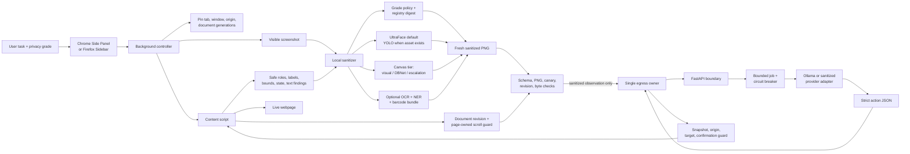
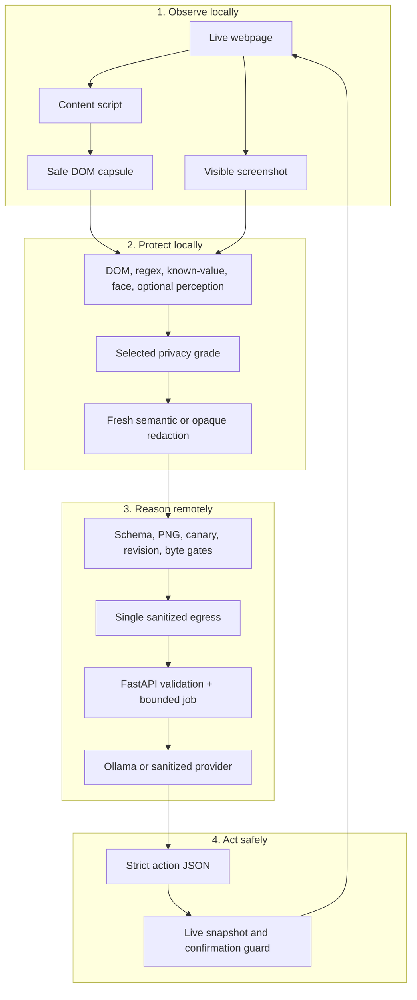
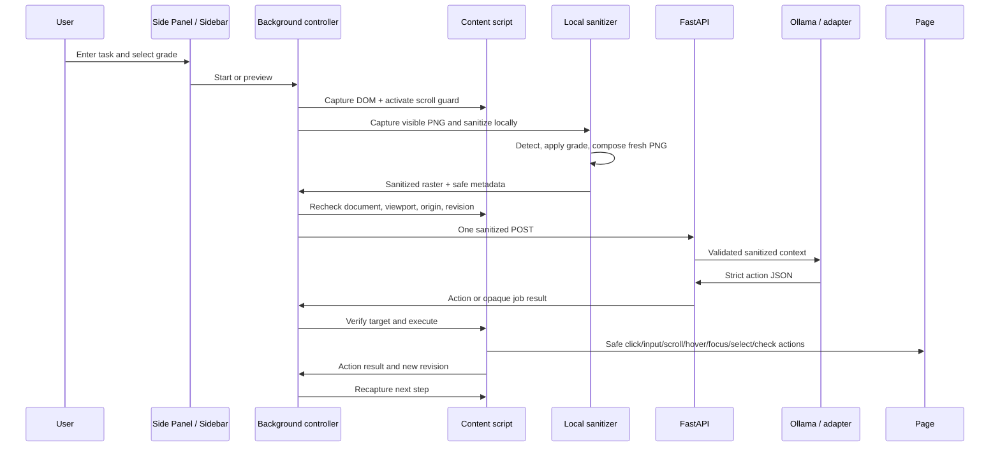
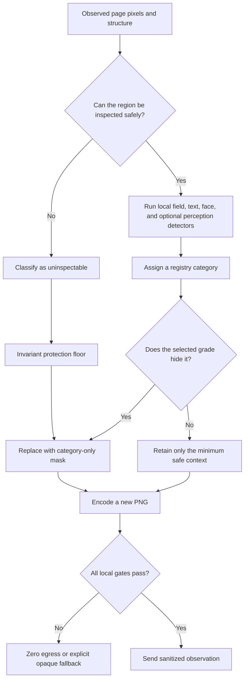
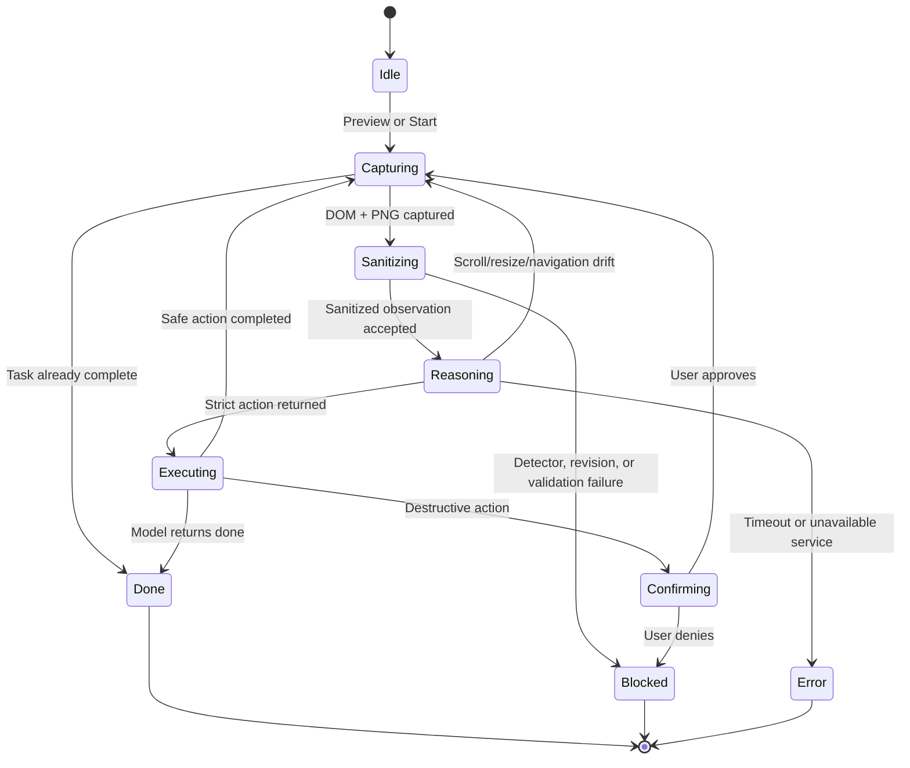
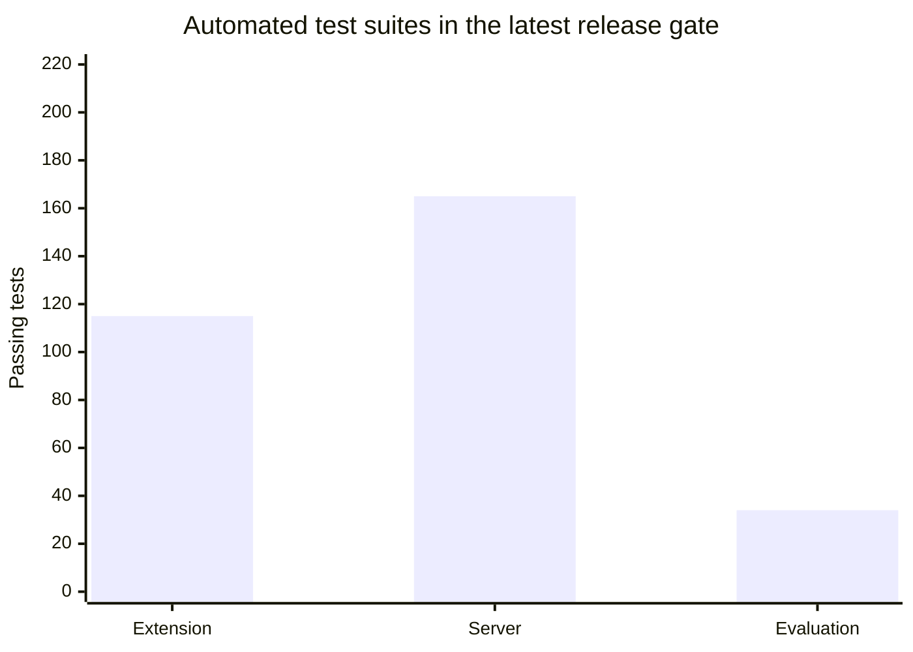

# Private Browser Agent

## On-device visual perception with a zero-trust privacy boundary

This repository is the SIH26171 prototype for **On-device Visual Perception for Light-weight Browser Agents**. It combines a cross-browser extension, local privacy enforcement, a sanitized reasoning protocol, and a bounded action executor.

The central design rule is simple:

> **The browser must decide what the reasoning service is allowed to see before any reasoning request is serialized or sent.**

The extension captures the visible page locally, combines DOM and visual signals, applies a user-selected privacy grade, creates a new sanitized image, validates the exact outbound bytes, and sends only the sanitized observation. The reasoning service returns one strict action. The extension then verifies that action against the live page before it executes.

This reverses the usual browser-agent order. A conventional agent often sends a screenshot, DOM snapshot, accessibility tree, or extracted text first and attempts to protect it later. This project makes disclosure control a prerequisite for reasoning.

> **Current status:** controlled synthetic prototype ready for team development and SIH demonstrations. The normal package uses the checked-in UltraFace face detector with WebGPU/WASM fallback; OCR/NER/barcode perception is disabled unless a separately evaluated, checksum-locked admission bundle is built. Person images are fully masked, explicitly classified public objects are preserved, and unknown or low-confidence media remains fail-closed. The repository does not claim universal PII detection, anonymization, browser coverage, or public-production readiness.

## Why this project stands out

The project is not only a browser agent with a privacy setting. Privacy is enforced as a sequence of independently testable boundaries:

1. **Local capture:** the page is observed inside the browser.
2. **Local classification:** DOM metadata, fields, text patterns, known-private values, faces, and explicitly admitted local perception are classified before egress.
3. **User-controlled disclosure:** Grade 1, Grade 2, or Grade 3 determines which categories may remain.
4. **Fresh redaction:** sensitive regions are replaced on a new canvas; the original screenshot is never used as the outbound image.
5. **Byte-level validation:** the serialized JSON and PNG are checked for schema violations, unsafe values, canaries, invalid bounds, metadata, missing masks, and a final local DLP scan over task text, labels, and metadata.
6. **One egress owner:** `extension/src/egress.ts` is the only reasoning `fetch` owner.
7. **Sanitized reasoning:** the server receives only the versioned sanitized observation.
8. **Strict action output:** the model cannot return arbitrary JavaScript, selectors, URLs, or keyboard injection.
9. **Live-page verification:** snapshot, document, viewport, origin, target, editability, and duplicate-action checks run again before execution.
10. **Human confirmation:** destructive clicks such as submit, delete, pay, or navigation require native confirmation.

This gives the project a stronger privacy story than a provider setting or a promise that a cloud model will delete data after it has already received the original page.

## What is implemented

| Capability | Default development package | Optional or deployment-gated capability |
| --- | --- | --- |
| Browser targets | Chrome MV3 and Firefox package from one TypeScript source tree | Live Firefox matrix evidence is still required |
| User interface | Chrome Side Panel, Firefox Sidebar, popup controller, activity log, preview modal, full-view preview tab | Per-site policy simulation and richer trace export remain future work |
| Local page capture | Visible PNG plus safe DOM/role/label/bounds/state capsule | Accessibility-tree fusion beyond the current safe capsule remains future work |
| Privacy grades | Grade 1 Essential, Grade 2 Balanced, Grade 3 Strict default | Additional user-defined categories require registry and protocol review |
| Face detection | Checked-in UltraFace ONNX, WebGPU first, WASM fallback | None for the default face path |
| Document visual detection | Implementation present but no `yolo-privacy-v1.onnx` is checked in | Unified YOLOv8n/v10n asset, checksum, license, and held-out evaluation |
| Canvas text detection | DBNet implementation and three-tier policy contract | `dbnet-text-det.onnx` asset and explicit production wiring |
| Credential OCR for image fixtures | Locked local English Tesseract asset redacts PAN/payment-card and Aadhaar-style PII lines while preserving non-secret document artwork | Larger document set, multilingual OCR, and held-out precision/recall evidence |
| OCR/NER/barcodes perception bundle | Local runtime and orchestration implemented behind an evaluation admission gate | `LOCAL_PERCEPTION_EVALUATED=1 npm run package:perception`, locked assets, browser/resource measurements, held-out accuracy |
| High-assurance mode | User-selectable structure-only transmission: sanitized DOM plus a fully opaque black PNG | Browser/device coverage and independent review |
| Outbound privacy receipt | Local aggregate receipt with grade, detector, redaction categories, masked area, sanitized-image hash, request count, and egress state | Long-term receipt export and independent review |
| Reasoning | Local Ollama, normally `qwen3-vl:2b-instruct` | Provider-neutral hosted or air-gapped sanitized adapter |
| Agent controller | LangGraph.js StateGraph with bounded callbacks plus bounded FastAPI jobs | Durable checkpointer-backed resume and distributed graph execution remain future work |
| Browser actions | `click`, `input`, `scroll`, `wait`, `done`, `hover`, `focus`, `doubleClick`, `check`, `uncheck`, `select` | Privileged navigation/download/upload/keyboard/cookie actions remain outside the safe broker |
| Queue | Development in-memory jobs; optional metadata-only SQLite | Production Redis ledger and shared rate limiter |
| Evidence | Synthetic demo, automated release gate, local Ollama smoke/e2e summaries | Independent security review, signed artifacts, live browser matrix, trained-model metrics |

## The concrete SIH demonstration

The synthetic portal at `http://127.0.0.1:8765/demo` contains:

- a synthetic employee profile;
- full name, email, phone, PAN, Aadhaar-like value, employee code, date of birth, home address, username, customer ID, IP address, and bank-account fields;
- public fields such as preferred name, work email, phone, city, benefit plan, and coverage date;
- a synthetic face image;
- synthetic credit-card and PAN-card SVG image fixtures, each with a generated portrait for local face-redaction coverage;
- a synthetic Aadhaar-style document fixture with a generated female portrait plus name, date of birth, gender, mobile, address, and Aadhaar-number lines;
- document portraits are rendered as responsive, explicitly tagged HTML overlays above the SVG artwork, so Chrome and Firefox paint them consistently and the local media policy can classify each as `person`;
- a media-policy lab that compares selective document redaction, full person-image masking, and preservation of an explicitly classified public object;
- a portal password;
- a confirmation checkbox and submit enrollment button;
- a privacy-spectrum display showing which grades protect which categories.

The intended task is:

```text
Check the confirmation checkbox, then submit the enrollment.
```

At Grade 3, the reasoning service can see the public structure, safe labels, roles, bounds, checkbox state, and submit control. Personal values, the face, passwords, and uninspectable media are redacted locally. In the default package, local credential OCR narrows a confidently recognized synthetic payment/PAN or Aadhaar-style document to its complete set of PII boxes; a missing, low-confidence, timed-out, incomplete, or unsupported OCR result keeps the complete media region masked. The model can identify the checkbox and submit control without receiving the enrollment data.

The image fixtures intentionally exercise four media paths: precise local OCR redaction for supported documents, full-image masking for the synthetic person, preservation for the explicitly classified public object, and fail-closed masking for unclassified or low-confidence media.

## Architecture

### High-level flow



### Trust boundary

The extension is the trusted privacy boundary for the configured reasoning channel. The webpage and reasoning service are treated as untrusted inputs or recipients.

```mermaid
flowchart LR
  subgraph DEVICE[User device: extension boundary]
    PAGE[Untrusted webpage<br/>DOM, forms, canvas, frames, media]
    CAPTURE[Content capture + visible PNG]
    DETECT[Local DOM, regex, known-value,<br/>face, optional perception]
    POLICY[Versioned Grade 1/2/3 policy]
    COMPOSE[Fresh compositor<br/>semantic redaction or opaque mask]
    CHECK[Serialized-body and revision checks]
    EGRESS[Only reasoning egress owner]
    EXEC[Action verifier and executor]
    PAGE --> CAPTURE
    CAPTURE --> DETECT --> POLICY --> COMPOSE --> CHECK --> EGRESS
    EGRESS --> EXEC --> PAGE
  end
  subgraph SERVICE[Reasoning service: untrusted recipient]
    BOUNDARY[Authentication, origins,<br/>size and content checks]
    VALIDATE[Strict sanitized protocol validator]
    JOBS[Bounded jobs and circuit breaker]
    MODEL[Ollama or provider adapter]
    RESPONSE[Strict action response]
    BOUNDARY --> VALIDATE --> JOBS --> MODEL --> RESPONSE
  end
  EGRESS -->|sanitized PNG + safe metadata| BOUNDARY
  RESPONSE --> EXEC
  RAW[Original pixels, raw DOM values,<br/>cookies, selectors, real URL,<br/>private-value map] -. never crosses .-> BOUNDARY
```



The server receives a versioned observation containing a fresh PNG, safe structure, opaque IDs, redaction metadata, the selected grade, a detector/registry description, and an origin alias. It does not receive the original screenshot, raw HTML, selectors, form values, cookies, storage, the real hostname, or the local ID-to-DOM map.

The privacy guarantee is scoped to this extension-to-configured-reasoning-service channel. It does not control ordinary website traffic, another extension, another application, a compromised browser, external screen sharing, or a provider outside the configured protocol.

### Read the system in four layers



The first two layers run on the user's machine. The reasoning service only receives the output of the protection layer. The final layer returns to the live page through a local opaque-ID map; the model never receives selectors or DOM handles.

### One step, end to end



If the page scrolls, resizes, navigates, changes origin, or otherwise invalidates the captured context during reasoning, the returned action is discarded and the extension captures a fresh step.

### The privacy decision ladder



The ladder explains why a lower grade never disables the invariant floor: unknown or high-impact data reaches the mask path before the grade-specific disclosure choice is considered.

## Client extension

### Build targets and packaging

`extension/scripts/build.mjs` produces:

- Chrome MV3 targeting Chrome 120;
- Firefox MV2-compatible packaging targeting Firefox 121;
- popup and persistent Side Panel/Sidebar bundles from the shared `popup.ts` controller;
- the full-view preview page;
- Chrome's offscreen document;
- ONNX Runtime Web WASM assets;
- only the local model assets that actually exist and pass checks;
- reproducible ZIP packages when `--package` is used.

The manifests request the prototype permissions required for active-tab capture, extension storage, page scripting, local offscreen processing, and the browser-specific panel surface. Chrome uses `side_panel`; Firefox uses `sidebar_action`.

### Side Panel, Sidebar, and popup controls

The panel supports:

- task entry with a bounded length;
- task presets for review/submit and public-field workflows;
- Grade 1/2/3 selection with explanations;
- reasoning endpoint configuration;
- maximum step budget;
- memory-only API key entry;
- memory-only known-private canaries;
- explicit full-mask fallback selection;
- local **Privacy preview**;
- **Start agent** and **Stop** controls;
- run-state badge and phase message;
- step count, detector backend, redaction count, masked-area percentage, and last server latency;
- live activity log;
- sanitized preview image;
- judge-facing **Sanitized DOM capsule** showing the exact sanitized task,
  page metadata, opaque element IDs, roles, bounds, safe labels, state flags,
  redaction counts, and an expandable sanitized DOM payload;
- full-screen preview modal and separate full-view extension tab.

The API key and canaries are kept only in panel memory during the run. They are not persisted into source, storage, request metadata, logs, or evidence.

Only non-secret preferences are persisted in extension storage: endpoint, maximum steps, selected privacy grade, and the explicit full-mask fallback preference. Tasks, API keys, and known-private canaries remain in memory.

### Page capture and safe DOM capsule

`extension/src/content.ts` runs in the page and locally:

- assigns opaque IDs to visible buttons, links, textboxes, textareas, selects, checkboxes, radios, comboboxes, options, contenteditable elements, and scroll regions;
- limits the safe element list to 500;
- reports role, sanitized label, bounds, disabled/checked/editable/required state;
- uses labels, placeholders, accessible names, titles, field names, autocomplete hints, nearby text, and visible text for classification;
- classifies password and sensitive fields before any network request;
- finds regex and known-private values;
- marks frames, images, canvas, video, SVG, object/embed, CSS backgrounds, pseudo-elements, and inspectability-uncertain regions;
- walks inspectable open shadow roots and custom-element content;
- tracks document revision on mutation, scroll, resize, orientation, visual viewport movement, and other relevant layout changes;
- never places raw field values in the sanitized element list.

The real map from an opaque element ID to a DOM node stays inside the content script.

`capture-rate-gate.ts` keeps visible-tab screenshot capture demand-driven and below the browser's capture limit. `context-guard.ts` binds work to the original tab, window, origin, update generation, activation generation, document, and viewport. `validation.ts` performs the client-side schema, PNG, bounds, redaction, registry, and serialized-body checks before `egress.ts` can send anything.

### Capture identity and scroll-drift protection

The background service worker pins:

- active tab and window;
- origin alias;
- tab update and activation generations;
- document ID and document revision;
- viewport size and scroll position;
- operation deadline.

`scroll-drift-guard.ts` belongs to the content script because the background context cannot observe webpage scroll events. It installs a passive capture-phase scroll listener, debounces drift, observes `visualViewport`, and exposes `SET_SCROLL_GUARD`/`GET_SCROLL_DRIFT`. The guard is enabled during reasoning and disabled after the response. Drift invalidates the set-of-mark registry, discards the action, and forces recapture.

### Supported actions

The model can return only these actions. Every target is an opaque ID from the
current sanitized observation; the page-side broker resolves it locally after
fresh revision and visibility checks.

| Action | Current behavior |
| --- | --- |
| `click` | Click a current visible target after disabled, connected, origin, snapshot, and destructive-action checks. |
| `input` | Fill a current editable text control or contenteditable element; read-only and disabled targets are rejected. |
| `scroll` | Scroll the page or a verified scroll-region target by a bounded amount. |
| `wait` | Wait a bounded duration and capture again. |
| `done` | End the task with a status message. |
| `hover` | Dispatch a local hover sequence (`mouseover`, `mousemove`, `mouseenter`) to reveal ordinary menus/tooltips. |
| `focus` | Focus the current target without allowing the model to supply a selector or script. |
| `doubleClick` | Dispatch a local double-click event; destructive labels use the same native confirmation as `click`. |
| `check` / `uncheck` | Set a current checkbox to the requested state without toggle ambiguity. |
| `select` | Choose an exact public label/value on a current native `<select>`; no option list or private value is sent. |

The content script rejects arbitrary JavaScript, selectors, URLs, keyboard injection,
unknown action fields, stale snapshot IDs, stale document revisions, cross-origin
targets, hidden/detached elements, disabled/read-only controls, unsupported custom
combobox selection, and duplicate in-flight actions. The server also checks checkbox
and combobox roles and applies the PII floor to `select.option`.

Clicks with destructive or irreversible labels such as submit, pay, delete, checkout, confirm, or navigation pause for native `window.confirm()` approval. The model cannot silently bypass that confirmation.

### Agent state machine



The state machine is bounded by the configured maximum step count and total operation deadline. It never retries by relaxing redaction.

### Local privacy policy

The shared detector registry defines the minimum grade at which a category is hidden. The policy is cumulative:

- **Grade 1 — Essential:** protect high-impact or irreversible information.
- **Grade 2 — Balanced:** additionally protect direct contact and linkable context.
- **Grade 3 — Strict:** additionally protect identity labels and unknown populated fields.

Missing or invalid settings normalize to Grade 3. A newly added detector category defaults to `unknown-populated-field`, which fails closed at Grade 3 until policy governance assigns it explicitly.

**Names and dates of birth follow the same policy across form fields, labelled profile text, repeated known identity values, and supported document OCR.** Names (including cardholder names) are hidden at Grade 3; dates of birth are hidden at Grades 2 and 3. The document type does not change those thresholds. Values learned from labelled fields remain capture-local. OCR must locate every field required by the selected grade before replacing a full document mask with selective boxes. Changing the grade hides the old panel preview; click **Privacy preview** to generate a fresh capture under the new policy. Existing expanded preview tabs are snapshots of their original capture.

The invariant floor applies at every grade:

- credentials and secrets;
- passwords, OTPs, PINs, CVVs, bearer/API/private-key tokens;
- government identifiers;
- financial/payment data;
- faces and biometric regions;
- user-declared known-private values;
- visual regions the client cannot inspect reliably.

The main detector categories are:

| Category | Grade 1 | Grade 2 | Grade 3 |
| --- | :---: | :---: | :---: |
| Credentials, secrets, government IDs, financial data, faces | hide | hide | hide |
| Known private values and unsupported/uninspectable media | hide | hide | hide |
| Email, phone, address/location, date of birth, network/device IDs, account IDs | keep when safe | hide | hide |
| Names, usernames, professional/employee identifiers | keep when safe | keep when safe | hide |
| Unknown populated editable fields | keep only when classified safe | keep only when classified safe | hide |

`privacy.ts` applies deterministic DOM and field metadata rules, regex patterns for Indian and general identifiers, exact known-value matching, Unicode/whitespace normalization, and category mapping. `privacy-policy.ts` consumes the generated registry and digest. `PRIVACY_LEVELS.md` contains the complete policy contract.

### Local visual detection

The client uses an asset-gated unified detector interface.

#### Default checked-in path: UltraFace

`extension/models/version-RFB-320.onnx` is checked in with attribution and license files. `face-detector.ts` invokes it through ONNX Runtime Web:

1. try WebGPU;
2. fall back to WASM;
3. return a typed failure if neither backend is available.

The reviewed model SHA-256 is:

```text
34CD7E60AEFF28744C657DE7A3DC64E872D506741DE66987F3426F2B79F88017
```

#### Optional Approach B path: unified YOLO

`yolo-detector.ts` implements:

- 640-pixel letterbox preprocessing;
- YOLOv8 output transpose and NMS;
- YOLOv10 end-to-end output decoding;
- face, Aadhaar card, PAN card, voter ID, driving licence, passport, and signature classes;
- WebGPU-first and WASM fallback execution;
- asset-gated selection through `__YOLO_MODEL_INCLUDED__`.

The default repository package does **not** contain `yolo-privacy-v1.onnx`; therefore the default build reports the UltraFace path and does not claim trained document-ID coverage or YOLO performance. To activate YOLO, the team must supply an approved asset with license, checksum, provenance, and held-out evaluation.

### Redaction and fresh-image construction

`image-redactor.ts`:

- maps DOM and visual boxes into screenshot pixels;
- clips invalid or out-of-bounds rectangles;
- merges overlapping masks;
- draws neutral category-only markers such as `[REDACTED:EMAIL]`, `[REDACTED:PASSWORD]`, or `[REDACTED:FACE]`;
- computes category counts and masked-area percentage;
- creates a new PNG from a new canvas;
- can produce a fully opaque image only when the user explicitly enables the full-mask fallback;
- never treats a visual overlay on the original screenshot as a valid outbound artifact;
- does not expose the original screenshot in `SanitizedObservation`.

### High-assurance structure-only mode

The Advanced privacy controls include **High-assurance structure-only mode**.
When selected, the local pipeline still captures the page to obtain viewport
dimensions and the safe DOM capsule, but it skips visual detection, OCR, NER,
and barcode interpretation for that capture. It creates a fresh all-black PNG
and sends only that opaque image plus sanitized roles, labels, bounds, and
state. The wire metadata reports `detectorBackend: "missing"`,
`visualFallback: "full-mask"`, and `redactionMode: "opaque"`, so the server
cannot mistake the image for a semantic screenshot.

Every preview and accepted reasoning request also exposes a local outbound
privacy receipt. It contains only the selected grade, detector backend,
redaction category counts, masked-area percentage, a SHA-256 hash of the
sanitized PNG, request count, transmission mode, and whether the request was
accepted. Raw values and the original screenshot are never shown in the
receipt.

### Canvas, frames, and media

Canvas-rendered applications are difficult because text pixels may not exist in the DOM. `canvas-privacy.ts` defines a three-tier strategy:

1. **Visual redaction:** normal inspectable visual-object redaction.
2. **DBNet blind masking:** optional DBNet text-region detection without OCR or content retention.
3. **Manual escalation:** require user review when safe local classification is unavailable.

The default live path conservatively masks inspectability-uncertain media and frames. A narrow local document-OCR pass runs only on image media that would otherwise be fully masked. If it confidently recognizes a supported PAN, payment-card, or Aadhaar-style fixture, the full media mask is replaced with credential/PII boxes; a local coarse card hint can help recover a small CVV token when its caption is lost during downscaling, but card number, expiry, and CVV coverage are still required together. The local preview renders category-specific placeholders such as `[REDACTED:CARD_NUMBER]`, `[REDACTED:EXPIRY]`, `[REDACTED:CVV]`, `[REDACTED:NAME]`, `[REDACTED:PHONE_NUMBER]`, and `[REDACTED:AADHAAR_NUMBER]`, while raw OCR text is discarded. If OCR is absent, low confidence, over budget, or cannot classify the image, the full media mask remains. A page may explicitly mark a known public object with `data-privacy-media-kind="object"`; only that opt-in fixture path is preserved, while unknown media remains fail-closed. `dbnet-detector.ts` is implemented, but `dbnet-text-det.onnx` is not in the default package. The repository therefore does not claim DBNet coverage until the asset and explicit runtime wiring are supplied.

The document preview uses locally upscaled, contrast-normalized OCR crops with sparse-text segmentation and a single-block retry when required fields are missing. Fullscreen uses a dedicated preview tab and a viewport-sized fallback when the browser rejects native fullscreen; Escape exits the expanded view. Rebuild and reload the extension before generating a new preview.

### Local credential OCR for image media

The default package includes an explicitly locked local bundle. The build
verifies `extension/models/ocr/lang-data/eng.traineddata` against
`extension/models/ocr-lock.json`; set `LOCAL_OCR=0` only for a constrained
package that intentionally omits this path. `document-ocr.ts` uses Tesseract.js
locally on cropped media boxes and emits only:

- a document class: `credit-card`, `pan-card`, or `aadhaar-card`;
- credential/PII boxes for payment card number, expiry/CVV, PAN identifier,
  Aadhaar number, name, date of birth, gender, mobile, and address;
- confidence and bounds.

Raw OCR text is transient local data and is discarded before observation construction. The server receives semantic redaction records such as `source: "ocr"` and the freshly redacted PNG, not the OCR text. This deliberately does not claim generic document understanding; unsupported image media remains covered by `uninspectable-media`. The public-object fixture is a separate explicit page hint, not a generic “images are safe” rule.

### Optional local perception bundle

The opt-in bundle is implemented in `perception.ts` and `perception-runtime.ts`:

- Tesseract.js OCR for English and Hindi;
- Transformers.js multilingual NER using a locked local ONNX model;
- ZXing QR/barcode bounds;
- regex and known-value classification;
- confidence thresholds that convert uncertain results to `uninspectable`;
- strict pixel, text, character, and time budgets;
- cleanup after every capture.

The raw OCR text, NER entities, and decoded barcode values are transient local data. They are never sent, logged, or included in evidence.

Build it only after local perception assets have passed the lock-file checks
and the team has reviewed the local evaluation report:

```powershell
Push-Location extension
$env:LOCAL_PERCEPTION_EVALUATED = "1"
npm run package:perception
Pop-Location
```

The build refuses `--perception` without `LOCAL_PERCEPTION_EVALUATED=1`.
This is an admission acknowledgement, not a fabricated score: the report
must still be reviewed for corpus limits, latency, and browser coverage. If an
asset is absent, corrupt, over budget, low confidence, or returns invalid
bounds, local perception fails with a generic error and egress is blocked.
`evidence/local-perception.json` records real local measurements on a small
synthetic corpus; those measurements are not universal recall/precision
results.

### Chrome and Firefox sanitizer paths

Chrome uses `sanitizer-offscreen.ts` and the offscreen document for image decoding, inference, composition, and PNG encoding outside the service worker. Firefox uses `sanitizer-direct.ts` because the offscreen API is not equivalent across both browser engines. Both paths produce the same protocol shape and enforce the same fail-closed conditions.

### The single egress invariant

`extension/src/egress.ts` is the only TypeScript source file that owns reasoning `fetch` calls. It:

- validates the endpoint;
- allows loopback HTTP for development and requires HTTPS outside loopback;
- prevents redirects;
- sends the API key through the expected header only;
- validates the final serialized bytes;
- rejects unsafe property names and known canaries;
- sends one sanitized `POST /v1/reason` with `Prefer: respond-async`;
- polls only with an opaque UUID job ID;
- uses bounded timeouts and abort signals.

Immediately before serialization, `dlp.ts` performs the final local gate over
the task, page title, element labels, redaction metadata, and privacy metadata.
It rejects suspicious grade-sensitive PII findings instead of attempting a
remote repair. The complete JSON is also checked for canaries, including
encoded forms, before the POST is created.

The release gate checks this source-level invariant.

## Reasoning service

The server is intentionally treated as an untrusted recipient. Its purpose is to validate and reason over sanitized context, not to be trusted with raw page data.

### HTTP routes

| Route | Purpose |
| --- | --- |
| `POST /v1/reason` | Validate a sanitized observation and return an action or admit an asynchronous job. |
| `GET /v1/reason/{jobId}` | Bodyless opaque job polling. |
| `GET /health/live` | Liveness. |
| `GET /health/ready` | Readiness, provider, configuration, and ledger checks. |
| `GET /health/metrics` | Aggregate operational counters when enabled. |
| `GET /demo` | Synthetic SIH portal. |
| `POST /demo/api/reset` | Reset synthetic portal state. |
| `GET /demo/api/state` | Read synthetic portal state. |
| `POST /demo/api/submit` | Submit synthetic enrollment after required conditions. |

### Boundary and strict validation

`server/app/boundary.py` enforces:

- method and content-type rules;
- body-size and request limits;
- API key and origin checks;
- safe access logging;
- security headers;
- no unsafe reasoning-path access.

`server/app/schemas.py` uses strict Pydantic models with unknown fields forbidden. `server/app/validation.py` performs defense-in-depth checks on:

- base64 and PNG structure;
- image dimensions, size, and pixel limits;
- redaction count and bounds;
- forbidden metadata and animation characteristics;
- semantic placeholder pixels or verified opaque fallback pixels;
- invariant-floor text and canary absence;
- safe element roles, IDs, bounds, and states;
- privacy grade and registry digest.

### Configuration profiles

Important server settings include:

- API key and required-authentication mode;
- explicit CORS origin allowlist;
- Ollama URL, model, optional immutable digest, timeout, and remote opt-in;
- provider-neutral gateway URL and API key;
- request/image/pixel/element/redaction limits;
- maximum jobs and concurrent model calls;
- model admission timeout and job TTL;
- rate-limit window and request count;
- metrics and log level;
- development or production deployment profile;
- Redis URL and optional metadata-only SQLite ledger path;
- structural planner fallback.

The production profile requires:

- a strong API key;
- a pinned model digest;
- a reachable Redis URL;
- structural fallback disabled.

Development can use loopback, the in-memory job store, optional SQLite metadata, and the structural planner.

### Ollama and model adapters

`server/app/gateways/ollama.py`:

- checks the configured model manifest/digest when one is required;
- uses `qwen3-vl:2b-instruct` by default;
- resizes the already-sanitized image to configured model limits;
- sends only sanitized context and image;
- uses a defensive prompt;
- requests strict JSON output;
- bounds response size and timeout;
- validates the returned action against the strict response model.

`gateway_adapter.py` and `model_adapter.py` define a provider-neutral sanitized adapter for a hosted or air-gapped deployment. The adapter accepts only `SanitizedObservation` and returns only the allowlisted action schema.

The current local setup uses Ollama on `127.0.0.1:11434`. The current development evidence does not record a pinned model digest, so it must not be described as a production-pinned model release.

### Jobs, ledger, circuit breaker, and fallback

- `jobs.py` bounds asynchronous jobs, concurrency, admission time, TTL, completion, failure, cancellation, and shutdown.
- `job_ledger.py` provides an in-memory development path, metadata-only SQLite restart ledger, and Redis ledger. Raw observations are not stored in the ledger.
- `rate_limit.py` provides a process-local development limiter and an atomic Lua Redis sliding-window limiter for multi-instance deployments.
- `circuit_breaker.py` implements Closed/Open/Half-Open model admission.
- `structural_planner.py` handles only unambiguous schema-valid tasks in development and never infers private values.
- `action_guard.py` checks action/observation consistency and consent/submit prerequisites.
- `observability.py` records aggregate counters and timings without page content, raw URLs, request bodies, keys, or private labels.

### Container baseline

`docker-compose.yml` includes:

- FastAPI server;
- Redis;
- Nginx reverse proxy;
- dropped Linux capabilities;
- read-only server/Redis roots with required temporary storage;
- CPU and memory limits;
- a dedicated model network;
- persistent Redis data volume.

This is a hardened baseline. Public production still requires TLS certificates, secret management, key rotation, multi-instance failover evidence, image/dependency provenance, and independent review.

## Versioned protocol

The wire contract is frozen in [PROTOCOL.md](PROTOCOL.md). A sanitized request has this shape:

```json
{
  "schemaVersion": "1.0",
  "snapshotId": "opaque-uuid",
  "documentId": "opaque-document-id",
  "page": {
    "origin": "https://site-0123456789abcdef0123.invalid",
    "title": "Enrollment form"
  },
  "task": "Check the confirmation checkbox, then submit the enrollment.",
  "elements": [
    {
      "id": "opaque-7",
      "role": "checkbox",
      "label": "I agree",
      "bounds": {"x": 120, "y": 460, "width": 18, "height": 18},
      "state": {"disabled": false, "checked": false, "editable": false, "required": true}
    },
    {
      "id": "opaque-12",
      "role": "button",
      "label": "Submit enrollment",
      "bounds": {"x": 640, "y": 520, "width": 220, "height": 48},
      "state": {"disabled": false, "checked": false, "editable": false, "required": false}
    }
  ],
  "image": {
    "mime": "image/png",
    "width": 1280,
    "height": 720,
    "dataBase64": "<fresh sanitized PNG>"
  },
  "redactions": [
    {
      "kind": "face",
      "source": "onnx",
      "bounds": {"x": 80, "y": 120, "width": 96, "height": 96}
    }
  ],
  "privacy": {
    "grade": 3,
    "detectorBackend": "wasm",
    "visualFallback": "none",
    "rawImageRetained": false,
    "redactionMode": "semantic",
    "registryDigest": "sha256:<64 lowercase hex>"
  }
}
```

The model returns exactly one action:

```json
{
  "schemaVersion": "1.0",
  "snapshotId": "opaque-uuid",
  "action": {
    "type": "click",
    "elementId": "opaque-12"
  }
}
```

Only the initial POST contains the sanitized observation. Polls contain only an opaque UUID job ID and status. Private form values cannot be requested from the reasoning server in protocol v1.

Failure in capture, inference, decoding, redaction, encoding, validation, endpoint checks, canary checks, or revision checks produces no reasoning request. If the user explicitly enables the full-mask fallback, the extension may send a verified opaque image plus safe DOM structure; otherwise it blocks egress.

## Security model

### What remains local

- original screenshot and decoded source pixels;
- raw HTML, DOM attributes, selectors, form values, cookies, storage, and browser profiles;
- real page URL/hostname;
- local opaque-ID-to-DOM mapping;
- known-private-value list and HMAC key;
- raw OCR tokens, NER entities, barcode contents, and detector/model error details;
- API keys and local runtime logs.

### Mandatory engineering rules

1. Keep `extension/src/egress.ts` as the only reasoning network owner.
2. Treat page content, server responses, model output, prompts, and upstream repositories as untrusted.
3. Preserve the invariant privacy floor at every grade.
4. Add new detector categories to the shared registry, digest, server verifier, tests, and evaluation corpus.
5. Add stale-context, malformed-output, duplicate-action, destructive-confirmation, and serialized-body tests for every new action.
6. Never commit real values, screenshots, request bodies, API keys, browser profiles, or runtime directories.
7. Keep ordinary website traffic outside the project claim.

The complete policy matrix is in [PRIVACY_LEVELS.md](PRIVACY_LEVELS.md). The complete threat model is in [THREAT_MODEL.md](THREAT_MODEL.md). The failure matrix is in [EDGE_CASE_MATRIX.md](EDGE_CASE_MATRIX.md). Security reporting is described in [SECURITY.md](SECURITY.md).

## Evaluation and evidence

### Recorded validation totals

The totals below are regenerated by `python scripts/release-gate.py`; the
current repository contains the extension privacy-receipt/DLP tests and the
held-out adversarial-corpus contract tests in addition to the earlier suites.
Do not copy these numbers into a release note without rerunning the gate.
- TypeScript typecheck passed;
- Ruff lint passed;
- Chrome package built;
- Firefox package built;
- governance, security scan, SBOM, metadata, and source-egress checks passed.

The evidence is synthetic or aggregate:

| File | Evidence |
| --- | --- |
| `evidence/extension-e2e-summary.json` | Deterministic sanitized Chrome flow, three requests, WASM path, nine redactions per step, canaries absent, enrollment submitted. |
| `evidence/live-ollama-summary.json` | Local Ollama flow, asynchronous POST/poll sequence, empty poll bodies, canaries absent, final `done`, enrollment submitted. |
| `evidence/local-perception.json` | Local OCR/NER/model timings and category measurements on a small synthetic corpus. |
| `evidence/browser-matrix-chrome.json` | Chrome extension smoke run covering semantic preview, high-assurance opaque preview, and a local privacy receipt. |
| `evidence/browser-matrix-firefox.json` | Firefox matrix status; it is `skipped` until a Firefox executable is supplied to the runner. |
| `evidence/latest-release.json` | Automated release-gate result, package hashes, and suite totals. |
| `evidence/sih-demo-package.json` | Synthetic grade matrix, demonstrations, data-handling statement, and limitations. |

These results prove repository contracts and the controlled demo. They do not prove universal PII recall, all-language coverage, all-browser/device behavior, or public deployment security.

### Verification scorecard



The bar chart shows test volume, not a privacy score. Accuracy, recall, redaction IoU, excess area, resource use, and live browser coverage require separate evidence.

Run the browser smoke matrix after building the extension:

```powershell
node scripts/browser-matrix.mjs
$env:PRIVACY_E2E_BROWSER = "firefox"
node scripts/browser-matrix.mjs
```

The Chrome runner verifies both semantic and structure-only previews and
checks that the structure-only PNG is opaque black. The Firefox command
records an explicit `skipped` status when no Firefox executable is installed;
it never turns a missing browser into a passing claim. The held-out privacy
coverage contract is in
`evaluation/corpus/adversarial-privacy-v1.json` and requires precision,
recall, IoU, excess masked area, latency, and peak-memory measurements before
results can be admitted.

Run the aggregate local checks:

```powershell
.\Test-Prototype.ps1
python scripts/release-gate.py
```

The release gate also verifies governance synchronization, model/package
metadata, tracked-file secrets, SBOM generation, extension/server/evaluation
checks, the source-level single-egress invariant, dependency/model lock
checksums, and the allowlisted browser permissions. Development mode reports
unsigned artifacts explicitly. Production mode additionally requires a pinned
Ollama digest and detached SHA-256/GPG signatures; use
`scripts/sign-release.ps1` after packaging. The independent-review status is
tracked in [SECURITY_REVIEW.md](SECURITY_REVIEW.md).

Before a judging run, use the preflight script:

```powershell
powershell -ExecutionPolicy Bypass -File scripts/demo-preflight.ps1
```

It checks loopback health, the configured local model, both browser-package builds, and the synthetic portal reset.

## Run the prototype

### Requirements

- Windows PowerShell for the supplied scripts;
- Node.js 20 or newer;
- Python 3.11 or newer;
- Git;
- Ollama with a machine capable of running `qwen3-vl:2b-instruct`.

### Setup

```powershell
git clone https://github.com/Rohinth-S/privacy-focused-browser-agent.git
Set-Location privacy-focused-browser-agent
.\Setup-Prototype.ps1
ollama pull qwen3-vl:2b-instruct
.\Test-Prototype.ps1
```

The setup script installs extension dependencies, creates `server\.venv`, installs server test dependencies, and verifies the checked-in UltraFace checksum. Dependencies, models, API keys, and runtime files stay in ignored directories.

### Start and stop

```powershell
.\Start-Prototype.ps1
```

The launcher:

- starts or reuses local Ollama on loopback;
- verifies the selected model exists;
- generates or reuses `.runtime\api-key.txt`;
- starts Uvicorn on `127.0.0.1:8765`;
- configures development API-key and CORS settings.

`Start-LocalOllama.ps1` keeps Ollama bound to loopback, disables Ollama cloud mode and anonymized telemetry for the prototype, and places its project-local model/runtime state under ignored paths when possible.

Use `.\Start-Prototype.ps1 -SkipOllama` when Ollama is already managed separately. Stop with:

```powershell
.\Stop-Prototype.ps1
```

### Build and load the extension

```powershell
Push-Location extension
npm run package
Pop-Location
```

For optional local perception:

```powershell
Push-Location extension
npm run package:perception
Pop-Location
```

If the local OCR asset ever needs to be restored, verify and download it with:

```powershell
Push-Location extension
npm run prepare:ocr
Pop-Location
```

Chrome:

1. Open `chrome://extensions`.
2. Enable **Developer mode**.
3. Choose **Load unpacked**.
4. Select `extension\dist\chrome`.
5. Click the extension icon to open the persistent Private Browser Agent Side Panel.

Firefox:

1. Open `about:debugging#/runtime/this-firefox`.
2. Choose **Load Temporary Add-on**.
3. Select `extension\dist\firefox\manifest.json`.
4. Open the Private Browser Agent Sidebar.

### Run the synthetic task

1. Open `http://127.0.0.1:8765/demo`.
2. Open the Side Panel/Sidebar.
3. Choose a preset or enter a task.
4. Copy the value inside `.runtime\api-key.txt` and paste it into **Optional API key**. Paste the key, not the file path.
5. Optionally enter fictional demo values under **Known private values**.
6. Select Grade 1, Grade 2, or Grade 3.
7. Click **Privacy preview** and inspect the locally generated image, redaction count, detector backend, and mask area. Preview makes no reasoning request.
8. Open **Sanitized DOM capsule** below the image. Its snapshot ID matches the
   image preview, and its expandable JSON view shows the structured fields
   eligible for the reasoning request. The panel explicitly lists omitted raw
   values, selectors, DOM references, cookies, the real URL, and the raw DOM
   snapshot.
9. Use **Expand** or **Open full view** to inspect the redacted image and DOM
   capsule at full size.
10. Click **Start agent**.
11. Approve the native confirmation when the agent requests the submit action.
12. Confirm `Enrollment submitted successfully.` appears in the demo.

For a grade comparison recording, reset the demo and run Privacy preview once at each grade:

- Grade 1 masks credentials, government/financial IDs, faces, known-private values, and uninspectable media.
- Grade 2 also masks contact, location, date-of-birth, account, and network categories.
- Grade 3 also masks names, usernames, employee identifiers, and ambiguous populated fields.

If the panel reports local offscreen sanitization failure, rebuild and reload the extension before changing the API key. The failure occurs before the reasoning request. Use the full-mask fallback only as a diagnostic or explicit high-privacy mode because it makes the entire image opaque.

### Useful commands

```powershell
Push-Location extension
npm run typecheck
npm test
npm run package
Pop-Location

Push-Location server
.\.venv\Scripts\pytest.exe
.\.venv\Scripts\ruff.exe check .
Pop-Location

$env:PYTHONPATH = "$PWD\server;$PWD\evaluation"
& .\server\.venv\Scripts\python.exe -m pytest .\evaluation\tests -q

python scripts/verify-governance.py
python scripts/security-scan.py
python scripts/generate-sbom.py
```

## Repository guide

| Path | Purpose |
| --- | --- |
| `extension/` | Cross-browser extension source, local capture, policy, detectors, redaction, preview, egress, actions, tests, and packaging. |
| `server/` | FastAPI receiver, strict schemas, validation, Ollama/provider adapters, jobs, ledgers, action guard, and demo portal. |
| `evaluation/` | Synthetic corpus, receiver verifier, precision/recall and pixel-area helpers, fuzzing, and state-machine tests. |
| `evidence/` | Aggregate synthetic and local model evidence only. |
| `governance/` | Detector registry schema, protocol manifest/migrations, and security review records. |
| `scripts/` | Release gate, governance, security, SBOM, disk budget, demo preflight, signing, retention, and preview helpers. |
| `PRIVACY_LEVELS.md` | Complete Grade 1/2/3 classification contract. |
| `PROTOCOL.md` | Frozen v1 request, async polling, response, and failure contract. |
| `ARCHITECTURE.md` | Trust boundary, data inventory, fail-closed choices, and browser-fork decision. |
| `ARCHITECTURE_REVIEW.md` | Approach A versus Approach B reasoning and migration record. |
| `INTEGRATION_REVIEW.md` | Integration invariants and verification record. |
| `EDGE_CASE_MATRIX.md` | Required capture, detector, browser, network, and action failure behavior. |
| `THREAT_MODEL.md` | Threat actors, trust assumptions, assets, and out-of-scope systems. |
| `VALIDATION_REPORT.md` | Validation snapshot and evidence interpretation. |
| `TEAM_HANDOFF.md` | Detailed current architecture and implementation handoff. |
| `TEAM_WORK_SPLIT.md` | Ownership, completed workstreams, acceptance criteria, and remaining release gates. |
| `MITHUL_HANDOFF.md` | Local perception and model portability handoff. |
| `MITHUL_RELEASE_RUNBOOK.md` | Release and evidence runbook. |
| `CONTRIBUTING.md` | Team workflow, privacy rules, tests, and review checklist. |
| `RELEASE_CHECKLIST.md` | Release and production-hardening checklist. |
| `SECURITY.md` | Security reporting and scope of the privacy claim. |
| `docker-compose.yml` | Hardened server, Redis, and Nginx deployment baseline. |
| `.github/workflows/ci.yml` | Extension, server, evaluation, governance, security, and SBOM CI. |

The optional `browser-use/` checkout and `BrowserOS-reference/` directory are comparison/reference material. They are not runtime dependencies of this implementation and should retain their upstream licenses if kept locally.

## Architecture evolution: Approach A to Approach B

The architecture evolved from the original multi-model, conservative per-step design to Approach B after an engineering trade-off review:

| Bottleneck | Approach B response |
| --- | --- |
| Separate face/document/template inference paths | Unified YOLO interface with asset-gated v8/v10 parsing and UltraFace fallback |
| Canvas applications contain pixels invisible to DOM inspection | Three-tier canvas strategy with optional DBNet blind masking and manual escalation |
| Viewport can move while a model reasons | Content-script Step 0 scroll-drift guard and recapture |
| Flat latency claims hide local versus end-to-end cost | Separate local processing and end-to-end latency measurements |
| Long-running model calls are fragile in MV3 | Bounded async server jobs, bodyless polling, and service-worker heartbeat |

Approach B preserved the important invariants: Chrome/Firefox extension packaging, local privacy enforcement, fresh-image redaction, fail-closed egress, strict action output, snapshot-bound execution, and explicit limitations.

The architecture decision is documented in [ARCHITECTURE_REVIEW.md](ARCHITECTURE_REVIEW.md) and the external RFC references:

- [SIH26171 Consolidated Engineering RFC](https://app.notion.com/p/SIH26171-Consolidated-Engineering-RFC-Single-Page-Master-Specification-3d8e39636db881a1865ee211e787be0b)
- [Architecture Trade-off Analysis RFC](https://app.notion.com/p/Architecture-Trade-off-Analysis-Approach-A-vs-Approach-B-RFC-Evaluation-3d8e39636db881a492eacc8fc4833c8b)

## Remaining production gates

The current code is ready for controlled synthetic demonstrations. Before real sensitive data or a public deployment, the team still needs:

### Detection and measurement

- approved YOLO and DBNet model assets with license, attribution, provenance, and checksums;
- held-out multilingual PII corpus;
- grade-wise precision, recall, F1, redaction IoU, excess masked area, and confidence intervals;
- Chrome and Firefox WebGPU/WASM latency, memory, GPU, and tab-jank measurements;
- OCR/NER/barcode evaluation on image, canvas, SVG, video, PDF, shadow-root, and cross-origin media cases.

### Browser and reliability

- live Chrome and Firefox matrix runs;
- WebGPU-disabled and cold-start paths;
- high-DPI, zoom, resize, long pages, animation, nested scroll, tab switch, navigation, origin change, service-worker suspension, popup closure, timeout, malformed model response, and queue saturation scenarios;
- aggregate evidence that contains no page content.

### Deployment and assurance

- pinned Ollama/model digest and prompt version;
- HTTPS, external secret management, key rotation, and Redis failover;
- signed packages and reproducible provenance;
- independent extension, supply-chain, malicious-page, compromised-model, and server security review;
- production retention, rollback, incident response, and monitoring procedures.

These are evidence, asset, deployment, or independent-review gates. They are not silently presented as completed features.

## Contributing safely

Use short-lived branches and pull requests. Every change that adds a detector, category, field, action, endpoint, permission, model, or serialized property must update:

- implementation;
- unit and failure tests;
- `PROTOCOL.md` when the wire contract changes;
- `PRIVACY_LEVELS.md` and the detector registry when policy changes;
- `EDGE_CASE_MATRIX.md` when failure behavior changes;
- evidence and release metadata when a measured claim changes.

Preserve the single-egress invariant, avoid real personal data, keep runtime state ignored, and run the focused checks plus `.\Test-Prototype.ps1` before requesting review.

## License and attribution

The UltraFace attribution and license are shipped under `extension/models`. The optional `browser-use/` and BrowserOS references retain their upstream license files when cloned separately. Choose and add a project-level open-source license before public production distribution.
