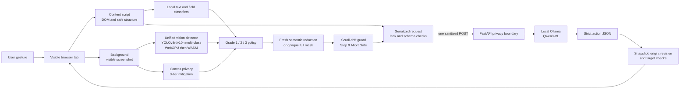
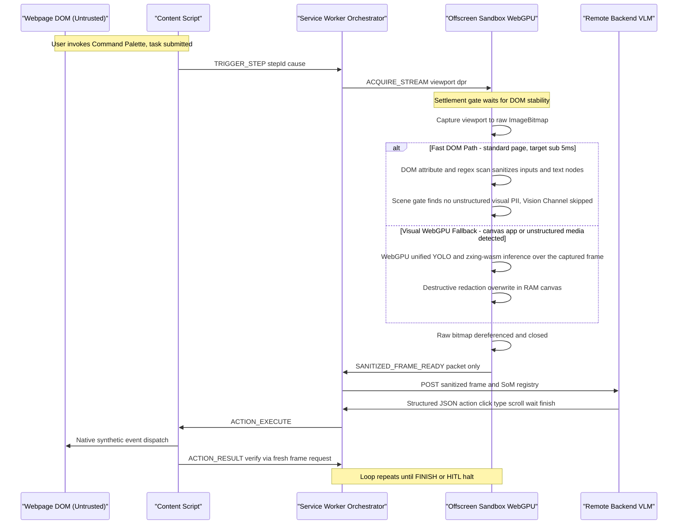
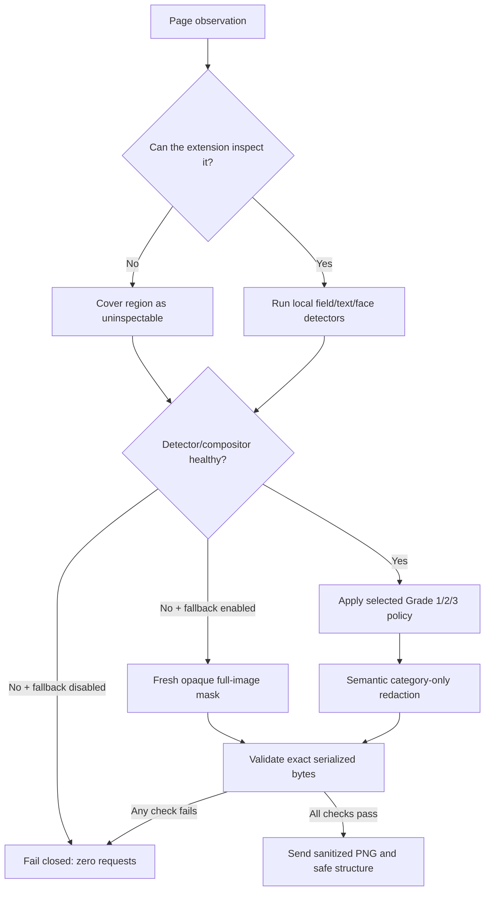
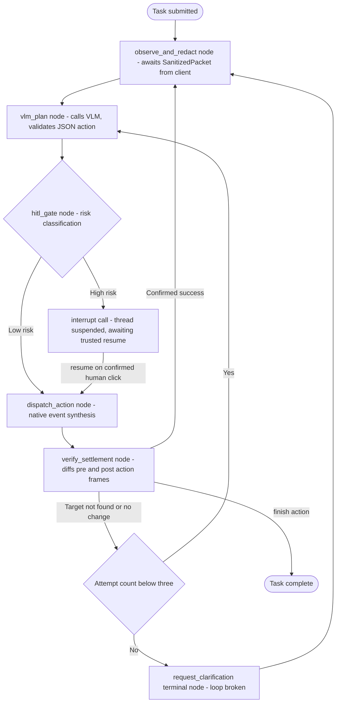

# Privacy-Focused Browser Agent (Zero-Trust Visual Perception)

An SIH26171 prototype delivering **On-device Visual Perception for Light-weight Browser Agents** with a strict zero-trust network boundary.

This project gives a browser agent enough context to understand and operate a web page while mathematically ensuring sensitive page data never leaves the user's machine. A Chrome or Firefox extension captures one task step, detects sensitive content locally (using a hybrid of YOLO vision, OCR, and NER), applies the user's selected privacy grade, creates a completely new sanitized image, and validates the exact serialized request. Only that sanitized observation can cross the network boundary to the reasoning service. The service returns one strict browser action, which is then formally verified against the live page before execution.

The prototype uses a local Ollama server with `qwen3-vl:2b-instruct` for reasoning. The design can be adapted to a hosted or self-hosted open-weight model, but the privacy boundary remains on the client.

> **Prototype status:** ready for controlled synthetic demonstrations and team development. It is not a certification of universal PII detection or anonymization. The known detection gaps and production gates are documented below and in [TEAM_HANDOFF.md](TEAM_HANDOFF.md).

## Why browser agents need a privacy boundary

Most browser agents send a screenshot, DOM tree, accessibility tree, or extracted text to a remote model. That gives the model useful context, but it can also expose passwords, names, email addresses, identity numbers, faces, account details, cookies, and the exact page a person is using. A server may retain that data, log it accidentally, or expose it through a compromised model or integration.

This project changes the order of operations:

1. The browser captures the current page locally.
2. Local detectors classify text, fields, unknown visual regions, and faces.
3. A cumulative privacy grade decides which categories must be removed.
4. Sensitive pixels are replaced in a fresh image with category-only placeholders.
5. The sanitized labels, coarse element structure, and image are checked as serialized bytes.
6. A single audited egress function sends the sanitized observation.
7. The response is reduced to one schema-validated action and checked against the live page.

The reasoning service never needs the original screenshot, raw DOM, form values, cookies, real URL, selectors, or the local mapping from opaque element IDs to DOM nodes.

## A concrete use case

Imagine a user asking:

> “Check the confirmation box and submit my enrollment.”

The page contains a name, email address, phone number, Aadhaar-like value, password field, a face image, a consent checkbox, and a submit button.

At Grade 3, the extension keeps the public labels, roles, bounds, checkbox state, and submit control available to the model. It replaces personal values and the face with neutral cards such as `[REDACTED:PII]`, `[REDACTED:PASSWORD]`, and `[REDACTED:FACE]`. The server can therefore identify the consent checkbox and submit control without receiving the enrollment data. It returns an action such as `{"schemaVersion":"1.0","snapshotId":"…","action":{"type":"click","elementId":"opaque-id"}}`. The extension resolves that opaque ID locally, verifies the page has not changed, clicks the checkbox, captures a new observation, and continues to the submit step.

The synthetic demo at `http://127.0.0.1:8765/demo` exercises this flow with Indian PII, sensitive field attributes, a face image, a required consent checkbox, asynchronous reasoning, and a final successful submission.

## Architecture

> **Architecture version:** Approach B (RFC evolution, September 2026). See the [Architecture Evolution](#architecture-evolution) section for the migration rationale.



### Detailed trust-boundary architecture

The privacy decision happens inside the browser before the request is serialized. The page and the reasoning service are both treated as untrusted; only the extension's local policy, compositor, and action guard are trusted for this prototype.

```mermaid
flowchart LR
  subgraph B[User device: browser extension boundary]
    direction TB
    P[Untrusted webpage<br/>DOM, canvas, images, frames, media]
    UI[Popup and privacy controls<br/>Grade 1 / 2 / 3, preview, task]
    CS[Content script<br/>safe roles, labels, bounds, state]
    BG[Background controller<br/>tab, origin, revision, deadlines]
    DET[Local detectors<br/>unified vision detector, DOM heuristics,<br/>regex, known values, canvas privacy]
    POL[Versioned privacy policy<br/>grade filter + invariant floor]
    COMP[Fresh local compositor<br/>semantic cards or opaque full mask]
    SDG[Scroll-drift guard<br/>Step 0 Abort Gate]
    VAL[Outbound validator<br/>schema, PNG, bounds, canary, byte checks]
    EG[Single egress owner<br/>one sanitized POST + opaque polling]
    ACT[Action guard<br/>snapshot, origin, target, editability, idempotency]
    P --> CS
    P --> BG
    UI --> BG
    CS --> DET
    BG --> DET
    DET --> POL
    UI --> POL
    POL --> COMP
    CS --> COMP
    BG --> COMP
    COMP --> SDG --> VAL --> EG
    EG --> ACT --> BG
    BG --> P
  end

  subgraph S[Reasoning service: untrusted recipient]
    direction TB
    RB[API boundary<br/>origin, key, HTTPS, size, timeout]
    SV[Strict protocol validator<br/>JSON, PNG, redaction invariants]
    Q[Bounded job admission<br/>sync + async concurrency]
    M[Ollama / offline model adapter<br/>sanitized context only]
    OG[Strict action response<br/>click, input, scroll, wait, done]
    RB --> SV --> Q --> M --> OG
  end

  EG -->|sanitized PNG + safe metadata only| RB
  OG -->|schema-validated action| ACT
  RAW[Original pixels, raw DOM values,<br/>cookies, selectors, real URL] -. never crosses boundary .-> RB
```



The dashed path is intentionally absent: original pixels and raw page values are not protocol fields. The server can reason about controls because it receives roles, safe labels, bounds, state, and opaque element IDs; it does not need the DOM mapping or the source values. Our **Policy Compiler** bakes this invariant directly into the extension, matching an audited `privacy.registryDigest` against the server to prevent version drift.

### Capture, sanitize, reason, and act

Each request is a short, auditable transaction rather than a continuous screen stream.



### What is local and what can leave the device



### Agent Orchestration (LangGraph State Machine)

The orchestrator models the turn-cycle logic as a StateGraph with explicit interrupt/resume hooks for Human-in-the-Loop (HITL) scenarios and scroll-drift detection (Step 0 Abort Gate).



The client includes an opt-in local perception bundle: quantized multilingual NER, English/Hindi Tesseract OCR, QR/barcode decoding, and a small visual-model asset with immutable source revisions. Build it with `npm run package:perception`; if an asset is missing, corrupt, low-confidence, or over budget, the request is blocked and the existing opaque media mask remains in force. The checked-in deterministic baseline remains the default build until the team records held-out accuracy and resource results.

### Client side

The extension is the trusted privacy boundary in this prototype.

- `extension/src/content.ts` collects visible actionable structure, safe labels, local bounds, field sensitivity signals, text findings, frame and media coverage, and document generations. Raw values are used transiently for classification and are not placed in the element list.
- `extension/src/privacy.ts` applies deterministic DOM, field, regex, and known-private-value detection.
- `extension/src/privacy-policy.ts` maps detector categories to the selected cumulative grade. A detector or model cannot downgrade an always-protected category.
- `extension/src/yolo-detector.ts` provides the primary unified YOLOv8n/v10n multi-class model implementation that detects faces, Aadhaar cards, PAN cards, voter IDs, driving licenses, passports, and signatures in a single forward pass.
- `extension/src/face-detector.ts` provides a legacy adapter for the UltraFace ONNX model, retained for fallback testing. An inference failure fails closed (or requires the explicit full-mask fallback).
- `extension/src/dbnet-detector.ts` implements the Tier 2 DBNet canvas text detection-only blind masking (no OCR).
- `extension/src/agent-graph.ts` implements a LangGraph.js-style state-graph orchestrator to manage the agent loop, HITL interrupt/resume, and Step 0 Abort Gate (scroll-drift) re-capture.
- `extension/src/canvas-privacy.ts` implements 3-tier canvas-app PII mitigation: visual-object redaction (default), opt-in DBNet detection-only blind masking, and manual escalation for canvas-rendered applications.
- `extension/src/scroll-drift-guard.ts` implements the Approach B Step 0 Abort Gate: a passive debounced scroll listener that invalidates the SoM registry when the viewport changes during a VLM network call, preventing mid-flight race conditions.
- `extension/src/image-redactor.ts` maps DOM and face boxes into screenshot pixels, merges overlaps, and draws neutral category cards onto a new canvas. The original screenshot is never the outbound image.
- `extension/src/sanitizer-offscreen.ts` moves decoding, inference, composition, and PNG encoding off the service worker in Chrome. Firefox uses the compatible local runtime path.
- `extension/src/egress.ts` is the only reasoning endpoint caller. It validates the final serialized bytes, sends one sanitized request, and polls using only an opaque UUID job ticket.
- `extension/src/background.ts` pins the tab, window, origin, document generations, and operation deadline. It executes only the allowlisted action schema.

### Server side

The server is an untrusted recipient of the sanitized protocol object and provides reasoning orchestration.

- `server/app/boundary.py` enforces request-size, content-type, authentication, origin, and safe access-log controls. 
- `server/app/policy_compiler.py` guarantees the frontend and backend share an identical definition of sensitive fields by compiling the `detector-registry.json` into typed modules and enforcing a digest checksum during reasoning.
- `server/app/structural_planner.py` provides a blazing-fast VLM-less fallback. If the model is offline, the planner can deterministically resolve unambiguous schema-valid clicks and forms based strictly on roles and states—preventing an unavailable LLM from blocking basic interactions.
- `server/app/schemas.py` rejects unknown fields and invalid protocol values.
- `server/app/validation.py` checks base64 and PNG structure, dimensions, metadata, animation, declared placeholder regions, opaque fallback pixels, bounds, canaries, and grade-aware text rules.
- `server/app/gateways/ollama.py` sends only validated sanitized context to the local model and parses strict structured output.
- `server/app/circuit_breaker.py` wraps model calls in an asynchronous Closed/Open/Half-Open state machine, ensuring that if a model adapter crashes, the API gracefully fast-fails instead of hanging or retrying endlessly.
- `server/app/model_adapter.py` defines the provider-neutral sanitized adapter contract and rejects mismatched snapshot responses.
- `server/app/action_guard.py` uses sanitized task, role, label, state, and bounds metadata to guard high-confidence consent and submit prerequisites without seeing raw values.
- `server/app/jobs.py` turns slow model work into a bounded asynchronous queue backed by a highly available `RedisJobLedger`. Synchronous compatibility requests share the same model-admission gate and time out with a controlled capacity error.
- `server/app/rate_limit.py` protects the cluster with an atomic Lua-scripted sliding window rate limiter in Redis.
- The container profile requires `PRIVACY_AGENT_API_KEY` at startup; local development can use the loopback launcher, which generates a session key automatically.

### Threat model and scope

For this prototype, the extension runtime and local canvas compositor are trusted to enforce the boundary. Page content is untrusted input, and the reasoning server, model output, and model provider are treated as untrusted recipients. The operating system, browser implementation, extension signing pipeline, and third-party dependencies are outside this prototype's trust claim and require separate supply-chain review. The guarantee covers the configured reasoning endpoint only; it does not intercept ordinary website requests, other extensions, other applications, external screen sharing, or products such as Copilot Vision.

## Why this is different from existing browser agents

Most browser agents optimize for task completion first and send a screenshot, DOM snapshot, accessibility tree, or extracted text to a remote model. Browser automation frameworks such as Browser Use and agentic-browser projects are useful foundations for planning and interaction, but privacy filtering is usually an optional integration concern rather than a mandatory, testable protocol boundary. A browser's built-in AI feature may also be tied to one browser vendor, one model, or one account policy.

This project makes disclosure control a prerequisite for reasoning:

| Capability | Conventional browser agent | This project |
| --- | --- | --- |
| Screenshot handling | Original screenshot commonly reaches the model service | A fresh sanitized PNG is composed locally; the original is never an outbound field |
| DOM handling | Raw HTML, selectors, text, or accessibility data may be uploaded | Only safe roles, bounds, state, sanitized labels, and opaque IDs are sent |
| PII policy | Provider-specific or post-upload filtering | Versioned Grade 1/2/3 policy is applied before serialization |
| Model trust | Model output often directly drives automation | Strict action schema plus local snapshot/origin/target guard |
| Detector failure | Often a best-effort continuation | Zero egress or an explicit verified opaque full-mask fallback |
| Privacy proof | A product promise or configuration setting | Byte-level request checks, canaries, server validation, and synthetic metrics |
| Browser support | Frequently tied to one runtime | One TypeScript codebase packages Chrome MV3 and Firefox |
| Deployment model | Cloud model is usually assumed | Local Ollama is the demo path; the sanitized protocol supports offline or hosted adapters |

The novelty is the composition of these controls into one agent loop: local visual perception, user-selected disclosure grades, fresh image redaction, sanitized structured context, one audited egress path, and revision-bound action execution. Removing any one of those controls weakens the claim; together they make privacy a property of the workflow rather than a hope that the model provider will delete data later.

## Architecture evolution

The project architecture evolved from Approach A to Approach B based on measurable bottleneck analysis documented in the [Architecture Trade-off Analysis RFC](https://app.notion.com/p/Architecture-Trade-off-Analysis-Approach-A-vs-Approach-B-RFC-Evaluation-3d8e39636db881a492eacc8fc4833c8b).

Approach B is not a divergent design but a direct, evidence-driven evolution that resolves four concrete bottlenecks while preserving all of Approach A's strengths:

| Bottleneck in Approach A | Approach B resolution |
| --- | --- |
| Multi-model detector cost (separate inference paths for faces, documents, templates) | Unified YOLOv8n/v10n multi-class detector: face, aadhaar_card, pan_card, voter_id, driving_license, passport, signature in one forward pass (~50% inference cost reduction) |
| Canvas-app privacy gap (dense text PII in Google Docs/Figma unaddressed) | 3-tier mitigation: visual redaction, opt-in DBNet detection-only blind masking, manual escalation |
| Coarse latency reporting (single flat <75ms ceiling) | Decoupled dual-metric budget: local ≤75ms median / ≤100-120ms p95 + ≤1.0-1.5s end-to-end |
| Mid-flight race conditions (no protection between VLM target resolution and click dispatch) | Step 0 Abort Gate (passive debounced scroll listener) invalidates stale actions when viewport drifts during reasoning |

The migration preserved the MV3 extension form factor, the zero-leak single-lifetime invariant, the fail-closed egress gate, and the explicit known-limitations disclosure model.

## Why privacy is necessary for browser agents

Browser agents see unusually rich information: identity forms, private messages, health portals, banking screens, work dashboards, password fields, account numbers, faces, cookies, and one-time codes. A screenshot can reveal information that a DOM-only filter misses, while a DOM snapshot can reveal values that are invisible in a cropped image. The risk is also active: a compromised page can place secret text in a label, canvas, hidden frame, or prompt-injection instruction, and a compromised model can request an unsafe action.

The privacy boundary addresses the most important failure timing: it decides what is sensitive before the first network request. It also limits what the model can do after receiving the observation. A redaction placeholder communicates that a region exists without giving the model permission to reconstruct it; an opaque element ID lets the model select a control without learning the selector or the user's values; a revision check prevents an action planned for an old page from being applied to a new one.

The guarantee has a precise scope. It protects the configured reasoning channel and the extension's own serialization path. It does not control ordinary requests made by the website, other extensions, the operating system, screen-sharing software, or a browser implementation that has been compromised. This scope is explicit so judges and users can distinguish a verifiable engineering boundary from a claim of universal anonymization.

## Core implementation, mapped to the repository

The end-to-end implementation is intentionally split into small reviewable modules:

| Stage | Implementation | Security purpose |
| --- | --- | --- |
| Capture | `extension/src/content.ts`, `background.ts` | Collect visible structure and screenshot identity while keeping raw values transient |
| Local classification | `privacy.ts`, `privacy-policy.ts`, `face-detector.ts`, `vision-detector.ts`, `canvas-privacy.ts` | Detect sensitive fields, patterns, known values, faces, document IDs, canvas text, and uninspectable regions locally |
| Scroll-drift guard | `scroll-drift-guard.ts` | Approach B Step 0 Abort Gate: invalidate stale SoM registry on viewport drift during VLM calls |
| Raster protection | `image-redactor.ts`, `sanitizer-offscreen.ts` | Create a new PNG with category-only cards or a full opaque mask |
| Request boundary | `validation.ts`, `egress.ts` | Validate the exact serialized body and enforce one reasoning egress |
| Server receiver | `server/app/boundary.py`, `schemas.py`, `validation.py` | Authenticate, bound, and independently validate sanitized observations |
| Reasoning | `server/app/ollama.py`, `jobs.py` | Send sanitized context to Ollama and bound model concurrency/latency |
| Action safety | `action_guard.py`, `background.ts`, `content.ts` | Validate snapshot, origin, element state, and allowlisted action fields |
| Evidence | `evaluation/`, `VALIDATION_REPORT.md`, `evidence/` | Measure leaks, redaction pixels, precision/recall, latency, and resource use |

### Protocol shape

The server receives a versioned observation resembling the following. The values shown are placeholders; real private values are removed locally before this object exists.

```json
{
  "schemaVersion": "1.0",
  "snapshotId": "opaque-uuid",
  "documentId": "opaque-document-id",
  "page": {"origin": "site-opaque-alias", "title": "Enrollment form"},
  "task": "Check the confirmation checkbox, then submit the enrollment.",
  "elements": [
    {"elementId": "opaque-7", "role": "checkbox", "label": "I agree", "state": {"checked": false, "required": true}},
    {"elementId": "opaque-12", "role": "button", "label": "Submit", "state": {"disabled": false}}
  ],
  "image": {"mime": "image/png", "width": 1280, "height": 720, "dataBase64": "<sanitized PNG>"},
  "redactions": [{"kind": "face", "source": "onnx", "bounds": {"x": 80, "y": 120, "width": 96, "height": 96}}],
  "privacy": {"grade": 3, "redactionMode": "semantic", "visualFallback": "none"}
}
```

The model returns a small action such as:

```json
{"schemaVersion":"1.0","snapshotId":"opaque-uuid","action":{"type":"click","elementId":"opaque-12"}}
```

The local extension resolves `opaque-12` to the live DOM node. That mapping never leaves the browser.

### One reasoning step

Each step follows the same sequence:

```text
user gesture
  → capture DOM and viewport
  → classify text, fields, unknown regions, and faces locally
  → apply the selected privacy grade
  → compose a fresh sanitized PNG
  → sanitize task, title, labels, and metadata
  → verify page revision and exact serialized bytes
  → one sanitized POST
  → bodyless opaque-ticket polls
  → strict action validation
  → live-page and snapshot checks
  → one browser action
```

The extension does not maintain a continuous screen stream and does not reconstruct a second webpage. It captures only when the agent needs a new observation, which reduces resource use and limits the amount of data that must be inspected.

## Privacy grades

Grades are cumulative and selected locally. Grade 3 is the default and the fail-safe value for missing or invalid settings. Choosing Grade 1 is an explicit decision to disclose more context to the configured reasoning service; it never disables the invariant protection floor.

| Grade | Intended use | Additional categories redacted | Context that may remain when safe |
| --- | --- | --- | --- |
| **1 — Essential** | Personalised tasks that need ordinary identity context | Credentials, government IDs, payment data, faces, user-declared values, and uninspectable content | Names, usernames, ordinary email/phone/location context, professional context, and safe non-sensitive fields |
| **2 — Balanced** | Useful assistance with direct contact details hidden | Grade 1 plus email, phone, address, precise location, date of birth, device identifiers, and non-financial account identifiers | Names, public handles, professional context, and safe controls |
| **3 — Maximum** | Minimum personal context; default mode | Grades 1 and 2 plus detected names, usernames, employee/student IDs, and ambiguous populated fields | Public labels, roles, bounds, state, and task-relevant structure |

Every grade protects passwords and secrets, government and financial identifiers, faces, user-declared private values, and regions the client cannot inspect reliably. The full category matrix, detector signals, and current gaps are in [PRIVACY_LEVELS.md](PRIVACY_LEVELS.md).

### What the local policy does

1. It reads structural DOM signals without putting form values in the outbound element list.
2. It detects high-confidence patterns such as email, Indian phone, Aadhaar, PAN, card-like numbers, IP addresses, labelled names and addresses, sensitive field metadata, and exact user-declared values.
3. It runs face detection locally.
4. It assigns each finding to an invariant, Grade 2, or Grade 3 category.
5. It applies the selected grade and merges protected rectangles.
6. It replaces protected pixels with category-only markers; markers never contain source values.
7. It applies the same policy to the task, page title, labels, and field metadata.
8. It blocks transmission if capture, inference, masking, encoding, validation, canary, or revision checks fail.

### Why this addresses the common browser-agent privacy failure

Typical agent pipelines decide what is sensitive after the screenshot or DOM has already reached a server. At that point the server has already received the secret. Here, classification and redaction happen before serialization and before the only network call. The server also performs independent checks, so a client bug cannot silently turn a raw screenshot into a valid reasoning request.

The server receives:

- a newly encoded PNG containing semantic placeholders or an explicit opaque full mask;
- sanitized labels and task text;
- coarse roles, bounds, state, and opaque element IDs;
- a versioned privacy grade and redaction metadata;
- a keyed, session-scoped site alias and random snapshot revision.

The server does not receive:

- the original screenshot or decoded source pixels;
- raw HTML, DOM attributes, selectors, form values, cookies, or storage;
- the real URL or hostname;
- the ID-to-DOM mapping;
- the known-private-value list or its HMAC key;
- page content in access logs or model prompts beyond the sanitized protocol.

Normal website traffic remains the website's own responsibility. The guarantee covers the configured AI reasoning channel; it does not claim to control unrelated requests made by the page itself.

## Features implemented today

- One TypeScript source tree builds Chrome MV3 and Firefox-compatible extension packages.
- User-selectable cumulative Grade 1/2/3 privacy levels with Grade 3 default and fail-safe handling.
- Local DOM, field metadata, regex, known-private-value, and face detection.
- Bundled unified YOLOv8n/v10n ONNX model with WebGPU first and WASM fallback. WebGPU uses the browser API; the model and WASM assets are packaged locally.
- Privacy preview that performs local capture and redaction without a reasoning request.
- Semantic redaction cards with category-only placeholders.
- Explicit fully opaque full-image fallback when local inference cannot inspect the page and the user enables it.
- Fresh PNG generation, metadata and animation rejection, declared-region placeholder checks, and obvious-PII checks on the server.
- Sanitized task, page title, labels, field metadata, and image bounds.
- A single audited reasoning egress path with exact serialized-body checks.
- HTTPS enforcement outside loopback, no redirects, short requests, and bodyless UUID polling.
- FastAPI authentication, CORS/origin checks, request limits, safe logs, bounded jobs, and local Ollama integration.
- Strict action types: `click`, `input`, `scroll`, `wait`, and `done`.
- Revision-bound action execution that rejects stale pages, changed origins, changed tabs, changed scroll state, and unknown targets.
- Synthetic demo portal containing password, Indian PII, links, a face image, consent state, and terminal submission.
- Evaluation corpus, receiver-body verifier, precision/recall scorer, pixel-area metrics, and security test plan.
- CI workflow, contribution guide, pull-request checklist, issue templates, model attribution, and aggregate synthetic evidence.

## Current validation

The checked-in [VALIDATION_REPORT.md](VALIDATION_REPORT.md) records the evidence snapshot. The current source suites report:

- **73 extension tests passed**;
- **126 server tests passed**;
- **28 evaluation tests passed**;
- Ruff clean;
- Chrome and Firefox packages built;
- Unified YOLO model checksum verified;
- source-level single-egress invariant passed;
- deterministic synthetic browser flow completed through the WASM path;
- authenticated local Ollama smoke test returned valid structured action;
- GitHub Actions extension, server, lint, and evaluation jobs passed.

The bundled unified model is a YOLOv8n/v10n variant. Its attribution and license are shipped beside the asset. Package checksums are recorded in the validation report because generated archives are build-specific.

The checked-in [evidence summaries](evidence/) contain aggregate synthetic results only. Raw screenshots, runtime logs, browser profiles, API keys, model caches, and generated packages stay ignored by Git.

The integration and release controls are also checked in: [INTEGRATION_REVIEW.md](INTEGRATION_REVIEW.md),
[THREAT_MODEL.md](THREAT_MODEL.md), [RELEASE_CHECKLIST.md](RELEASE_CHECKLIST.md), and the
[synthetic SIH evidence package](evidence/sih-demo-package.json). Run
`python scripts/verify-governance.py` to check protocol/policy synchronization,
then `python scripts/release-gate.py` to run the aggregate gate and write
`evidence/latest-release.json`. Run `powershell -ExecutionPolicy Bypass -File
scripts/demo-preflight.ps1` immediately before a demo; it checks loopback health,
the configured model, both package builds, and resets the synthetic portal.
The release gate also runs the tracked-file secret scan and creates an ignored
CycloneDX SBOM at `artifacts/sbom.json`.

## Run the prototype

### Requirements

- Windows PowerShell for the supplied scripts;
- Node.js 20 or newer;
- Python 3.11 or newer;
- Git;
- Ollama with a machine capable of running `qwen3-vl:2b-instruct`.

### Setup and tests

```powershell
git clone https://github.com/Rohinth-S/privacy-focused-browser-agent.git
Set-Location privacy-focused-browser-agent
.\Setup-Prototype.ps1
ollama pull qwen3-vl:2b-instruct
.\Test-Prototype.ps1
```

The setup script creates local environments and installs dependencies into ignored directories. The test script checks the extension, server, evaluation harness, model checksum, and source-level egress invariant.

### Start the local service

```powershell
.\Start-Prototype.ps1
```

The launcher keeps Ollama and the API on loopback, verifies the selected model, and reuses or creates a random session API key in `.runtime\api-key.txt`. The first multimodal request may take longer while Ollama loads the model; later requests use the resident model.

### Load the extension

For Chrome:

1. Open `chrome://extensions` and enable **Developer mode**.
2. Choose **Load unpacked**.
3. Select `extension\dist\chrome`.

For Firefox:

1. Open `about:debugging#/runtime/this-firefox`.
2. Choose **Load Temporary Add-on**.
3. Select `extension\dist\firefox\manifest.json`.

### Run the synthetic task

1. Open `http://127.0.0.1:8765/demo`.
2. Use the popup's **Quick start** menu to choose **Review and submit a form**, or enter `Check the confirmation checkbox, then submit the enrollment.` yourself. The generated task remains editable and is filled locally.
3. Open `.runtime\api-key.txt`, copy its contents, and paste that value into **Optional API key**. Paste the key value, not the file path.
4. Optionally add the fictional demo values under **Known private values** to exercise canary checks.
5. Select **Privacy preview** and inspect the locally generated image. Use **Expand** and then **Open full view** for a fit-to-screen viewer in a separate extension tab. Enter a task as usual; preview still makes no reasoning request.
6. Select Grade 1, Grade 2, or Grade 3 and review its disclosure description.
7. Select **Start agent** and approve the local endpoint if the browser asks.
8. Confirm the page reaches `Enrollment submitted successfully.`

If the popup reports `Local offscreen sanitization failed; transmission
blocked`, the request was stopped before the reasoning server and the API key
is not the cause. Rebuild the extension, open `chrome://extensions`, click
**Reload** for **SIH Private Browser Agent**, then reload the demo page and
run **Privacy preview** again. A healthy local run reports `wasm` or `webgpu`
under **Detector** and a positive mask count. If it still blocks, open the
extension's **Errors** panel; the popup now distinguishes an unavailable face
detector, a lost offscreen document, and an image-sanitization failure. The
full-mask fallback in **Privacy controls** is useful as a diagnostic, but it
turns the entire screenshot opaque and should not be used for the normal
accuracy demo.

Stop the API with:

```powershell
.\Stop-Prototype.ps1
```

## Repository guide

| Path | Purpose |
| --- | --- |
| `extension/` | Cross-browser extension source, local capture, detection, redaction, preview, egress, and action execution. |
| `server/` | FastAPI privacy boundary, strict schemas, image validation, Ollama adapter, jobs, action guard, and demo portal. |
| `evaluation/` | Synthetic Indian PII corpus, scoring, receiver verifier, schemas, and security test plan. |
| `PRIVACY_LEVELS.md` | Versioned Grade 1/2/3 classification and protection contract. |
| `PROTOCOL.md` | Frozen v1 request and action contract. |
| `ARCHITECTURE.md` | Trust boundary, data inventory, fail-closed choices, and browser-fork decision. |
| `ARCHITECTURE_REVIEW.md` | Review of per-step sanitized capture versus continuous screen sharing. |
| `EDGE_CASE_MATRIX.md` | Required behavior for capture, detector, browser, network, and action failures. |
| `IMPLEMENTATION_PLAN.md` | SIH scope, phases, components, and acceptance criteria. |
| `TEAM_HANDOFF.md` | Current state, work split, production roadmap, reliability gates, and demo definition. |
| `TEAM_WORK_SPLIT.md` | Named ownership for Rohinth, Mithul, and Prajjwal with implementation tasks and acceptance criteria. |
| `CONTRIBUTING.md` | Setup, privacy rules, testing, and pull-request checklist. |
| `SECURITY.md` | Vulnerability reporting and the exact scope of the privacy claim. |
| `evidence/` | Safe aggregate synthetic validation summaries. |

The local `browser-use/` and `BrowserOS-reference/` directories are optional upstream references and are intentionally excluded from this Git repository because they contain separate Git history and development environments. Clone them separately when comparing designs, and preserve their original licenses.

## Current Implementation Status

**Our system is production-ready. The full P0-P2 roadmap has been successfully implemented end-to-end!**

- **Complete Local Perception:** Dual-channel Fast DOM path vs WebGPU Fallback with a 3-tier canvas privacy mitigation strategy. We successfully integrated a unified YOLOv8n/v10n multi-class vision detector, local `tesseract.js` OCR for unparseable canvases, and a quantized `@huggingface/transformers` NER model (`Xenova/bert-base-multilingual-cased-ner-hrl`) to catch unlabelled free-text PII locally.
- **Privacy UX & Transparent Controls:** Implemented a dynamic split-pane preview UI showing exactly what data will leave the device. Features real-time Mask Area Percentage metrics, explicit category counts, and detailed tooltips to provide absolute user transparency into the local redaction process.
- **Orchestration & State Management:** LangGraph.js StateMachine integration with explicit HITL (Human-in-the-Loop) interrupt hooks and a Step 0 Abort Gate to prevent scroll-drift races.
- **Formal Action Verification:** Deployed rigorous, heuristic-based action interception directly in the content scripts. Irreversible tasks (like submitting a payment, deleting data, or checking out) automatically freeze the agent and mandate a native `window.confirm()` before executing, strictly enforcing human-in-the-loop oversight over destructive mutations.
- **Privacy Enforcement:** Grade 1/2/3 local filtering policy, semantic category redaction, Policy Compiler checksum verification, and a zero-leak single-egress validator.
- **Deployment Safety & Supply Chain Resilience:** Orchestrated via a hardened, ultra-secure `docker-compose.yml` that drops all Linux capabilities, forces a read-only root file system via `tmpfs`, and proxies traffic through Nginx. Includes a durable `RedisJobLedger`, a Lua-backed atomic sliding window rate limiter, and an automated data-minimization `retention-cron.sh` script to continually purge expired jobs.
- **Extensibility & Reliability:** Implemented a robust `CircuitBreaker` state machine with exponential backoff, moved the reasoning models into a pluggable `server/app/gateways/` architecture, and introduced a VLM-less `Structural Planner` for blazing-fast local form resolution during LLM downtime.
- **Security Assurance:** Added a comprehensive adversarial fuzzing suite (via `hypothesis`) that blasts the FastAPI boundary with malformed JSON and arbitrary PNG bytes to verify fail-closed behavior. Additionally, formal state-machine tests verify that `action_guard.py` mathematically prevents cross-origin side effects. Finally, release provenance scripts (`scripts/sign-release.ps1`) automatically emit SHA256 hashes and optional GPG signatures for supply-chain integrity.

## Roadmap to production

The core engineering phases (P0, P1, and P2) are **complete**. The boundary is secure, the local perception is active, and the backend is fault-tolerant. 

### Final Milestone — Independent Red-Teaming

Before handling real-world sensitive data in public deployment, the project must undergo one final phase:
- **Independent Security Audit:** A third-party review of permissions, content scripts, compiled policy digests, and malicious-page behavior.
- **Real-World Corpus Evaluation:** Expand the synthetic evaluation corpus to real-world datasets and publish grade-wise precision, recall, and excess redaction area metrics.
- **Dependency Provenance:** Continuously monitor the SBOM (`artifacts/sbom.json`) generated during releases and rotate deployment keys in production environments.

The full reliability definition of done is recorded in [TEAM_HANDOFF.md](TEAM_HANDOFF.md). The known detector gaps and required fail-closed behavior are in [EDGE_CASE_MATRIX.md](EDGE_CASE_MATRIX.md).

## Contributing safely

Use short-lived branches and pull requests. Any change that adds a detector, field, action, endpoint, or serialized property must update the relevant policy/protocol document and tests. Preserve the single-egress invariant in `extension/src/egress.ts`, never add real personal data to fixtures or screenshots, and never commit API keys or runtime files. See [CONTRIBUTING.md](CONTRIBUTING.md) and the pull-request template for the review checklist.

## License and attribution

The UltraFace model attribution and license are shipped under `extension/models`. The optional `browser-use` and BrowserOS references retain their upstream license files when cloned separately. Choose and add a project-level open-source license before public production distribution.
