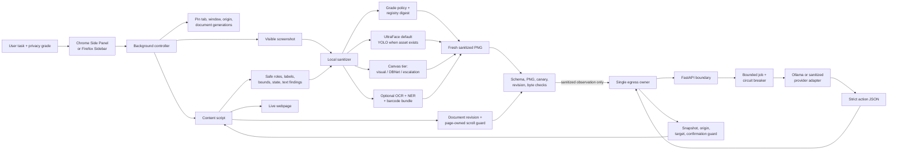

# Privacy-Focused Browser Agent (SIH26171)

### On-Device Visual Perception & Zero-Trust Privacy Boundary for Lightweight Web Agents

[](PRIVACY_LEVELS.md)
[](PROTOCOL.md)
[](docs/security/01-privacy-and-security-model.md)
[](docs/client/01-extension-and-ui.md)
[](docs/server/01-reasoning-service.md)

---

## 📌 Executive Summary & Core Paradigm

This repository is the SIH26171 prototype for **On-device Visual Perception for Light-weight Browser Agents**. It combines a cross-browser extension, local privacy enforcement, a sanitized reasoning protocol, and a bounded action executor.

The central design rule is simple:

> **The browser must decide what the reasoning service is allowed to see before any reasoning request is serialized or sent.**

The extension captures the visible page locally, combines DOM and visual signals, applies a user-selected privacy grade, creates a new sanitized image, validates the exact outbound bytes, and sends only the sanitized observation. The reasoning service returns one strict action. The extension then verifies that action against the live page before it executes.

This reverses the conventional browser-agent paradigm. Standard web agents send screenshots, DOM snapshots, accessibility trees, or extracted text first and attempt to mask them post-hoc. This project makes disclosure control a prerequisite for reasoning.

> **Current status:** Controlled synthetic prototype ready for team development and SIH demonstrations. The normal package uses the checked-in UltraFace face detector with WebGPU/WASM fallback; OCR/NER/barcode perception is disabled unless a separately evaluated, checksum-locked admission bundle is built. Person images are fully masked, explicitly classified public objects are preserved, and unknown or low-confidence media remains fail-closed.

---

## 💡 Why This Project Stands Out

The project is not simply a browser agent with a privacy toggle. Privacy is enforced as a sequence of 10 independently testable boundaries:

1. **Local capture:** The page is observed inside the browser sandbox.
2. **Local classification:** DOM metadata, fields, text patterns, known-private values, faces, and explicitly admitted local perception are classified before egress.
3. **User-controlled disclosure:** Grade 1, Grade 2, or Grade 3 determines which categories may remain.
4. **Fresh redaction:** Sensitive regions are replaced on a fresh canvas; the original screenshot is never used as the outbound image.
5. **Byte-level validation:** Serialized JSON and PNG are checked for schema violations, unsafe values, canaries, invalid bounds, metadata, missing masks, and a final local DLP scan over task text, labels, and metadata.
6. **One egress owner:** `extension/src/egress.ts` is the only reasoning `fetch` owner in the codebase.
7. **Sanitized reasoning:** The server receives only the versioned sanitized observation.
8. **Strict action output:** The model cannot return arbitrary JavaScript, selectors, URLs, or keyboard injection.
9. **Live-page verification:** Snapshot, document, viewport, origin, target, editability, and duplicate-action checks run again before execution.
10. **Human confirmation:** Destructive clicks such as submit, delete, pay, or navigation pause for an in-page review card.

---

## 🏗️ High-Level System Architecture


```mermaid
flowchart LR
    U[User task + privacy grade] --> UI[Chrome Side Panel<br/>or Firefox Sidebar]
    UI --> BG[Background controller]
    BG --> PIN[Pin tab, window, origin,<br/>document generations]
    BG --> CS[Content script]
    BG --> CAP[Visible screenshot]
    CS --> DOM[Safe roles, labels,<br/>bounds, state, text findings]
    CS --> REV[Document revision +<br/>page-owned scroll guard]
    CAP --> LOCAL[Local sanitizer]
    DOM --> LOCAL
    LOCAL --> POL[Grade policy +<br/>registry digest]
    LOCAL --> DET[UltraFace default<br/>YOLO when asset exists]
    LOCAL --> CAN[Canvas tier:<br/>visual / DBNet / escalation]
    LOCAL --> PER[Optional OCR + NER<br/>+ barcode bundle]
    POL --> RED[Fresh sanitized PNG]
    DET --> RED
    CAN --> RED
    PER --> RED
    RED --> VAL[Schema, PNG, canary,<br/>revision, byte checks]
    REV --> VAL
    VAL -->|sanitized observation only| EG[Single egress owner]
    EG --> API[FastAPI boundary]
    API --> JOB[Bounded job +<br/>circuit breaker]
    JOB --> MODEL[Ollama or sanitized<br/>provider adapter]
    MODEL --> ACTION[Strict action JSON]
    ACTION --> EG
    EG --> GUARD[Snapshot, origin,<br/>target, confirmation guard]
    GUARD --> CS
    CS --> PAGE[Live webpage]
```

---

## ⚡ 3-Minute Quickstart

### 1. System Requirements
- Windows PowerShell / Linux Shell
- Node.js 20+ & Python 3.11+
- [Ollama](https://ollama.ai) with `qwen3-vl:2b-instruct` model pulled

### 2. Setup & Execution
```powershell
# Clone and setup environment
git clone https://github.com/Rohinth-S/privacy-focused-browser-agent.git
cd privacy-focused-browser-agent
.\Setup-Prototype.ps1

# Pull required reasoning model
ollama pull qwen3-vl:2b-instruct

# Run unit & contract checks
.\Test-Prototype.ps1

# Launch prototype local server & Ollama launcher
.\Start-Prototype.ps1
```

### 3. Load Browser Extension
1. Build packages: `cd extension; npm run package; cd ..`
2. Open Chrome at `chrome://extensions` -> **Developer mode** -> **Load unpacked** -> select `extension/dist/chrome`.
3. Open `http://127.0.0.1:8765/demo` in browser to run the synthetic SIH portal demo.

---

## 🎯 Implementation Capabilities Matrix

| Capability | Default development package | Optional or deployment-gated capability |
| --- | --- | --- |
| Browser targets | Chrome MV3 and Firefox package from one TypeScript source tree | Live Firefox matrix evidence is still required |
| User interface | Chrome Side Panel, Firefox Sidebar, popup controller, activity log, preview modal, full-view preview tab | Per-site policy simulation and richer trace export remain future work |
| Local page capture | Visible PNG plus safe DOM/role/label/bounds/state capsule | Accessibility-tree fusion beyond the current safe capsule remains future work |
| Privacy grades | Grade 1 Essential, Grade 2 Balanced, Grade 3 Strict default | Additional user-defined categories require registry and protocol review |
| Face detection | Checked-in UltraFace ONNX, WebGPU first, WASM fallback | None for the default face path |
| Document visual detection | Implementation present but no `yolo-privacy-v1.onnx` is checked in | Unified YOLOv8n/v10n asset, checksum, license, and held-out evaluation |
| Canvas text detection | DBNet implementation and three-tier policy contract | `dbnet-text-det.onnx` asset and explicit production wiring |
| Credential OCR for image fixtures | Locked local English Tesseract asset redacts PAN/payment-card and Aadhaar-style PII lines | Larger document set, multilingual OCR, and held-out precision/recall evidence |
| OCR/NER/barcodes perception bundle | Local runtime and orchestration implemented behind an evaluation admission gate | `LOCAL_PERCEPTION_EVALUATED=1 npm run package:perception`, locked assets, browser/resource measurements |
| High-assurance mode | User-selectable structure-only transmission: sanitized DOM plus a fully opaque black PNG | Browser/device coverage and independent review |
| Outbound privacy receipt | Local aggregate receipt with grade, detector, redaction categories, masked area, sanitized hash | Long-term receipt export and independent review |
| Reasoning | Local Ollama, normally `qwen3-vl:2b-instruct` | Provider-neutral hosted or air-gapped sanitized adapter |
| Agent controller | LangGraph.js StateGraph with bounded callbacks plus bounded FastAPI jobs | Durable checkpointer-backed resume and distributed graph execution |
| Browser actions | `click`, `input`, `scroll`, `wait`, `done`, `hover`, `focus`, `doubleClick`, `check`, `uncheck`, `select` | Privileged navigation/download/upload actions remain outside safe broker |
| Queue | Development in-memory jobs; optional metadata-only SQLite | Production Redis ledger and shared rate limiter |

---

## 🧪 The Concrete SIH Demonstration

The synthetic portal at `http://127.0.0.1:8765/demo` contains synthetic employee profiles, Aadhaar/PAN card SVG fixtures, responsive portrait overlays, credit card fixtures, password fields, and a submit confirmation checkbox.

The demonstration task is:
```text
Check the confirmation checkbox, then submit the enrollment.
```

At **Grade 3**, the reasoning server sees public page structure, safe element labels, roles, bounds, and interactive controls, while all personal data, faces, passwords, and uninspectable media are redacted locally on a fresh canvas.

---

## 📚 Repository Documentation Sitemap

For comprehensive technical specifications, module guides, and operational runbooks, explore the organized documentation subdirectories below:

| Documentation Module | Contents & Direct Links |
| --- | --- |
| 🏛️ **System Architecture** | [Architecture & Design Specification](docs/architecture/01-system-architecture.md)<br/>• Technical Modules Flowchart & Clickable Code Map<br/>• Trust Boundary Model & Device/Service Segregation<br/>• 4-Layer System View & Sequence Diagram<br/>• Privacy Decision Ladder & Approach A vs. B Evolution |
| 🧩 **Client Extension** | [Extension Architecture & UI Guide](docs/client/01-extension-and-ui.md)<br/>• Build Targets, MV3/MV2 Packaging & Manifests<br/>• Side Panel / Sidebar UI Controls & State Machine<br/>• Page Capture, DOM Capsule & Scroll-Drift Guard<br/>• Supported Actions Matrix & Destructive Click Confirmation<br/><br/>[Local Perception & Redaction Engine](docs/client/02-local-perception-and-redaction.md)<br/>• Local Privacy Policy & Grade 1 / 2 / 3 Matrix<br/>• UltraFace & Unified YOLO Local Detection<br/>• Image Redactor & High-Assurance Opaque Mode<br/>• Canvas 3-Tier Strategy & Credential OCR / NER Bundle |
| ⚙️ **Reasoning Service** | [Reasoning Service & FastAPI Server](docs/server/01-reasoning-service.md)<br/>• HTTP Routes API Specification<br/>• Boundary Defense, Schemas & Validation Rules<br/>• Configuration Profiles (Development vs. Production)<br/>• Ollama & Provider-Neutral Gateway Adapters<br/>• Jobs Queue, SQLite Ledger, Rate Limiter & Circuit Breaker<br/>• Docker Compose Hardened Container Baseline |
| 🛡️ **Privacy & Security** | [Privacy Model & Single Egress Invariant](docs/security/01-privacy-and-security-model.md)<br/>• Single Egress Invariant (`egress.ts` Owner)<br/>• Versioned Wire Protocol v1 JSON Schemas<br/>• Security Model, Local Data Inventories & Engineering Rules |
| 📊 **Evaluation & Evidence** | [Evaluation, Benchmarks & Evidence](docs/evaluation/01-evaluation-and-evidence.md)<br/>• Validation Scorecard & Test Suite Totals<br/>• Evidence Files Inventory & Browser Smoke Matrix<br/>• Remaining Production Gates & Verification Scripts |
| 📖 **Guides & Runbooks** | [Setup, Operations & Development Runbook](docs/guides/01-setup-and-runbook.md)<br/>• Detailed Installation & System Requirements<br/>• Launcher Scripts (`Start-Prototype.ps1`, `Stop-Prototype.ps1`)<br/>• Extension Packaging & Browser Sideloading Guide<br/>• Synthetic SIH Demo Walkthrough & Developer Commands Index |
| 📜 **Core Contracts** | • [PROTOCOL.md](PROTOCOL.md) - Frozen Wire Protocol Contract<br/>• [PRIVACY_LEVELS.md](PRIVACY_LEVELS.md) - Grade 1/2/3 Policy Matrix<br/>• [ARCHITECTURE.md](ARCHITECTURE.md) - Core Architecture Record<br/>• [THREAT_MODEL.md](THREAT_MODEL.md) - Security Threat Model<br/>• [EDGE_CASE_MATRIX.md](EDGE_CASE_MATRIX.md) - Edge Cases & Failures<br/>• [SECURITY.md](SECURITY.md) - Vulnerability Disclosure & Policy |

---

## 📜 License and Attribution

The UltraFace attribution and license are shipped under `extension/models`. The optional `browser-use/` and BrowserOS references retain their upstream license files when cloned separately. Choose and add a project-level open-source license before public production distribution.
