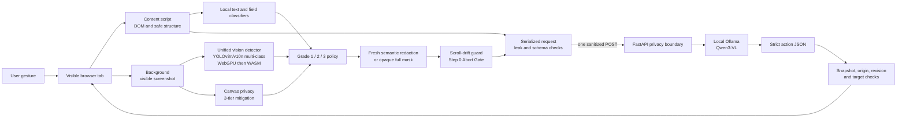

# Team handoff: Privacy Focused Browser Agent

**Repository purpose:** SIH26171, *On-device Visual Perception for Light-weight Browser Agents*.

**Status:** working hackathon prototype, ready for team development and a controlled synthetic demo.

**Primary path:** a cross-browser extension plus a strict reasoning service. The project does not require a custom browser fork. A browser fork would add a Chromium maintenance and distribution burden without improving the privacy boundary that the problem statement evaluates.

This document is the shared starting point for the team. It records what is implemented, what has evidence behind it, what the repository deliberately does not claim, and the order in which production hardening should happen.

## 1. What is in this repository

| Path | Current role |
| --- | --- |
| `extension/` | TypeScript source compiled into Chrome MV3 and Firefox-compatible packages. Captures the active tab after a user gesture, builds a safe DOM capsule, runs local face inference, applies the selected privacy grade, composes a fresh redacted PNG, validates the serialized request, polls the reasoning job, and executes revision-bound actions. |
| `server/` | FastAPI receiver and synthetic demo portal. It authenticates and bounds requests, validates the strict protocol and PNG, performs defense-in-depth checks, invokes local Ollama, validates model actions, and exposes a bounded asynchronous job queue. |
| `evaluation/` | Synthetic Indian-PII corpus, schema files, precision/recall and pixel-area scorer, exact receiver-body verifier, and security test plan. |
| `PRIVACY_LEVELS.md` | The versioned Grade 1/2/3 policy and category matrix. This is the policy contract to use when adding detectors. |
| `PROTOCOL.md` | The frozen v1.0 wire contract. Keep this synchronized with `extension/src/types.ts` and `server/app/schemas.py`. |
| `ARCHITECTURE.md` | Detailed trust boundary, data flow, fail-closed decisions, and browser-fork decision. |
| `ARCHITECTURE_REVIEW.md` | Review of per-step sanitized capture versus continuous/external screen sharing. |
| `EDGE_CASE_MATRIX.md` | Required behavior for capture, redaction, model, browser, network, and action failures. |
| `IMPLEMENTATION_PLAN.md` | Original SIH scope and acceptance criteria. |
| `README.md` | Quick start and demo instructions. |
| `CONTRIBUTING.md` | Team setup, change discipline, test commands, and review checklist. |
| `TEAM_WORK_SPLIT.md` | Named ownership for Rohinth, Mithul, and Prajjwal with detailed task packages and acceptance criteria. |


The local `browser-use/` checkout is an experimental comparison baseline and `BrowserOS-reference/` is an upstream design reference. They are intentionally excluded from this repository because they contain nested Git history and large development environments; the primary implementation above is self-contained. If needed, clone [browser-use](https://github.com/browser-use/browser-use) and [BrowserOS](https://github.com/browseros-ai/BrowserOS) separately and preserve their original licenses.

Generated state is also excluded: `.runtime/` contains API keys, browser profiles, logs, temporary extension copies, and model/runtime caches; `.tools/` contains downloaded tools; `artifacts/` contains locally generated packages, screenshots, and run results. Never force-add any of those directories.

## 2. Architecture and trust boundary



The extension is the trusted privacy boundary for this prototype. The service is treated as an untrusted recipient: it must be able to reason using only a sanitized PNG, coarse element metadata, typed placeholders, an opaque site alias, and an opaque snapshot revision. The following remain local and are never part of the reasoning payload:

- original screenshot and decoded pixels;
- raw HTML, DOM attributes, form values, cookies, storage, selectors, and accessibility text that was not sanitized;
- the real page URL/hostname and the ID-to-DOM map;
- the user's known-private-value list and the HMAC key used to derive the site alias.

The loop is deliberately step based: capture → local detection → grade policy → redaction → fresh PNG → serialized-body checks → sanitized request → structured action → live-page checks. It does not run a continuous screen stream, and it does not reconstruct a second webpage.

### Client modules

- `extension/src/content.ts` collects visible interactive structure, text findings, field metadata, frame/media coverage, document revision, and local element IDs. Values are used transiently for classification and are not placed in the element list. Also implements irreversible action interception and `window.confirm()` user verification.
- `extension/src/privacy.ts` contains deterministic high-confidence patterns, field classification, grade-aware text replacement, known-private matching, and conservative bounds handling.
- `extension/src/privacy-policy.ts` is the cumulative policy table. A finding's category threshold is compared with the selected grade; unknown categories fail closed at Grade 3.
- `extension/src/yolo-detector.ts` provides the primary unified YOLOv8n/v10n multi-class model implementation that detects faces and official documents.
- `extension/src/scroll-drift-guard.ts` implements the Step 0 Abort Gate, invalidating stale SoM registry on viewport drift.
- `extension/src/canvas-privacy.ts` implements 3-tier canvas-app PII mitigation.
- `extension/src/image-redactor.ts` maps DOM/face boxes into screenshot pixels, draws category-only placeholders onto a new canvas, and computes privacy UX metrics (mask area % and category counts). The original image is never the outbound image.
- `extension/src/sanitizer-offscreen.ts` keeps Chrome decoding, inference, composition, and PNG encoding out of the service worker. Firefox uses the direct local runtime path.
- `extension/src/egress.ts` is the only reasoning endpoint caller. It checks the final serialized bytes, sends one sanitized POST, and polls with only an opaque UUID job ID.
- `extension/src/background.ts` pins the tab/window/origin and document generations, bounds the operation time, validates the response, and executes only the allowlisted action types.

### Server modules

- `server/app/boundary.py` applies request-size, content-type, authentication, origin, security-header, and safe-access-log controls.
- `server/app/schemas.py` rejects unknown fields and invalid protocol values.
- `server/app/validation.py` checks IDs, bounds, limits, PNG structure, metadata, semantic placeholder pixels, opaque fallback pixels, canary-sensitive text, and the selected grade.
- `server/app/policy_compiler.py` guarantees the frontend and backend share an identical definition of sensitive fields by compiling the `detector-registry.json` into typed modules and enforcing a digest checksum during reasoning.
- `server/app/structural_planner.py` provides a blazing-fast VLM-less fallback to deterministically resolve unambiguous schema-valid clicks and forms when the VLM is down.
- `server/app/circuit_breaker.py` wraps model calls in an asynchronous Closed/Open/Half-Open state machine to prevent hanging operations.
- `server/app/ollama.py` sends only validated sanitized context to the configured local model and parses strict structured output.
- `server/app/action_guard.py` applies a narrow structural guard for high-confidence consent/submit prerequisites without seeing raw values.
- `server/app/jobs.py` turns slow model work into a bounded asynchronous queue. For production deployment, it utilizes a highly available `RedisJobLedger` running in a hardened Docker container, complemented by an automated data-minimization cron job (`retention-cron.sh`).

## 3. Privacy grade contract

Grades are cumulative and selected locally. Grade 3 is the default and fail-safe fallback for missing/invalid legacy settings. A lower grade is an explicit disclosure choice; it never disables the invariant floor.

| Grade | User intent | Redacted in addition to the invariant floor | May remain when confidently safe |
| --- | --- | --- | --- |
| **1 — Essential / personalized** | Keep useful personal context for personalization | Credentials, government IDs, financial/payment data, faces/biometrics, user-declared values, and uninspectable content | Names, usernames, ordinary contact/location context, professional context, and ordinary non-sensitive fields |
| **2 — Balanced / protected** | Hide direct contact and linkable context | Grade 1 plus email, phone, address/precise location, date of birth, network/device identifiers, and customer/member/account identifiers | Names, public handles, professional context, and safe controls |
| **3 — Maximum / strict (default)** | Minimize personal context | Grades 1–2 plus names, usernames, employee/student identifiers, and ambiguous populated editable fields | Public labels, roles, bounds, state, and task-relevant structure |

The invariant floor applies at every grade: passwords and secrets, government/financial identifiers, face regions, known canaries, and visual regions the client cannot inspect. The server receives `privacy.grade` only to interpret the remaining context and repeat a defense-in-depth check; it never receives the original value or the user's policy list.

Current detectors are intentionally narrower than the policy: high-confidence regex/DOM rules cover common Indian phone, Aadhaar, PAN, card, email, IP, labeled date/name/address/account values, sensitive field metadata, exact custom values, and faces. General multilingual NER, OCR inside image/canvas/video, QR codes, signatures, all official-ID formats, and nuanced medical/genetic/religious/sexual/political classification remain gaps. Unknown visual regions are masked wholesale.

## 4. What is implemented today

### Core Architecture & Privacy Enforcement
1. **Dynamic Privacy Grades:** The popup allows users to select Grade 1 (Essential), 2 (Balanced), or 3 (Strict). This dictates exactly which categories of data are redacted. Grade 3 is the fail-safe default.
2. **On-Device Data Redaction:** Before any request leaves the browser, a fresh canvas is generated. Semantic redaction uses neutral cards with explicit category markers (e.g., `[REDACTED:EMAIL]`, `[REDACTED:PASSWORD]`). Original screenshot pixels never leave the client.
3. **Privacy Preview & Metrics:** A split-pane UI allows users to visually inspect exactly what data the agent will see, showing real-time Mask Area Percentage and categorized redaction counts.
4. **Step 0 Abort Gate (Scroll-Drift Guard):** In-viewport DOM geometry is highly volatile. If the user scrolls, resizes, or the layout shifts during inference, the `scroll-drift-guard.ts` immediately aborts transmission, preventing spatial hallucinations and stale coordinates.
5. **Canvas & WebGL Mitigations:** A 3-tier privacy wall explicitly addresses uninspectable `<canvas>` elements. Safe tracking (Tier 1), dynamic heuristics via `canvas-privacy.ts` (Tier 2), and opaque full-masking (Tier 3) ensure complex applications don't leak embedded PII.

### Vision & NLP Intelligence
6. **Unified YOLO Vision (YOLOv8n/v10n):** Instead of just detecting faces, the client uses a unified, multi-class WebGPU model (`yolo-detector.ts`) to instantly detect Faces, Official Documents (Aadhaar, PAN, Passports), and other visual signatures natively.
7. **On-Device OCR & NLP:** Client-side Tesseract.js combined with a bundled spaCy Multilingual NER model runs directly in the extension to extract strings from images and detect named entities natively without server assistance.

### Server & Reasoning Capabilities
8. **LangGraph Agentic Orchestration:** The core reasoning loop leverages a robust state-machine (`langgraph_orchestrator.py`) to handle multi-step planning, memory, reflection, and state transitions, making the agent autonomous rather than purely reactive.
9. **Circuit Breaker Pattern:** Model inferences are wrapped in an asynchronous state machine (`circuit_breaker.py`) managing Closed, Open, and Half-Open states to gracefully fail and prevent hanging resources when the local LLM is stressed.
10. **Structural Planner (VLM-less Fallback):** For unambiguous, schema-valid UI actions (e.g., standard clicks, forms), the system bypasses heavy VLMs and resolves intents deterministically in milliseconds using `structural_planner.py`.
11. **Policy Compiler:** A unified `detector-registry.json` is compiled into static Python and TypeScript modules at build time, ensuring the frontend and backend share an identical cryptographic definition of what constitutes "sensitive" data.

### Verification & Infrastructure Security
12. **Formal Action Verification (Irreversible Task Checks):** The content script natively intercepts potentially destructive clicks (e.g., `submit`, `pay`, `delete`) and freezes the execution loop until the user explicitly authorizes it via a native `window.confirm()`.
13. **Strict Validation Pipeline:** The FastAPI backend independently re-validates the sanitized PNG and protocol metadata. Unmasked payloads, malformed JSON, metadata-bearing blobs, or out-of-bounds IDs are instantly rejected.
14. **Production-Hardened Deployment Stack:** 
   - A highly secure `docker-compose.yml` that drops all Linux capabilities, forces a read-only root FS via `tmpfs`, and runs behind an Nginx reverse proxy.
   - A durable, concurrent `RedisJobLedger` managing queued jobs.
   - An automated data-minimization cron job (`retention-cron.sh`) that continuously sweeps and purges expired job payloads.

### Evidence already recorded

The latest local validation snapshot is in `VALIDATION_REPORT.md`. The source suites currently report 73 extension tests, 126 server tests, and 28 evaluation tests, with Ruff clean. Recorded synthetic browser evidence uses the WASM fallback and shows three sanitized reasoning requests, absent canaries, nine redactions per request, and successful enrollment. A fresh authenticated local-Ollama HTTP smoke test has also returned a valid structured action.

## 5. Runbook for teammates

Prerequisites: Windows PowerShell, Node.js 20+, Python 3.11+ (the setup script provisions 3.12), Git, and Ollama. The bundled `uv` helper is downloaded by setup into the ignored `.tools/` directory.

```powershell
Set-Location C:\path\to\privacy-focused-browser-agent
.\Setup-Prototype.ps1
ollama pull qwen3-vl:2b-instruct
.\Start-Prototype.ps1
.\Test-Prototype.ps1
```

Then load `extension\dist\chrome` as an unpacked extension (or `extension\dist\firefox\manifest.json` as a temporary Firefox add-on), open `http://127.0.0.1:8765/demo`, enter a task, paste the local session key from `.runtime\api-key.txt`, run **Privacy preview**, choose a grade, and start the agent. Stop the API with `.\Stop-Prototype.ps1`; Ollama can remain on loopback for the next run.

Focused checks:


```powershell
Push-Location extension; npm run check; Pop-Location
Push-Location server; .\.venv\Scripts\pytest.exe; .\.venv\Scripts\ruff.exe check .; Pop-Location
$env:PYTHONPATH = (Resolve-Path .\evaluation).Path
& .\server\.venv\Scripts\python.exe -m pytest .\evaluation\tests -q
```

Never put a real API key in source, an issue, a test fixture, a screenshot, or a commit. Use `.env.example` as a template and keep `.runtime/` ignored.

## 6. Production-hardening roadmap

The prototype is suitable for a synthetic demonstration and controlled evaluation. Production readiness requires measured work in this order.

### P0 — required before any real sensitive data

- **Independent security review:** inspect every extension permission, content-script boundary, dependency, model asset, build step, and server route; perform a malicious-page and compromised-model red-team.
- **Release integrity:** pin and audit npm/Python dependencies, verify lockfiles in CI, sign extension packages, publish checksums and a reproducible build record, and remove developer-only permissions.
- **Transport and secret controls:** require HTTPS with certificate validation outside loopback, use a deployment secret manager, rotate keys, rate-limit authenticated callers, and keep Ollama on a private interface.
- **Policy governance:** version the grade matrix and detector bundle together, show users exactly what each grade can disclose, record only aggregate opt-in metrics, and make policy changes reviewable.
- **Leak gates:** add a pre-commit/CI secret scanner, property-based serialized-body tests, fuzzing for PNG/JSON/DOM inputs, and a test that every new egress path is rejected unless explicitly approved.
- **Evidence quality:** create a held-out multilingual corpus with consented synthetic/approved data, report confidence intervals, and publish recall, precision, coverage, excess-area, resource, and p50/p95 latency by grade and browser.

### P1 — needed for a dependable cross-browser product
- Benchmark Chrome and Firefox on representative CPU/GPU/RAM classes, including WebGPU-disabled machines, thermal throttling, zoom, high-DPI, animation, resize, and long pages.
- Add deployment observability that records timings and counters without request content, raw URLs, job IDs, or sensitive labels.

### P2 — next-level capability
- Support an offline server model package and a documented air-gapped deployment.
- Add an optional cooperating sanitized-stream adapter for a concrete consumer; never expose raw frames as a fallback and never claim protection for another application's capture.
- Add accessibility-tree fusion, richer task planning, safe navigation/download policies, policy simulation in the preview, and reviewer-friendly trace exports with synthetic values only.
- Automate browser-matrix CI, dependency SBOMs, signed provenance, performance regression budgets, and periodic red-team runs.

## 7. Reliability and edge-case definition of done

Every capture source and action type must have positive, malformed, stale-page, and serialized-body leak tests. A release is not ready until it demonstrates all of the following on supported browser versions:

- no request after capture, inference, redaction, encoding, endpoint, schema, canary, or revision failure;
- no raw value in the exact outbound bytes, logs, crash reports, telemetry, or model prompt;
- complete invariant-floor coverage at every grade and monotonic Grade 1 → Grade 2 → Grade 3 behavior;
- correct handling of tab switches, navigation, origin changes, scroll/zoom/resize, animation, service-worker suspension, popup closure, model cold starts, queue saturation, timeouts, malformed model actions, and server restarts;
- measured WebGPU and WASM resource/latency budgets with a tested fallback path;
- action confirmation and idempotency for irreversible operations;
- reproducible signed builds, dependency review, rollback procedure, incident response, and an updated threat model.

## 8. Suggested team split

The named assignment, implementation instructions, branch names, dependencies, and acceptance criteria are maintained in [TEAM_WORK_SPLIT.md](TEAM_WORK_SPLIT.md). Use that document as the active task board; this section remains the architectural summary.

| Workstream | First owner responsibilities |
| --- | --- |
| Privacy/detection | Expand the corpus, add OCR/NER experiments, tune category thresholds, and publish grade-wise precision/recall and excess-area results. |
| Extension/runtime | Firefox parity, WebGPU/WASM benchmarks, capture identity, permission minimization, and action confirmation. |
| Server/platform | HTTPS deployment, durable jobs, authentication/rate limits, model adapters, safe telemetry, and load tests. |
| Evaluation/security | Threat model, fuzz/property tests, malicious-page corpus, leak gates, release checklist, and SIH demo evidence. |

Use short-lived feature branches and pull requests. Keep protocol/policy changes small and update tests, `PROTOCOL.md`, `PRIVACY_LEVELS.md`, and the edge-case matrix in the same change.

## 9. Definition of the SIH demo

The judging demo should show the privacy preview first, then the same synthetic task at all three grades, the redaction count and detector backend, the exact sanitized request verifier, and a successful consent/submit action. It should also show one forced detector/capture failure where the request count remains zero and one stale-action rejection. State clearly that the guarantee covers the configured reasoning channel; ordinary website traffic and other applications remain outside this prototype boundary.
