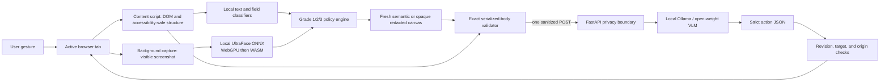

# Team handoff: Privacy Focused Browser Agent

**Repository purpose:** SIH26171, *On-device Visual Perception for Light-weight Browser Agents*.

**Status:** working hackathon prototype, ready for team development and a controlled synthetic demo.

**Primary path:** a cross-browser extension plus a strict reasoning service. The project does not require a custom browser fork. A browser fork would add a Chromium maintenance and distribution burden without improving the privacy boundary that the problem statement evaluates.

This document is the shared starting point for the team. It records what is implemented, what has evidence behind it, what the repository deliberately does not claim, and the order in which production hardening should happen.

## 1. What is in this repository

| Path | Current role |
| --- | --- |
| `extension/` | TypeScript source compiled into Chrome MV3 and Firefox-compatible packages. Captures the active tab after a user gesture, builds a safe DOM capsule, runs local face inference, applies the selected privacy grade, composes a fresh redacted PNG, validates the serialized request, polls the reasoning job, and executes revision-bound actions. |
| `server/` | FastAPI receiver and synthetic demo portal. It authenticates and bounds requests, validates the strict protocol and PNG, performs defense-in-depth checks, invokes local Ollama, validates model actions, and exposes a bounded asynchronous job queue. |
| `evaluation/` | Synthetic Indian-PII corpus, schema files, precision/recall and pixel-area scorer, exact receiver-body verifier, and security test plan. |
| `PRIVACY_LEVELS.md` | The versioned Grade 1/2/3 policy and category matrix. This is the policy contract to use when adding detectors. |
| `PROTOCOL.md` | The frozen v1.0 wire contract. Keep this synchronized with `extension/src/types.ts` and `server/app/schemas.py`. |
| `ARCHITECTURE.md` | Detailed trust boundary, data flow, fail-closed decisions, and browser-fork decision. |
| `ARCHITECTURE_REVIEW.md` | Review of per-step sanitized capture versus continuous/external screen sharing. |
| `EDGE_CASE_MATRIX.md` | Required behavior for capture, redaction, model, browser, network, and action failures. |
| `IMPLEMENTATION_PLAN.md` | Original SIH scope and acceptance criteria. |
| `README.md` | Quick start and demo instructions. |
| `CONTRIBUTING.md` | Team setup, change discipline, test commands, and review checklist. |

The local `browser-use/` checkout is an experimental comparison baseline and `BrowserOS-reference/` is an upstream design reference. They are intentionally excluded from this repository because they contain nested Git history and large development environments; the primary implementation above is self-contained. If needed, clone [browser-use](https://github.com/browser-use/browser-use) and [BrowserOS](https://github.com/browseros-ai/BrowserOS) separately and preserve their original licenses.

Generated state is also excluded: `.runtime/` contains API keys, browser profiles, logs, temporary extension copies, and model/runtime caches; `.tools/` contains downloaded tools; `artifacts/` contains locally generated packages, screenshots, and run results. Never force-add any of those directories.

## 2. Architecture and trust boundary



The extension is the trusted privacy boundary for this prototype. The service is treated as an untrusted recipient: it must be able to reason using only a sanitized PNG, coarse element metadata, typed placeholders, an opaque site alias, and an opaque snapshot revision. The following remain local and are never part of the reasoning payload:

- original screenshot and decoded pixels;
- raw HTML, DOM attributes, form values, cookies, storage, selectors, and accessibility text that was not sanitized;
- the real page URL/hostname and the ID-to-DOM map;
- the user's known-private-value list and the HMAC key used to derive the site alias.

The loop is deliberately step based: capture → local detection → grade policy → redaction → fresh PNG → serialized-body checks → sanitized request → structured action → live-page checks. It does not run a continuous screen stream, and it does not reconstruct a second webpage.

### Client modules

- `extension/src/content.ts` collects visible interactive structure, text findings, field metadata, frame/media coverage, document revision, and local element IDs. Values are used transiently for classification and are not placed in the element list.
- `extension/src/privacy.ts` contains deterministic high-confidence patterns, field classification, grade-aware text replacement, known-private matching, and conservative bounds handling.
- `extension/src/privacy-policy.ts` is the cumulative policy table. A finding's category threshold is compared with the selected grade; unknown categories fail closed at Grade 3.
- `extension/src/face-detector.ts` runs the bundled UltraFace model locally, preferring WebGPU and falling back to single-threaded WASM.
- `extension/src/image-redactor.ts` maps DOM/face boxes into screenshot pixels and draws category-only placeholders onto a new canvas. The original image is never the outbound image.
- `extension/src/sanitizer-offscreen.ts` keeps Chrome decoding, inference, composition, and PNG encoding out of the service worker. Firefox uses the direct local runtime path.
- `extension/src/egress.ts` is the only reasoning endpoint caller. It checks the final serialized bytes, sends one sanitized POST, and polls with only an opaque UUID job ID.
- `extension/src/background.ts` pins the tab/window/origin and document generations, bounds the operation time, validates the response, and executes only the allowlisted action types.

### Server modules

- `server/app/boundary.py` applies request-size, content-type, authentication, origin, security-header, and safe-access-log controls.
- `server/app/schemas.py` rejects unknown fields and invalid protocol values.
- `server/app/validation.py` checks IDs, bounds, limits, PNG structure, metadata, semantic placeholder pixels, opaque fallback pixels, canary-sensitive text, and the selected grade.
- `server/app/ollama.py` sends only validated sanitized context to the configured local model and parses strict structured output.
- `server/app/action_guard.py` applies a narrow structural guard for high-confidence consent/submit prerequisites without seeing raw values.
- `server/app/jobs.py` turns slow model work into a bounded asynchronous queue. The default is 16 retained jobs and two concurrent model calls; a replicated deployment needs a shared protected job store or sticky routing.

## 3. Privacy grade contract

Grades are cumulative and selected locally. Grade 3 is the default and fail-safe fallback for missing/invalid legacy settings. A lower grade is an explicit disclosure choice; it never disables the invariant floor.

| Grade | User intent | Redacted in addition to the invariant floor | May remain when confidently safe |
| --- | --- | --- | --- |
| **1 — Essential / personalized** | Keep useful personal context for personalization | Credentials, government IDs, financial/payment data, faces/biometrics, user-declared values, and uninspectable content | Names, usernames, ordinary contact/location context, professional context, and ordinary non-sensitive fields |
| **2 — Balanced / protected** | Hide direct contact and linkable context | Grade 1 plus email, phone, address/precise location, date of birth, network/device identifiers, and customer/member/account identifiers | Names, public handles, professional context, and safe controls |
| **3 — Maximum / strict (default)** | Minimize personal context | Grades 1–2 plus names, usernames, employee/student identifiers, and ambiguous populated editable fields | Public labels, roles, bounds, state, and task-relevant structure |

The invariant floor applies at every grade: passwords and secrets, government/financial identifiers, face regions, known canaries, and visual regions the client cannot inspect. The server receives `privacy.grade` only to interpret the remaining context and repeat a defense-in-depth check; it never receives the original value or the user's policy list.

Current detectors are intentionally narrower than the policy: high-confidence regex/DOM rules cover common Indian phone, Aadhaar, PAN, card, email, IP, labeled date/name/address/account values, sensitive field metadata, exact custom values, and faces. General multilingual NER, OCR inside image/canvas/video, QR codes, signatures, all official-ID formats, and nuanced medical/genetic/religious/sexual/political classification remain gaps. Unknown visual regions are masked wholesale.

## 4. What is implemented today

### Demonstrable behavior

1. The popup lets the user select Grade 1, 2, or 3 and shows the disclosure meaning. The setting is local and Grade 3 is the default.
2. **Privacy preview** runs capture, local detection, and composition without calling the reasoning service.
3. The extension produces Chrome and Firefox packages from one source tree and includes the pinned UltraFace ONNX asset with attribution and checksum.
4. Semantic redaction uses neutral cards and category-only markers such as `[REDACTED:EMAIL]`, `[REDACTED:PASSWORD]`, and `[REDACTED:FACE]`. If local visual inference fails, transmission stops unless the user explicitly enables the full-image opaque fallback.
5. The request contains no raw-content keys, no real hostname, no ID-to-node map, and no sensitive value. The server rejects malformed, oversized, metadata-bearing, or visually unmasked payloads independently.
6. Reasoning uses local Ollama (`qwen3-vl:2b-instruct` by default), bounded async jobs, bodyless UUID polls, and a strict action schema (`click`, `input`, `scroll`, `wait`, `done`).
7. Actions are bound to the same snapshot, document revision, tab, window, origin, and opaque element ID, so a stale or cross-page action is rejected.
8. The synthetic demo portal exercises password, Indian PII, DOM attributes, links, a face image, a required consent checkbox, and terminal submission.

### Evidence already recorded

The latest local validation snapshot is in `VALIDATION_REPORT.md`. The source suites currently report 63 extension tests, 118 server tests, and 28 evaluation tests, with Ruff clean. Recorded synthetic browser evidence uses the WASM fallback and shows three sanitized reasoning requests, absent canaries, nine redactions per request, and successful enrollment. A fresh authenticated local-Ollama HTTP smoke test has also returned a valid structured action.

Generated evidence is intentionally kept out of Git history because it is machine-specific and can contain local paths or runtime metadata. Re-run the commands in `VALIDATION_REPORT.md` after cloning and attach a new run record to a release or SIH submission when hardware/model details are fixed.

## 5. Runbook for teammates

Prerequisites: Windows PowerShell, Node.js 20+, Python 3.11+ (the setup script provisions 3.12), Git, and Ollama. The bundled `uv` helper is downloaded by setup into the ignored `.tools/` directory.

```powershell
Set-Location C:\path\to\privacy-focused-browser-agent
.\Setup-Prototype.ps1
ollama pull qwen3-vl:2b-instruct
.\Start-Prototype.ps1
.\Test-Prototype.ps1
```

Then load `extension\dist\chrome` as an unpacked extension (or `extension\dist\firefox\manifest.json` as a temporary Firefox add-on), open `http://127.0.0.1:8765/demo`, enter a task, paste the local session key from `.runtime\api-key.txt`, run **Privacy preview**, choose a grade, and start the agent. Stop the API with `.\Stop-Prototype.ps1`; Ollama can remain on loopback for the next run.

Focused checks:

```powershell
Push-Location extension; npm run check; Pop-Location
Push-Location server; .\.venv\Scripts\pytest.exe; .\.venv\Scripts\ruff.exe check .; Pop-Location
$env:PYTHONPATH = (Resolve-Path .\evaluation).Path
& .\server\.venv\Scripts\python.exe -m pytest .\evaluation\tests -q
```

Never put a real API key in source, an issue, a test fixture, a screenshot, or a commit. Use `.env.example` as a template and keep `.runtime/` ignored.

## 6. Production-hardening roadmap

The prototype is suitable for a synthetic demonstration and controlled evaluation. Production readiness requires measured work in this order.

### P0 — required before any real sensitive data

- **Independent security review:** inspect every extension permission, content-script boundary, dependency, model asset, build step, and server route; perform a malicious-page and compromised-model red-team.
- **Release integrity:** pin and audit npm/Python dependencies, verify lockfiles in CI, sign extension packages, publish checksums and a reproducible build record, and remove developer-only permissions.
- **Transport and secret controls:** require HTTPS with certificate validation outside loopback, use a deployment secret manager, rotate keys, rate-limit authenticated callers, and keep Ollama on a private interface.
- **Policy governance:** version the grade matrix and detector bundle together, show users exactly what each grade can disclose, record only aggregate opt-in metrics, and make policy changes reviewable.
- **Leak gates:** add a pre-commit/CI secret scanner, property-based serialized-body tests, fuzzing for PNG/JSON/DOM inputs, and a test that every new egress path is rejected unless explicitly approved.
- **Evidence quality:** create a held-out multilingual corpus with consented synthetic/approved data, report confidence intervals, and publish recall, precision, coverage, excess-area, resource, and p50/p95 latency by grade and browser.

### P1 — needed for a dependable cross-browser product

- Add a local OCR/text detector for canvas, image, video, SVG, and PDF-like surfaces; replace whole-region masking only after frame-level recall is measured.
- Add multilingual and locale-aware entity detection, IPv6/MAC/IMEI/vehicle/QR/signature handling, health and other special-category labels, and adversarially split text-node tests.
- Benchmark Chrome and Firefox on representative CPU/GPU/RAM classes, including WebGPU-disabled machines, thermal throttling, zoom, high-DPI, animation, resize, and long pages.
- Harden capture/frame identity: reject stale detector boxes, CSS transforms, animated content, cross-origin frames, closed shadow DOM, and pixels whose geometry cannot be proven to match the DOM snapshot.
- Add explicit user confirmation for high-impact actions, idempotency keys, cancellation, retry budgets, back-pressure, and a durable multi-instance job store.
- Add deployment observability that records timings and counters without request content, raw URLs, job IDs, or sensitive labels.

### P2 — next-level capability

- Support an offline server model package and a documented air-gapped deployment.
- Add an optional cooperating sanitized-stream adapter for a concrete consumer; never expose raw frames as a fallback and never claim protection for another application's capture.
- Add accessibility-tree fusion, richer task planning, safe navigation/download policies, policy simulation in the preview, and reviewer-friendly trace exports with synthetic values only.
- Automate browser-matrix CI, dependency SBOMs, signed provenance, performance regression budgets, and periodic red-team runs.

## 7. Reliability and edge-case definition of done

Every capture source and action type must have positive, malformed, stale-page, and serialized-body leak tests. A release is not ready until it demonstrates all of the following on supported browser versions:

- no request after capture, inference, redaction, encoding, endpoint, schema, canary, or revision failure;
- no raw value in the exact outbound bytes, logs, crash reports, telemetry, or model prompt;
- complete invariant-floor coverage at every grade and monotonic Grade 1 → Grade 2 → Grade 3 behavior;
- correct handling of tab switches, navigation, origin changes, scroll/zoom/resize, animation, service-worker suspension, popup closure, model cold starts, queue saturation, timeouts, malformed model actions, and server restarts;
- measured WebGPU and WASM resource/latency budgets with a tested fallback path;
- action confirmation and idempotency for irreversible operations;
- reproducible signed builds, dependency review, rollback procedure, incident response, and an updated threat model.

## 8. Suggested team split

| Workstream | First owner responsibilities |
| --- | --- |
| Privacy/detection | Expand the corpus, add OCR/NER experiments, tune category thresholds, and publish grade-wise precision/recall and excess-area results. |
| Extension/runtime | Firefox parity, WebGPU/WASM benchmarks, capture identity, permission minimization, and action confirmation. |
| Server/platform | HTTPS deployment, durable jobs, authentication/rate limits, model adapters, safe telemetry, and load tests. |
| Evaluation/security | Threat model, fuzz/property tests, malicious-page corpus, leak gates, release checklist, and SIH demo evidence. |

Use short-lived feature branches and pull requests. Keep protocol/policy changes small and update tests, `PROTOCOL.md`, `PRIVACY_LEVELS.md`, and the edge-case matrix in the same change.

## 9. Definition of the SIH demo

The judging demo should show the privacy preview first, then the same synthetic task at all three grades, the redaction count and detector backend, the exact sanitized request verifier, and a successful consent/submit action. It should also show one forced detector/capture failure where the request count remains zero and one stale-action rejection. State clearly that the guarantee covers the configured reasoning channel; ordinary website traffic and other applications remain outside this prototype boundary.
