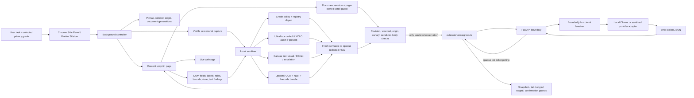

# SIH26171 team handoff

| Field | Current value |
| --- | --- |
| Project | On-device Visual Perception for Light-weight Browser Agents |
| Organization | ISRO / Department of Space |
| Repository | `sih-privacy-agent` |
| Handoff date | 16 September 2026 |
| Current branch | `main` |
| Current stage | Controlled synthetic prototype with a complete privacy-boundary path, Chrome/Firefox packages, a local Ollama reasoning path, a synthetic end-to-end demo, automated release checks, and explicit asset/evidence gates. |

This is the detailed handoff for the current repository. It describes the behavior that is present in source code, the behavior that is optional or asset-gated, the evidence that has actually been recorded, and the work that still requires a real browser run, model asset, deployment, or independent review. It is intentionally conservative: a module existing in the repository is not described as an active default feature unless the build and runtime select it.

## 1. Executive state of the repository

The repository implements **Approach B: per-step sanitized observation plus a safe DOM capsule**. The extension captures one visible browser step, classifies and redacts data locally, creates a new PNG, validates the exact serialized request, sends only the sanitized observation through one egress owner, receives a strict action, and verifies that action against the live page before execution.

The project is an extension and reasoning service. It is **not a custom browser fork**. The checked-out `browser-use/` directory is an experimental comparison checkout and `BrowserOS-reference/` is a design reference; neither is imported into the production extension or server runtime. A browser fork would increase distribution and Chromium-maintenance cost without improving the privacy boundary evaluated by SIH.

### What is working now

- One TypeScript source tree builds Chrome MV3 and Firefox packages.
- Chrome exposes a persistent Side Panel; Firefox exposes a persistent Sidebar.
- The panel lets a user enter a task, select Grade 1/2/3, configure the reasoning endpoint and step budget, enter memory-only canaries, request a local privacy preview, start/stop the agent, inspect live activity, and open a full-screen sanitized preview.
- The content script captures visible interactive structure, safe labels, geometry, state, document identity, revision, scroll position, media/frame candidates, and local text findings.
- A local sanitizer combines DOM rules, regex findings, known-private values, visual detector output, optional perception output, and the selected privacy grade.
- The default checked-in build includes the UltraFace ONNX model for local face detection, with WebGPU first and WASM fallback. It does not claim document-ID visual coverage unless a unified YOLO asset is supplied.
- The redactor draws a completely new sanitized PNG. Semantic category placeholders or a verified opaque full-image fallback replace sensitive regions. The original screenshot is not retained in the outbound observation.
- Chrome uses an offscreen document for decoding, inference, composition, and PNG encoding. Firefox uses the compatible direct local path.
- A page-owned scroll-drift guard invalidates a captured set-of-mark registry when the user scrolls or the viewport changes while the server is reasoning.
- The extension executes only the allowlisted actions `click`, `input`, `scroll`, `wait`, and `done`, after snapshot, document, revision, visibility, editability, origin, tab, window, and duplicate-action checks.
- Potentially destructive clicks such as submit, pay, delete, or navigation require native user confirmation.
- The FastAPI server validates the strict protocol, PNG structure, mask evidence, policy digest, request limits, authentication, origins, and model responses.
- Slow reasoning is admitted through a bounded asynchronous job queue. The development profile uses in-memory jobs by default; SQLite metadata or Redis can be selected. Production configuration requires Redis.
- Ollama is the default provider adapter. The local setup uses `qwen3-vl:2b-instruct` on loopback and asks for strict JSON action output.
- A provider-neutral sanitized gateway adapter is implemented for a hosted or air-gapped reasoning service.
- A deterministic structural planner is available only as a development fallback for unambiguous schema-valid tasks. Production configuration forces it off.
- The synthetic portal includes Indian-style PII, a face, sensitive fields, privacy-grade labels, synthetic credit-card and PAN-card image fixtures, a confirmation checkbox, and a submit action.
- The release gate currently reports 92 extension tests, 157 server tests, and 32 evaluation tests passing, plus typecheck, lint, package, governance, security, SBOM, metadata, and source-egress checks.

### What is deliberately not claimed as default

- The checked-in default package does **not** contain `yolo-privacy-v1.onnx`; the YOLO implementation is present but asset-gated.
- The checked-in default package does **not** contain `dbnet-text-det.onnx`; DBNet canvas text detection is implemented but optional and asset-gated.
- OCR, multilingual NER, barcode decoding, and the small visual model are implemented as an opt-in local perception bundle. They are packaged only by `npm run package:perception` after locked local assets pass checksums. The normal build keeps the deterministic baseline.
- `agent-graph.ts` documents the Approach B state topology and human-in-the-loop transitions. The live controller is the bounded TypeScript loop in `background.ts`; LangGraph.js is not the current runtime.
- The synthetic evidence is not universal PII recall/precision evidence. It does not certify production use with real personal data.
- A built Firefox package is not the same as a live Firefox browser-matrix run. A live Firefox run remains separate evidence.

## 2. Repository map

| Path | Purpose and current state |
| --- | --- |
| `extension/` | TypeScript browser extension, local capture, privacy policy, detectors, redaction, preview UI, egress, action execution, tests, and packaging. |
| `extension/src/background.ts` | Service-worker/background controller: pins the task context, captures, sanitizes, sends, polls, handles drift, executes actions, and reports status. |
| `extension/src/content.ts` | Page-owned DOM/accessibility-like capture, local sensitive-field/text classification, document revision tracking, scroll guard, and action execution. |
| `extension/src/popup.ts` | Shared controller for the popup and Side Panel/Sidebar UI. |
| `extension/src/sidepanel.html`, `sidepanel.css` | Persistent Chrome Side Panel and Firefox Sidebar interface. |
| `extension/src/preview.html`, `preview.ts`, `preview.css` | Separate full-view sanitized preview page. |
| `extension/src/privacy.ts` | Deterministic PII/secret patterns, field classification, known-value matching, normalization, and local text sanitization. |
| `extension/src/privacy-policy.ts` | Grade thresholds and registry digest consumption. |
| `extension/src/generated-policy.ts` | Generated policy representation shared with the server-side registry. |
| `extension/src/vision-detector.ts` | Unified detector interface and asset-gated UltraFace compatibility adapter. |
| `extension/src/face-detector.ts` | Checked-in UltraFace ONNX WebGPU/WASM face detector. |
| `extension/src/yolo-detector.ts` | Unified YOLOv8n/v10n parser, letterbox preprocessing, NMS/end-to-end decoding, and document/face class mapping. |
| `extension/src/dbnet-detector.ts` | Optional DBNet text-region detector for detection-only blind masking. |
| `extension/src/canvas-privacy.ts` | Approach B three-tier canvas privacy contract and DBNet/manual-escalation policy. |
| `extension/src/image-redactor.ts` | Fresh-canvas redaction, placeholder drawing, opaque fallback, pixel-coordinate mapping, mask counts, and masked-area calculation. |
| `extension/src/perception.ts` | Optional local OCR/NER/barcode orchestration, confidence handling, budgets, and fail-closed behavior. |
| `extension/src/perception-runtime.ts` | Tesseract English/Hindi OCR, Transformers.js local multilingual NER, and ZXing barcode bounds. |
| `extension/src/text-normalization.ts` | Unicode/whitespace normalization before local classification. |
| `extension/src/sanitizer-offscreen.ts` | Chrome offscreen local image-processing path. |
| `extension/src/sanitizer-direct.ts` | Firefox-compatible direct local image-processing path. |
| `extension/src/offscreen.ts`, `offscreen-protocol.ts`, `offscreen.html` | Chrome offscreen IPC and runtime asset handling. |
| `extension/src/scroll-drift-guard.ts` | Content-script passive scroll/viewport drift detection and Step 0 abort state. |
| `extension/src/egress.ts` | The only source file allowed to call `fetch` for the reasoning service. |
| `extension/src/context-guard.ts` | Active tab/window/origin/document generation binding and stale-context checks. |
| `extension/src/capture-rate-gate.ts` | Demand-driven `captureVisibleTab` rate gate. |
| `extension/src/task-presets.ts` | Safe task presets used by the UI and tests. |
| `extension/src/settings.ts` | Extension setting persistence and normalization. |
| `extension/src/types.ts` | Versioned observation, redaction, action, status, command, detector, canvas, and latency types. |
| `extension/src/validation.ts` | Client-side schema, PNG, bounds, redaction, registry, and serialized-body validation. |
| `extension/scripts/build.mjs` | Chrome/Firefox build, model-asset detection, optional perception packaging, deterministic ZIP packaging, and manifest generation. |
| `extension/scripts/prepare-perception.mjs` | Prepares the optional local perception assets from their locked source list. |
| `extension/scripts/evaluate-perception.mjs` | Runs the local perception measurement workflow. |
| `extension/scripts/release-metadata.mjs` | Creates package/model/protocol metadata. |
| `extension/models/version-RFB-320.onnx` | Checked-in UltraFace fallback model. Its reviewed SHA-256 is `34CD7E60AEFF28744C657DE7A3DC64E872D506741DE66987F3426F2B79F88017`. |
| `extension/models/perception-lock.json`, `perception-sources.json` | Optional perception asset lock and source metadata. |
| `server/` | FastAPI receiver, model adapters, bounded jobs, Redis/SQLite ledgers, policy compiler, validation, demo portal, tests, and container files. |
| `server/app/main.py` | Application factory, health endpoints, reasoning routes, async job polling, model/fallback orchestration, and synthetic demo routes. |
| `server/app/boundary.py` | HTTP method/content-type/body limits, authentication, origin checks, access-log hygiene, and security headers. |
| `server/app/schemas.py` | Strict Pydantic protocol models with unknown-field rejection. |
| `server/app/validation.py` | Server-side PNG, mask, metadata, grade, canary, bounds, element, and registry checks. |
| `server/app/settings.py` | Strict environment configuration and production-profile startup requirements. |
| `server/app/policy_compiler.py`, `generated_policy.py`, `detector_registry.py` | Registry compilation and policy parity between client and server. |
| `server/app/gateways/ollama.py` | Local Ollama adapter, model manifest/digest readiness, sanitized image resize, prompt, strict JSON format, and bounded output. |
| `server/app/gateway_adapter.py`, `model_adapter.py` | Provider-neutral sanitized model gateway and manifest validation. |
| `server/app/structural_planner.py` | Development-only deterministic planner for unambiguous actions. |
| `server/app/action_guard.py` | Server-side action/observation consistency and submit/consent checks. |
| `server/app/circuit_breaker.py` | Closed/Open/Half-Open model-call circuit breaker with timeout/concurrency controls. |
| `server/app/jobs.py` | Bounded in-memory async job store and execution lifecycle. |
| `server/app/job_ledger.py` | Metadata-only SQLite ledger and Redis ledger implementations. |
| `server/app/rate_limit.py` | Process-local development limiter and Redis Lua sliding-window limiter. |
| `server/app/observability.py` | Aggregate counters and timings without page content or raw request payloads. |
| `server/app/demo/` | Synthetic portal HTML/CSS/JS and a synthetic face asset. |
| `server/Dockerfile`, `server/nginx.conf`, `docker-compose.yml` | Containerized server, Nginx proxy, Redis, read-only filesystems, dropped capabilities, resource limits, and internal network configuration. |
| `evaluation/` | Synthetic corpus, protocol/model/PNG evaluator, receiver verifier, fuzzing, action-state tests, and run-result schemas. |
| `evidence/` | Aggregate synthetic E2E, Ollama, perception, release, and SIH demo evidence. |
| `governance/` | Detector-registry schema, protocol manifest/migrations, and security review records. |
| `scripts/` | Release gate, governance check, security scan, SBOM generation, disk budget, demo preflight, retention cleanup, local preview, and signing helpers. |
| `README.md`, `ARCHITECTURE.md`, `ARCHITECTURE_REVIEW.md`, `INTEGRATION_REVIEW.md` | Product, trust-boundary, architecture decision, and integration documentation. |
| `PRIVACY_LEVELS.md`, `PROTOCOL.md`, `EDGE_CASE_MATRIX.md`, `THREAT_MODEL.md` | Policy, wire contract, failure behavior, and threat model. |
| `TEAM_WORK_SPLIT.md` | Detailed task ownership, completed workstream audit, remaining release gates, and acceptance criteria. |
| `MITHUL_HANDOFF.md`, `MITHUL_RELEASE_RUNBOOK.md` | Local perception/model portability and release operation handoffs. |

Generated or secret state is intentionally ignored:

- `.runtime/`: API key, process files, logs, browser-use settings, model/runtime caches, and temporary run output.
- `.tools/`: local `uv` and other downloaded tools.
- `artifacts/`: built packages, previews, screenshots, and run outputs.
- `.hypothesis/`, `.pytest_cache/`, `.ruff_cache/`: local test caches.

Never force-add those directories or put a real key, page screenshot, request body, browser profile, or personal value in Git.

## 3. Active architecture and trust boundary



The extension is the trusted privacy boundary for the configured reasoning channel. The server is treated as an untrusted recipient and receives only:

- a versioned schema;
- an opaque snapshot and document identifier;
- an HMAC-derived origin alias rather than the real host;
- a task string that has passed the client boundary policy;
- opaque element IDs with role, sanitized label, coarse bounds, and safe state;
- a newly encoded PNG with sensitive regions replaced locally;
- redaction metadata and category counts;
- privacy grade, detector backend, detector architecture, canvas tier, and registry digest.

The following remain local and are not sent in the reasoning request:

- the original screenshot and original decoded pixels;
- raw HTML, selectors, form values, cookies, storage, credentials, and browser profile data;
- the real page URL/hostname and the element-ID-to-DOM map;
- the user's known-private values/canaries and the HMAC key;
- raw OCR tokens, NER output, decoded barcode contents, or model messages;
- local detector errors that may contain paths, URLs, or raw model text.

The privacy guarantee is scoped to this extension-to-configured-reasoning-server path. It does not control ordinary website traffic, another extension, another application, a compromised browser, or an external screen recorder.

## 4. Runtime sequence

Each agent step follows this order:

1. The user opens the Side Panel/Sidebar, enters a task, selects a privacy grade, and chooses the endpoint and step limit.
2. The background controller pins the active tab, window, origin, activation generation, and update generation. It injects or pings the content script only after the user gesture.
3. The content script captures the current document ID, revision, viewport, scroll state, visible interactive elements, safe labels, roles, state, text regions, media candidates, and DOM/regex redactions.
4. The background controller captures one visible PNG through the browser API. The capture rate gate stays below the browser's two-calls-per-second limit.
5. The local sanitizer verifies that the active tab is still the pinned tab and that capture and DOM metadata refer to the same page.
6. Local detection runs through the selected path:
   - default checked-in UltraFace for faces;
   - unified YOLO if `yolo-privacy-v1.onnx` is present;
   - optional DBNet for canvas text regions if its asset and flag are present;
   - optional OCR/NER/barcode perception if the perception bundle is built.
7. The local privacy policy applies the selected Grade 1/2/3 threshold. The invariant floor always wins.
8. The redactor maps CSS/visual coordinates into screenshot pixels, creates a new canvas, paints category placeholders or an opaque full-image fallback, and encodes a new PNG. No original image blob is reused.
9. The background controller asks the content script to re-check document ID, document revision, origin, viewport, scroll position, and scroll-drift state.
10. Client validation checks schema, bounds, sizes, registry digest, unsafe keys, caller canaries, image structure, placeholder pixels, and the final serialized bytes.
11. `extension/src/egress.ts` sends one sanitized `POST /v1/reason` with `Prefer: respond-async`. It never sends the original screenshot and never sends the observation again through another network owner.
12. The server authenticates and validates the request, admits it to the bounded job queue, and returns an opaque job ticket when reasoning is asynchronous.
13. The extension polls `GET /v1/reason/{jobId}`. Poll responses are bodyless until the job completes; they do not contain the sanitized observation.
14. Ollama or the configured sanitized gateway reasons over the sanitized image and element list and returns strict JSON containing one allowlisted action.
15. The extension disables the page-owned scroll guard after the response. If drift occurred, it discards the response and captures a new step.
16. The content script verifies the action against the current snapshot/document/revision and live DOM. Destructive clicks require a native confirmation.
17. The action executes, status/activity metrics update, and the loop repeats until `done`, the maximum step count, timeout, user stop, or a fail-closed error.

## 5. Extension behavior in detail

### Build targets and permissions

`extension/scripts/build.mjs` creates:

- Chrome MV3 targeting Chrome 120, including `scripting`, `offscreen`, and `sidePanel`.
- Firefox MV2-compatible packaging targeting Firefox 121, including `sidebar_action`.
- Separate `popup.js` and `sidepanel.js` bundles compiled from the shared `popup.ts` controller.
- `preview.html` and its script/styles.
- Chrome-only `offscreen.html`.
- ONNX Runtime Web WASM files.
- Optional model assets only when they exist locally.
- Reproducible ZIP files when `--package` is supplied.

The build detects these assets:

| Asset | Runtime selection |
| --- | --- |
| `models/version-RFB-320.onnx` | Checked-in UltraFace fallback; included by default. |
| `models/yolo-privacy-v1.onnx` | Enables unified YOLOv8n/v10n visual path. |
| `models/dbnet-text-det.onnx` | Enables DBNet canvas text-region path. |
| `models/perception/*` plus lock file | Enables optional OCR/NER/barcode local perception package. |

The build defines compile-time flags for face, YOLO, DBNet, and perception availability. Missing optional assets are not silently reported as active models.

### Side Panel, Sidebar, popup, and preview UI

The UI provides:

- task textarea with a 2,000-character limit;
- privacy grade selector with explanatory copy;
- reasoning endpoint field;
- maximum step field bounded to 1–30;
- API key field stored only in panel memory;
- known-private canaries field stored only in panel memory;
- explicit full-mask fallback checkbox;
- **Privacy preview** button;
- **Start agent** and **Stop** buttons;
- state badge and phase message;
- step count, detector backend, redaction count, masked-area percentage, and latest server latency;
- live activity log that remains visible during long runs;
- sanitized preview image;
- full-screen preview modal and separate full-view tab;
- local-only footnote explaining that website traffic remains controlled by the website.

The UI is not the privacy boundary by itself. All settings are normalized again in the background controller, and the server repeats validation.

### Content capture and safe element model

`content.ts` runs in the page and:

- builds an opaque-ID map for visible buttons, links, inputs, textareas, selects, checkboxes, radios, comboboxes, options, contenteditable controls, and scroll regions;
- limits the element list to 500;
- exposes role, sanitized label, bounds, disabled/checked/editable/required state;
- uses labels, placeholders, accessible names, titles, field names, autocomplete hints, and nearby text for classification;
- scans visible inputs and textareas, selected options, contenteditable values, and page text;
- finds DOM and regex redactions locally;
- marks `<iframe>`, ``, `<picture>`, `<canvas>`, `<video>`, `<svg>`, `<object>`, `<embed>`, CSS background/pseudo content, and inspectability-uncertain regions conservatively;
- handles open shadow roots and custom-element content where inspection is available;
- tracks document revision on scroll, resize, orientation, visual viewport movement, DOM mutation, and relevant page changes;
- never includes raw field values in `SanitizedElement`.

### Action capabilities and safety

The current action protocol supports:

| Action | Behavior |
| --- | --- |
| `click` | Clicks a current visible, connected target; checks disabled/ARIA-disabled state; asks confirmation for destructive labels/actions. |
| `input` | Fills a current editable text control or contenteditable target; rejects disabled/read-only/non-editable targets. |
| `scroll` | Scrolls the page or a verified scroll-region element by a bounded amount. |
| `wait` | Waits a bounded number of milliseconds before the next capture. |
| `done` | Ends the loop with a model message/status. |

The content script rejects arbitrary JavaScript, CSS selectors, arbitrary URLs, keyboard injection, unknown action fields, stale snapshot IDs, stale document IDs/revisions, cross-origin targets, hidden/detached targets, disabled controls, read-only controls, and duplicate in-flight action keys.

### Capture identity and scroll-drift guard

The background worker cannot directly observe page scroll events. The listener therefore belongs to the content script. `ScrollDriftGuard` attaches a passive capture-phase listener to `window`, debounces drift for roughly 350 ms, and also observes `visualViewport` movement. `SET_SCROLL_GUARD` starts it before model/network reasoning and `GET_SCROLL_DRIFT` reads the result.

Any detected drift invalidates the set-of-mark registry. The background loop discards the returned action and recaptures instead of executing against a moved viewport. This closes the race where a model reasons over one visual layout and a click lands on another.

### Local privacy policy

`privacy-policy.ts` consumes the generated detector registry and registry digest. Grades are cumulative:

- Grade 1 hides categories with minimum grade 1.
- Grade 2 hides Grade 1 plus categories with minimum grade 2.
- Grade 3 hides Grade 1 and 2 plus categories with minimum grade 3.
- Invalid or missing grade settings normalize to Grade 3.
- A new detector category defaults to `unknown-populated-field` and therefore fails closed at Grade 3 until the policy explicitly assigns it.

`privacy.ts` performs local matching for secrets, credentials, password/OTP/PIN/CVV, bearer/API/private-key tokens, government IDs, Aadhaar, PAN, passport, voter ID, driving licence, vehicle numbers, financial/payment identifiers, cards, bank accounts, UPI, IFSC, GSTIN, email, phone, address, date of birth/age, IPv4/IPv6, MAC, IMEI, account/customer IDs, employee IDs, names, usernames, known private values, and labeled or metadata-sensitive fields. It normalizes Unicode and spacing before matching.

### Grade matrix

| Category | Grade 1 | Grade 2 | Grade 3 |
| --- | :---: | :---: | :---: |
| Credentials and secrets | hide | hide | hide |
| Government IDs | hide | hide | hide |
| Financial/payment data | hide | hide | hide |
| Faces and biometric regions | hide | hide | hide |
| User-declared known values/canaries | hide | hide | hide |
| Uninspectable frames/media/canvas fallback | hide | hide | hide |
| Email and phone | keep when safe | hide | hide |
| Address/location | keep when safe | hide | hide |
| Date of birth/age | keep when safe | hide | hide |
| Network/device identifiers | keep when safe | hide | hide |
| Customer/account identifiers | keep when safe | hide | hide |
| Names | keep when safe | keep when safe | hide |
| Usernames | keep when safe | keep when safe | hide |
| Professional/employee/student identifiers | keep when safe | keep when safe | hide |
| Unknown populated editable fields | keep only when classified safe | keep only when classified safe | hide |

“Keep” means the value may remain only when the local policy can classify it as safe for that grade. The server receives the selected grade to interpret the sanitized representation and to repeat defense-in-depth checks; it never receives the source value or canary list.

### Visual detection and redaction

`vision-detector.ts` provides a common result shape. The default build selects `UltraFaceAdapter`, which invokes the checked-in `version-RFB-320.onnx` through ONNX Runtime Web:

1. try WebGPU;
2. fall back to WASM;
3. return a typed failure if both are unavailable.

`yolo-detector.ts` implements the Approach B unified path:

- 640-pixel letterbox preprocessing;
- YOLOv8 output transpose and NMS;
- YOLOv10 end-to-end output decoding;
- classes for face, Aadhaar card, PAN card, voter ID, driving licence, passport, and signature;
- WebGPU first and WASM fallback;
- asset-gated selection through `__YOLO_MODEL_INCLUDED__`.

The implementation is present, but the repository's default package contains no YOLO asset. The normal package therefore reports UltraFace and must not be presented as trained multi-class document detection.

`image-redactor.ts`:

- maps CSS and visual detector bounds into screenshot pixel coordinates;
- clips and validates boxes;
- draws semantic placeholders such as `[REDACTED:EMAIL]` where category rendering is possible;
- draws an opaque full-image fallback when detector failure is explicitly allowed;
- calculates category counts and masked-area percentage;
- creates the outbound PNG from a new canvas;
- does not return or retain the original screenshot as part of the observation.

### Canvas and uninspectable media policy

`canvas-privacy.ts` defines the Approach B three-tier contract:

1. **Tier 1 — visual redaction:** redact inspectable visual objects using the normal local path.
2. **Tier 2 — DBNet blind mask:** if the optional DBNet asset is supplied and enabled, detect text regions only and cover them without OCR or content retention.
3. **Tier 3 — manual escalation:** require user review/escalation when a canvas-rendered application cannot be safely classified.

The default content capture path conservatively masks media and frames as uninspectable. The DBNet module and policy are implemented, but the default build does not claim DBNet coverage unless its asset and explicit wiring are present.

### Optional local perception bundle

`perception.ts` and `perception-runtime.ts` implement an opt-in bundle:

- Tesseract.js OCR for English and Hindi;
- Transformers.js multilingual NER using the locked local ONNX model;
- ZXing barcode/QR bounds;
- regex and known-value classification;
- confidence thresholds that convert uncertain results to `uninspectable`;
- budgets of 4,194,304 pixels, 192 text regions/strings, 1,500 characters per text input, and 120,000 ms;
- cleanup after each frame;
- raw OCR tokens, NER entities, and decoded barcode contents used only transiently and never sent.

The bundle is built with:

```powershell
Push-Location extension
npm run package:perception
Pop-Location
```

If an asset is absent, corrupt, over budget, low-confidence, or returns invalid bounds, perception throws a generic error and transmission is blocked. The local evidence file records real quantized-model measurements on a small synthetic corpus; it is not a held-out population accuracy claim.

### Chrome and Firefox local runtime split

Chrome uses the offscreen document because image decoding, ONNX execution, canvas composition, and PNG encoding should not occupy the service worker. Firefox uses the direct local sanitizer path because the offscreen API is not equivalent across the two engines. Both paths implement the same observation contract and fail-closed checks.

### Single egress invariant

`extension/src/egress.ts` is the only TypeScript source file that calls `fetch`. It:

- validates the endpoint and disallows unsafe external HTTP;
- permits loopback HTTP for development;
- sends the API key only through the expected header;
- validates exact serialized bytes before sending;
- rejects unsafe keys and known canaries in the body;
- sends one POST with `Prefer: respond-async`;
- polls only with an opaque server job ID;
- uses timeouts and `AbortSignal`;
- never logs or returns raw response bodies as telemetry.

The source-level release check fails if another extension TypeScript file owns a `fetch` call.

## 6. Server behavior in detail

### HTTP routes

| Route | Purpose |
| --- | --- |
| `POST /v1/reason` | Validate a sanitized observation and synchronously return an action or admit an asynchronous job. |
| `GET /v1/reason/{jobId}` | Bodyless opaque job status/result polling. |
| `GET /health/live` | Process liveness. |
| `GET /health/ready` | Configuration/model/ledger readiness. |
| `GET /health/metrics` | Aggregate operational counters when metrics are enabled. |
| `GET /demo` | Synthetic SIH portal. |
| `POST /demo/api/reset` | Reset synthetic portal state. |
| `GET /demo/api/state` | Read synthetic demo state. |
| `POST /demo/api/submit` | Submit synthetic enrollment after the checkbox/password conditions. |

The HTTP boundary rejects wrong methods, wrong content types, oversized bodies, invalid credentials, unapproved origins, unsafe logging inputs, and invalid reasoning paths. Security headers are added at the boundary.

### Strict schemas and validation

`server/app/schemas.py` uses strict Pydantic models with extra fields forbidden. `SanitizedObservation` includes schema version, snapshot/document IDs, an opaque page origin alias, task, safe element list, PNG dimensions/data, redaction records, privacy grade, detector backend, fallback mode, registry digest, detector architecture, and canvas tier.

`server/app/validation.py` repeats the client checks and additionally verifies:

- base64 and PNG structure;
- image size and pixel bounds;
- dimensions and redaction limits;
- prohibited metadata/animation characteristics;
- expected semantic placeholder pixels or verified opaque fallback pixels;
- invariant-floor text and canary absence;
- element IDs/bounds/roles/state;
- policy registry digest and version;
- grade-aware text safety.

The server validates again before model invocation even when it receives a Pydantic instance from an internal adapter.

### Configuration and deployment profiles

`server/app/settings.py` is strict and rejects unknown configuration. Important settings include:

- API key and whether it is required;
- CORS origin allowlist;
- Ollama URL, model, optional digest, timeout, and remote-connection opt-in;
- provider adapter (`ollama` or `gateway`);
- gateway URL/API key;
- request/image/pixel/element/redaction limits;
- maximum jobs and concurrent reasoning jobs;
- model admission timeout and job TTL;
- rate-limit window and count;
- metrics/log level;
- development or production deployment profile;
- Redis URL and optional SQLite metadata ledger path;
- structural fallback enablement.

Production profile startup requires a strong API key, a pinned model digest, a reachable Redis URL, and structural fallback disabled. Remote Ollama is disabled unless explicitly opted in. Development may run on loopback with an in-memory job store and the structural planner.

### Ollama and provider-neutral model adapters

`server/app/gateways/ollama.py`:

- verifies the configured local model manifest/digest when a digest is supplied;
- uses `qwen3-vl:2b-instruct` by default;
- resizes the sanitized image to the configured model limits;
- sends only the sanitized image and structured context;
- uses a defensive prompt that treats page text and model-untrusted content as data;
- requests strict JSON output with a bounded context/output budget;
- validates the returned action against `ReasoningResponse`;
- fails closed on malformed, oversized, timed-out, or unavailable responses.

`gateway_adapter.py` and `model_adapter.py` define a provider-neutral manifest and response contract for a hosted or offline model. The adapter accepts only `SanitizedObservation` and returns only the strict action schema.

The current live setup uses local Ollama on `127.0.0.1:11434`; the model digest is not yet recorded in release metadata, so the current evidence is development-profile evidence.

### Jobs, circuit breaker, and fallback

- `jobs.py` bounds queued jobs, concurrent model calls, TTL, admission time, completion, failure, cancellation, and shutdown behavior.
- `job_ledger.py` provides a metadata-only SQLite ledger and a Redis ledger. Job IDs, states, status codes, and response metadata are stored; raw sanitized observations are not persisted in the ledger.
- Redis is required for the production deployment profile.
- `circuit_breaker.py` prevents repeated slow/unavailable model calls from consuming all capacity and supports Closed/Open/Half-Open transitions.
- `structural_planner.py` can produce deterministic actions for unambiguous safe forms in development. It does not infer private values and is not permitted in production.
- `action_guard.py` confirms that an action is compatible with the observation, consent/submit prerequisites, and safe state.

### Rate limiting and observability

Development uses a bounded process-local rate limiter. A configured Redis deployment uses an atomic Lua sliding-window limiter suitable for multiple server instances. Observability records aggregate counts, states, and timings only; request bodies, page content, raw URLs, keys, and private labels are not logged.

### Container deployment

`docker-compose.yml` describes a server, Redis, and Nginx proxy:

- server and Redis run with dropped Linux capabilities;
- server uses a read-only root filesystem and `/tmp` tmpfs;
- CPU/memory limits are declared;
- Redis persistence is mounted separately;
- Nginx exposes the configured port and forwards to the server;
- the model network is explicitly configured.

This is a hardened deployment baseline, not evidence of a completed public production deployment. TLS certificates, external secret management, key rotation, multi-instance failover, image signing, and independent review remain deployment gates.

## 7. Synthetic demo and current UI evidence

The synthetic portal at `http://127.0.0.1:8765/demo` contains:

- a synthetic employee profile;
- full name, email, phone, PAN, Aadhaar, employee code, date of birth, address, username, customer ID, IP address, and bank account fields;
- a synthetic face asset;
- synthetic credit-card and PAN-card SVG image fixtures that exercise the fail-closed media masking rule;
- a portal password;
- a confirmation checkbox;
- a submit enrollment button;
- visual privacy notes and grade-coverage markers.

The intended task is:

```text
Check the confirmation checkbox, then submit the enrollment.
```

The demo is synthetic only. The server-side demo reset/state/submit API exists to make repeatable evidence possible.

Recorded evidence:

| Evidence file | Recorded behavior |
| --- | --- |
| `evidence/extension-e2e-summary.json` | Three deterministic sanitized requests, WASM detector path, nine redactions per step, canaries absent, enrollment submitted. |
| `evidence/live-ollama-summary.json` | Local Ollama run, three POSTs, opaque polling, empty poll bodies, canaries absent, final `done` action, enrollment submitted. |
| `evidence/local-perception.json` | Real local OCR/NER/model measurements on a small synthetic corpus; category presence and latency only. |
| `evidence/latest-release.json` | Automated release-gate checks, package hashes, and current test-suite totals. |
| `evidence/sih-demo-package.json` | Synthetic SIH demo matrix, grade behavior, no-real-data statement, and failure-mode demonstrations. |

The recorded live Ollama evidence is machine-specific. It must not be presented as a universal latency or accuracy guarantee.

## 8. Verification and test coverage

### Current suite totals

The latest recorded release gate reports:

| Suite/check | Result |
| --- | ---: |
| Extension Vitest tests | 92 passed |
| Server Pytest tests | 157 passed |
| Evaluation Pytest tests | 32 passed |
| TypeScript typecheck | passed |
| Ruff lint | passed |
| Chrome package | built |
| Firefox package | built |
| Governance checks | passed |
| Security scan | passed |
| SBOM generation | passed |
| Release metadata | passed |
| Source-level single-egress check | passed |
| UltraFace checksum | passed |

The exact command used by the local aggregate script is:

```powershell
.\Test-Prototype.ps1
```

The release-gate script additionally runs governance, packages, security, SBOM, metadata, and evaluation checks:

```powershell
python scripts/release-gate.py
```

Focused commands:

```powershell
Push-Location extension
npm run typecheck
npm test
npm run package
Pop-Location

Push-Location server
.\.venv\Scripts\pytest.exe
.\.venv\Scripts\ruff.exe check .
Pop-Location

$env:PYTHONPATH = "$PWD\server;$PWD\evaluation"
& .\server\.venv\Scripts\python.exe -m pytest .\evaluation\tests -q
```

The tests cover:

- action-state and destructive confirmation guards;
- capture rate gates and context binding;
- stale snapshot/document/revision rejection;
- scroll-drift behavior;
- face detector WebGPU/WASM fallback;
- UltraFace and YOLO parsing;
- DBNet bounds/failure behavior;
- canvas privacy tiers;
- privacy-grade monotonicity and registry policy;
- local perception budgets, confidence, invalid output, and cleanup;
- fresh-image redaction, semantic placeholders, full-mask fallback, area metrics;
- offscreen/direct sanitizer behavior;
- exact egress body and no-canary checks;
- schema, PNG, bounds, metadata, and server validation;
- server authentication, origin, request limits, rate limits, jobs, ledgers, model adapters, circuit breaker, structural planner, and demo;
- evaluation precision/recall/IoU/area helpers, receiver verification, fuzzing, and state-machine scenarios.

These tests prove the repository contracts. They do not prove universal detector recall, all languages, every browser/device, or a secure public deployment.

## 9. Teammate setup and runbook

### Prerequisites

- Windows PowerShell;
- Node.js 20 or newer;
- npm;
- Python 3.11+ (the setup helper provisions Python 3.12 through bundled `uv`);
- Git;
- Ollama installed and available on PATH or at a path recognized by `Start-LocalOllama.ps1`.

### First setup

```powershell
Set-Location C:\Users\HP\OneDrive\Desktop\sih-privacy-agent
.\Setup-Prototype.ps1
ollama pull qwen3-vl:2b-instruct
```

`Setup-Prototype.ps1` installs extension dependencies, creates `server\.venv`, installs the server test extras, and verifies the checked-in UltraFace SHA-256.

### Start the local reasoning stack

```powershell
.\Start-Prototype.ps1
```

This starts local Ollama on loopback if it is not already running, ensures the configured model exists, generates or reuses `.runtime\api-key.txt`, starts Uvicorn on `127.0.0.1:8765`, and configures development CORS/API-key settings. The API key must be pasted into the extension panel; it is not committed or transmitted through the task UI except as the authenticated request header.

To start only the server without Ollama:

```powershell
.\Start-Prototype.ps1 -SkipOllama
```

To stop the server and local runtime:

```powershell
.\Stop-Prototype.ps1
```

### Build and load the extension

```powershell
Push-Location extension
npm run package
Pop-Location
```

Load `extension\dist\chrome` as an unpacked Chrome extension. For Firefox, load `extension\dist\firefox\manifest.json` as a temporary add-on. Open the extension action to display the Side Panel/Sidebar.

### Run the synthetic task

1. Open `http://127.0.0.1:8765/demo`.
2. Open the Private Browser Agent panel.
3. Enter the task text.
4. Select Grade 1, Grade 2, or Grade 3.
5. Paste the value from `.runtime\api-key.txt` into the memory-only API key field.
6. Click **Privacy preview** and inspect the sanitized image and metrics. Preview must perform no network request.
7. Click **Start agent**.
8. Observe the activity log, redaction count, detector backend, mask area, and server latency.
9. Approve the native confirmation if the agent requests a destructive submit click.
10. Confirm the portal reports successful enrollment.

If the default model or server is unavailable, the extension should enter a blocked/error state. Only select the explicit full-mask fallback when the team understands that the image becomes opaque and only safe DOM structure remains.

## 10. Privacy, security, and data-handling rules

The following rules are mandatory for every future change:

1. Raw screenshots, page values, credentials, keys, cookies, browser profiles, model prompts containing raw values, and real personal data never enter Git, CI, evidence, logs, or screenshots.
2. `extension/src/egress.ts` remains the only reasoning `fetch` owner.
3. A detector or perception feature must either produce validated local output or cause zero egress/full verified opaque masking.
4. Grade behavior stays monotonic and the invariant floor cannot be disabled by a user, page, server, or model.
5. Page content, model output, server responses, upstream repositories, and prompts are untrusted input.
6. Any new detector category must be added to the shared registry, compiled digest, policy tests, server verifier, and evaluation corpus.
7. Any new action must include schema, stale-context, duplicate, destructive-confirmation, and malformed-model tests.
8. New endpoints, permissions, model assets, or telemetry fields require review of `PROTOCOL.md`, `THREAT_MODEL.md`, `EDGE_CASE_MATRIX.md`, and `RELEASE_CHECKLIST.md`.
9. The server never receives the real origin, DOM map, raw field values, OCR tokens, NER output, or barcode contents.
10. API keys belong only in ignored runtime files or a secret manager. Never paste one into an issue, fixture, screenshot, README, or commit.

## 11. Current limitations and honest release gates

The prototype is suitable for a controlled synthetic demonstration. It is not yet a certification for arbitrary real-world pages or real personal data. The remaining gates are:

### Detector and evidence gates

- supply and review `yolo-privacy-v1.onnx` and `dbnet-text-det.onnx` with attribution, checksums, and licensing;
- build a consented/approved held-out corpus covering English, Hindi, and the languages the team claims;
- measure grade-wise precision, recall, F1, redaction IoU, excess masked area, and confidence intervals;
- measure Chrome/Firefox WebGPU and WASM latency, memory, GPU use, and tab jank on representative devices;
- measure OCR/NER/barcode behavior on images, canvas, SVG, video, PDF previews, and custom components.

### Browser/runtime gates

- perform a live Chrome and Firefox matrix run;
- repeat on WebGPU available/unavailable machines;
- cover high-DPI, zoom, resize, long pages, animation, nested scroll regions, popup closure, service-worker suspension, tab switch, navigation, origin change, and cross-origin media;
- record only aggregate evidence, never page content.

### Deployment and assurance gates

- pin and record the exact Ollama/model digest and prompt version;
- deploy with HTTPS, external secret management, key rotation, Redis failover, and image/dependency provenance;
- perform independent extension, supply-chain, malicious-page, compromised-model, and server security review;
- sign packages and publish reproducible build metadata;
- run retention cleanup and incident/rollback procedures in the target environment.

These gates are not missing because the code path is absent; they require assets, hardware/browser runs, deployment infrastructure, or independent review.

## 12. Ownership and next work

`TEAM_WORK_SPLIT.md` remains the active task board. The current ownership summary is:

| Workstream | Primary responsibilities now |
| --- | --- |
| Client privacy/perception | OCR/NER/barcode expansion, multilingual corpus, YOLO/DBNet assets, confidence thresholds, browser runtime measurements, and local model portability. |
| Extension/runtime | Chrome/Firefox live matrix, capture identity, action safety, permission minimization, resource budgets, and release packages. |
| Server/platform | Production profile, Redis/job durability, HTTPS/proxy, model digest verification, provider adapters, rate limits, observability, and load tests. |
| Evaluation/security | Held-out corpus, receiver/body leak checks, fuzzing, threat-model review, SBOM, signing, evidence package, and SIH demo reproducibility. |

Use short-lived branches and pull requests. For every change:

1. update implementation and tests together;
2. update policy/protocol/edge-case documentation when applicable;
3. run the focused tests;
4. run `.\Test-Prototype.ps1`;
5. run the release gate before calling the change integrated;
6. update `evidence/` only with aggregate synthetic or approved measurements;
7. re-check the single-egress invariant and model-asset claims.

## 13. SIH judging flow

The recommended demonstration sequence is:

1. Introduce the trust boundary: the browser performs capture, detection, policy, and redaction locally.
2. Show Grade 1, Grade 2, and Grade 3 on the synthetic portal and explain the cumulative matrix.
3. Click **Privacy preview** and show that the preview is generated locally with zero network requests.
4. Show the detector backend, mask count, mask area, and redaction categories.
5. Start the same synthetic task and show the activity log, async polling, and native confirmation.
6. Show that enrollment succeeds after the checkbox and submit action.
7. Show the exact receiver verifier/evidence statement that canaries are absent and poll bodies are empty.
8. Demonstrate a detector/capture failure and show that request count remains zero or the image is fully opaque.
9. Demonstrate a stale action/scroll drift and show that the action is discarded and the page is recaptured.
10. State the limits plainly: the evidence is synthetic, the configured reasoning channel is protected, optional trained visual assets are asset-gated, and ordinary website traffic remains outside the extension boundary.

The strongest SIH claim is therefore: **the prototype makes privacy a property of the browser-agent workflow by enforcing local policy, fresh redaction, strict serialized validation, one audited egress path, and revision-bound action execution.** It does not rely on a remote provider promising to delete raw data later.
