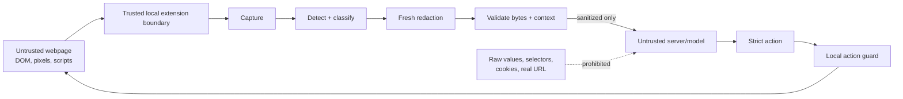
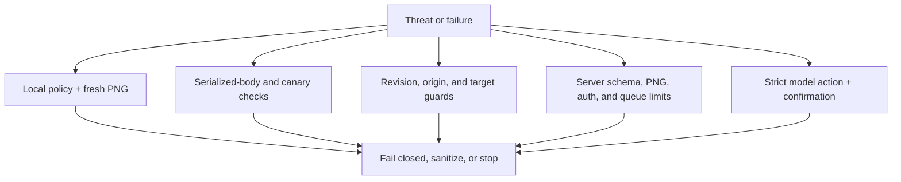

# SIH26171 threat model

## Protected asset and boundary

The protected asset is sensitive content rendered in the active browser tab.
The trusted boundary is the local extension capture, detector, policy, redaction,
encoding, and action-validation path. The configured reasoning server and model
are untrusted recipients. Only the versioned sanitized observation may cross
that boundary.

## Threat boundary diagram

The boundary protects the configured reasoning channel. It does not turn the
browser into a network proxy or control the page's own requests.

## In scope

- Malicious page text, prompt injection, malformed DOM and model output.
- Stale tabs, navigation, resize/zoom/scroll drift, duplicate actions, and
  cross-origin or uninspectable visual regions.
- Detector/model/transport failure, oversized payloads, auth failures, and
  server log leakage.

## Assumptions and limits

- The browser and extension runtime are not compromised.
- The visited website still sees its own normal requests, cookies, and form
  submission; this project does not act as a network proxy.
- OS telemetry, other extensions, screenshots taken outside this extension, and
  a compromised local machine are outside the reasoning-channel claim.
- Unrecognized visual or semantic content is conservatively masked or blocks
  egress; the prototype does not claim universal OCR/NER coverage.

## Controls

Single-egress source checks, keyed origin aliases, strict schemas, cumulative
privacy grades, local fresh-PNG composition, canary checks, body-size limits,
bounded jobs, auth/origin controls, stale-context validation, action allowlists,
safe logs, and deterministic synthetic evidence are reviewed at release.

## Control coverage map

