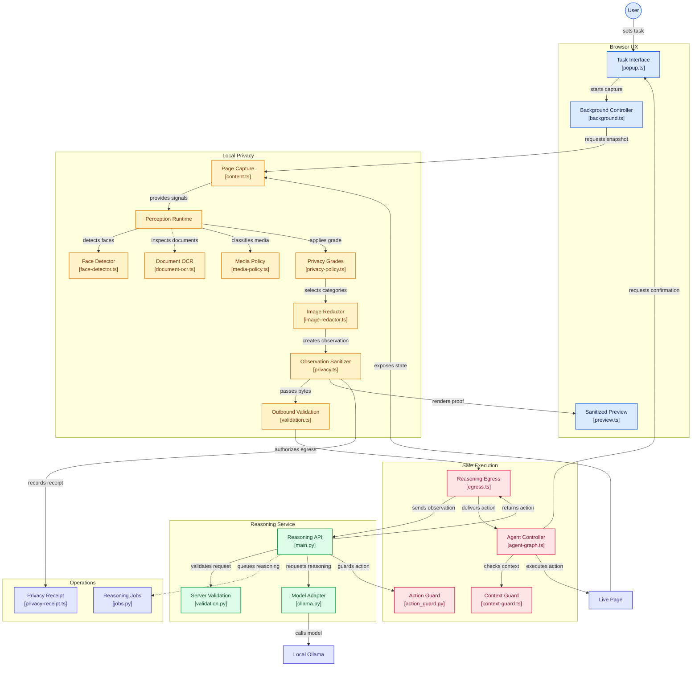
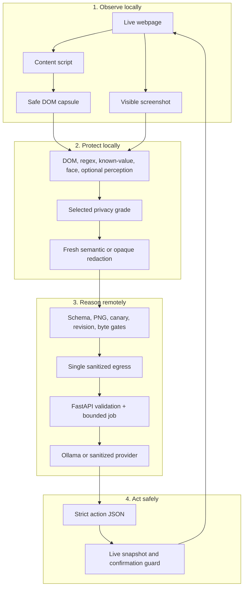
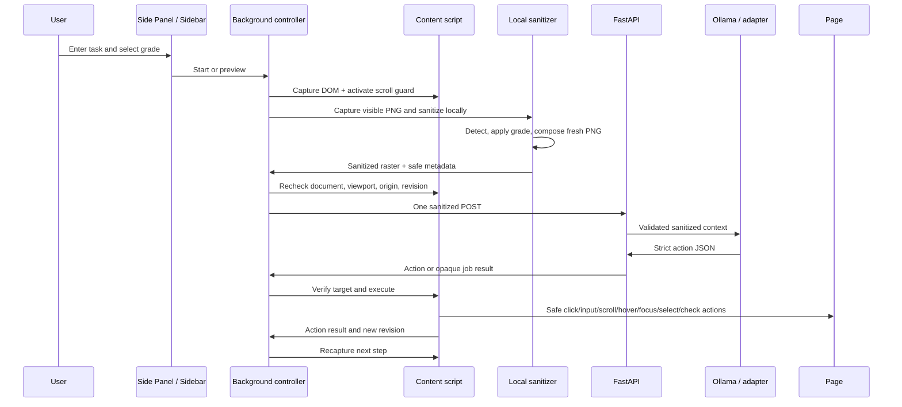
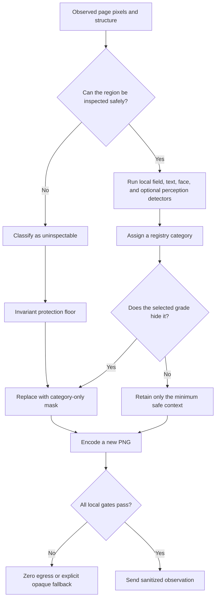

# System Architecture & Design Deep Dive

[← Back to Main README](../../README.md) | [Architecture Overview](../../ARCHITECTURE.md) | [Architecture Review](../../ARCHITECTURE_REVIEW.md)

---

## 1. Technical Modules Architecture

The following module-level view maps the browser UX, local privacy boundary, reasoning service, safe execution path, and operational evidence back to the source files that implement them.

---

## 2. Trust Boundary Architecture

The extension is the trusted privacy boundary for the configured reasoning channel. The webpage and reasoning service are treated as untrusted inputs or recipients.

```mermaid
flowchart LR
  subgraph DEVICE[User device: extension boundary]
    PAGE[Untrusted webpage<br/>DOM, forms, canvas, frames, media]
    CAPTURE[Content capture + visible PNG]
    DETECT[Local DOM, regex, known-value,<br/>face, optional perception]
    POLICY[Versioned Grade 1/2/3 policy]
    COMPOSE[Fresh compositor<br/>semantic redaction or opaque mask]
    CHECK[Serialized-body and revision checks]
    EGRESS[Only reasoning egress owner]
    EXEC[Action verifier and executor]
    PAGE --> CAPTURE
    CAPTURE --> DETECT --> POLICY --> COMPOSE --> CHECK --> EGRESS
    EGRESS --> EXEC --> PAGE
  end
  subgraph SERVICE[Reasoning service: untrusted recipient]
    BOUNDARY[Authentication, origins,<br/>size and content checks]
    VALIDATE[Strict sanitized protocol validator]
    JOBS[Bounded jobs and circuit breaker]
    MODEL[Ollama or provider adapter]
    RESPONSE[Strict action response]
    BOUNDARY --> VALIDATE --> JOBS --> MODEL --> RESPONSE
  end
  EGRESS -->|sanitized PNG + safe metadata| BOUNDARY
  RESPONSE --> EXEC
  RAW[Original pixels, raw DOM values,<br/>cookies, selectors, real URL,<br/>private-value map] -. never crosses .-> BOUNDARY
```

The server receives a versioned observation containing a fresh PNG, safe structure, opaque IDs, redaction metadata, the selected grade, a detector/registry description, and an origin alias. It does not receive the original screenshot, raw HTML, selectors, form values, cookies, storage, the real hostname, or the local ID-to-DOM map.

The privacy guarantee is scoped to this extension-to-configured-reasoning-service channel. It does not control ordinary website traffic, another extension, another application, a compromised browser, external screen sharing, or a provider outside the configured protocol.

---

## 3. Four-Layer System View

The first two layers run on the user's machine. The reasoning service only receives the output of the protection layer. The final layer returns to the live page through a local opaque-ID map; the model never receives selectors or DOM handles.

---

## 4. End-to-End Sequence Diagram

If the page scrolls, resizes, navigates, changes origin, or otherwise invalidates the captured context during reasoning, the returned action is discarded and the extension captures a fresh step.

---

## 5. Privacy Decision Ladder

The ladder explains why a lower grade never disables the invariant floor: unknown or high-impact data reaches the mask path before the grade-specific disclosure choice is considered.

---

## 6. Architecture Evolution: Approach A to Approach B

The architecture evolved from the original multi-model, conservative per-step design to Approach B after an engineering trade-off review:

| Bottleneck | Approach B response |
| --- | --- |
| Separate face/document/template inference paths | Unified YOLO interface with asset-gated v8/v10 parsing and UltraFace fallback |
| Canvas applications contain pixels invisible to DOM inspection | Three-tier canvas strategy with optional DBNet blind masking and manual escalation |
| Viewport can move while a model reasons | Content-script Step 0 scroll-drift guard and recapture |
| Flat latency claims hide local versus end-to-end cost | Separate local processing and end-to-end latency measurements |
| Long-running model calls are fragile in MV3 | Bounded async server jobs, bodyless polling, and service-worker heartbeat |

Approach B preserved the important invariants: Chrome/Firefox extension packaging, local privacy enforcement, fresh-image redaction, fail-closed egress, strict action output, snapshot-bound execution, and explicit limitations.

The architecture decision is documented in [ARCHITECTURE_REVIEW.md](../../ARCHITECTURE_REVIEW.md) and the external RFC references:
- [SIH26171 Consolidated Engineering RFC](https://app.notion.com/p/SIH26171-Consolidated-Engineering-RFC-Single-Page-Master-Specification-3d8e39636db881a1865ee211e787be0b)
- [Architecture Trade-off Analysis RFC](https://app.notion.com/p/Architecture-Trade-off-Analysis-Approach-A-vs-Approach-B-RFC-Evaluation-3d8e39636db881a492eacc8fc4833c8b)
