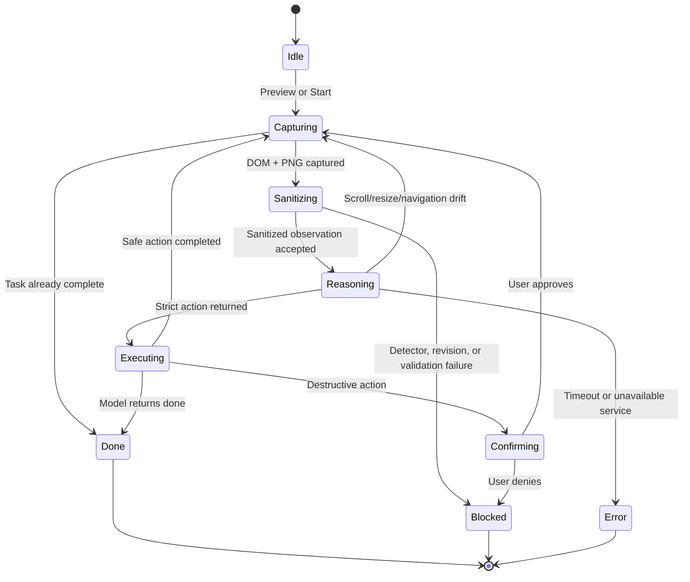

# Client Extension & User Interface

[← Back to Main README](../../README.md) | [Local Perception & Redaction](./02-local-perception-and-redaction.md)

---

## 1. Build Targets and Packaging

`extension/scripts/build.mjs` produces:

- **Chrome MV3** targeting Chrome 120;
- **Firefox MV2-compatible** packaging targeting Firefox 121;
- Popup and persistent Side Panel/Sidebar bundles from the shared `popup.ts` controller;
- The full-view preview page;
- Chrome's offscreen document;
- ONNX Runtime Web WASM assets;
- Only the local model assets that actually exist and pass checks;
- Reproducible ZIP packages when `--package` is used.

The manifests request the prototype permissions required for active-tab capture, extension storage, page scripting, local offscreen processing, and the browser-specific panel surface. Chrome uses `side_panel`; Firefox uses `sidebar_action`.

---

## 2. Side Panel, Sidebar, and Popup Controls

The panel supports:

- Task entry with a bounded length;
- Task presets for review/submit and public-field workflows;
- Grade 1/2/3 selection with explanations;
- Reasoning endpoint configuration;
- Maximum step budget;
- Memory-only API key entry;
- Memory-only known-private canaries;
- Explicit full-mask fallback selection;
- Local **Privacy preview**;
- **Start agent** and **Stop** controls;
- Run-state badge and phase message;
- Step count, detector backend, redaction count, masked-area percentage, and last server latency;
- Live activity log;
- Sanitized preview image;
- Judge-facing **Sanitized DOM capsule** showing the exact sanitized task, page metadata, opaque element IDs, roles, bounds, safe labels, state flags, redaction counts, and an expandable sanitized DOM payload;
- Full-screen preview modal and separate full-view extension tab.

The API key and canaries are kept only in panel memory during the run. They are not persisted into source, storage, request metadata, logs, or evidence.

Only non-secret preferences are persisted in extension storage: endpoint, maximum steps, selected privacy grade, and the explicit full-mask fallback preference. Tasks, API keys, and known-private canaries remain in memory.

---

## 3. Page Capture and Safe DOM Capsule

`extension/src/content.ts` runs in the page and locally:

- Assigns opaque IDs to visible buttons, links, textboxes, textareas, selects, checkboxes, radios, comboboxes, options, contenteditable elements, and scroll regions;
- Limits the safe element list to 500;
- Reports role, sanitized label, bounds, disabled/checked/editable/required state;
- Uses labels, placeholders, accessible names, titles, field names, autocomplete hints, nearby text, and visible text for classification;
- Classifies password and sensitive fields before any network request;
- Finds regex and known-private values;
- Marks frames, images, canvas, video, SVG, object/embed, CSS backgrounds, pseudo-elements, and inspectability-uncertain regions;
- Walks inspectable open shadow roots and custom-element content;
- Tracks document revision on mutation, scroll, resize, orientation, visual viewport movement, and other relevant layout changes;
- Never places raw field values in the sanitized element list.

The real map from an opaque element ID to a DOM node stays inside the content script.

Document images use local original-resolution OCR when their already-loaded pixels are canvas-readable and their screen geometry is valid. This prevents small PAN/Aadhaar fields from disappearing into whole-image masks at reduced page zoom. Source pixels stay inside the extension; only grade-specific field masks are painted onto the transmitted screenshot. Portraits retain separate masks. Unsupported source access or geometry falls back to screenshot OCR, and incomplete detection keeps the document masked. The packaged-browser regression is `node scripts/document-media-smoke.mjs`.

`capture-rate-gate.ts` keeps visible-tab screenshot capture demand-driven and below the browser's capture limit. `context-guard.ts` binds work to the original tab, window, origin, update generation, activation generation, document, and viewport. `validation.ts` performs the client-side schema, PNG, bounds, redaction, registry, and serialized-body checks before `egress.ts` can send anything.

---

## 4. Capture Identity and Scroll-Drift Protection

The background service worker pins:

- Active tab and window;
- Origin alias;
- Tab update and activation generations;
- Document ID and document revision;
- Viewport size and scroll position;
- Operation deadline.

`scroll-drift-guard.ts` belongs to the content script because the background context cannot observe webpage scroll events. It installs a passive capture-phase scroll listener, debounces drift, observes `visualViewport`, and exposes `SET_SCROLL_GUARD`/`GET_SCROLL_DRIFT`. The guard is enabled during reasoning and disabled after the response. Drift invalidates the set-of-mark registry, discards the action, and forces recapture.

---

## 5. Supported Actions Matrix

The model can return only these actions. Every target is an opaque ID from the current sanitized observation; the page-side broker resolves it locally after fresh revision and visibility checks.

| Action | Current behavior |
| --- | --- |
| `click` | Click a current visible target after disabled, connected, origin, snapshot, and destructive-action checks. |
| `input` | Fill a current editable text control or contenteditable element; read-only and disabled targets are rejected. |
| `scroll` | Scroll the page or a verified scroll-region target by a bounded amount. |
| `wait` | Wait a bounded duration and capture again. |
| `done` | End the task with a status message. |
| `hover` | Dispatch a local hover sequence (`mouseover`, `mousemove`, `mouseenter`) to reveal ordinary menus/tooltips. |
| `focus` | Focus the current target without allowing the model to supply a selector or script. |
| `doubleClick` | Dispatch a local double-click event; destructive labels use the same in-page review card as `click`. |
| `check` / `uncheck` | Set a current checkbox to the requested state without toggle ambiguity. |
| `select` | Choose an exact public label/value on a current native `<select>`; no option list or private value is sent. |

The content script rejects arbitrary JavaScript, selectors, URLs, keyboard injection, unknown action fields, stale snapshot IDs, stale document revisions, cross-origin targets, hidden/detached elements, disabled/read-only controls, unsupported custom combobox selection, and duplicate in-flight actions. The server also checks checkbox and combobox roles and applies the PII floor to `select.option`.

Clicks with destructive or irreversible labels such as submit, pay, delete, checkout, or confirm pause for a non-blocking in-page review card. The user can scroll and inspect the website before choosing **Approve submission** or **Cancel**; the model cannot silently bypass that confirmation. The Advanced privacy controls include an explicit **Auto-approve local demo submissions** option for the synthetic `http://127.0.0.1:8765/demo` page; it is off by default and has no effect on other origins.

For the synthetic enrollment workflow, fields marked `data-public-field="true"` are filled locally from explicit user instructions before reasoning begins. The content script exposes only boolean `[public]`/`[filled]` progress markers to the sanitized DOM capsule; the field values remain local. This removes a round-trip for every public field, supports native text/date/select controls, and leaves the consent checkbox and terminal submit action for the normal revision-bound broker. Before the terminal click, the extension asks the user to review every populated field and accepts submission only after the user chooses **OK**. A second in-flight submit cannot trigger a second click or a second prompt while the page is navigating to the success view.

When the sanitized structure makes the enrollment action unambiguous, the server returns that structural action synchronously instead of adding an async job poll; model-backed pages retain the bounded async path.

---

## 6. Agent State Machine

The state machine is bounded by the configured maximum step count and total operation deadline. It never retries by relaxing redaction.

---

## 7. Chrome and Firefox Sanitizer Paths

Chrome uses `sanitizer-offscreen.ts` and the offscreen document for image decoding, inference, composition, and PNG encoding outside the service worker. Firefox uses `sanitizer-direct.ts` because the offscreen API is not equivalent across both browser engines. Both paths produce the same protocol shape and enforce the same fail-closed conditions.
