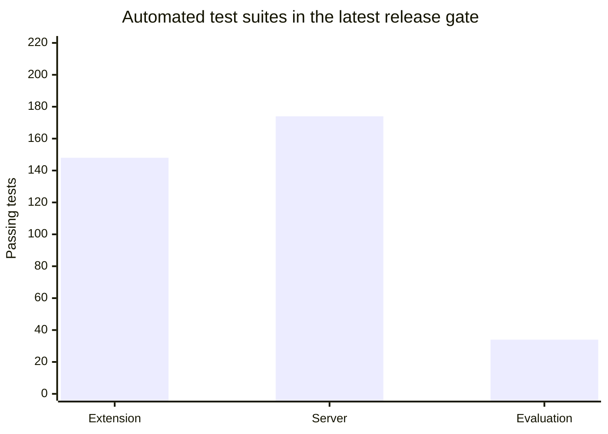

# Evaluation, Benchmarks & Operational Evidence

[← Back to Main README](../../README.md) | [Validation Snapshot](../../VALIDATION_REPORT.md) | [Release Gate Checklist](../../RELEASE_CHECKLIST.md)

---

## 1. Recorded Validation Totals

The totals below are regenerated by `python scripts/release-gate.py`; the current repository contains the extension privacy-receipt/DLP tests and the held-out adversarial-corpus contract tests in addition to the earlier suites. Do not copy these numbers into a release note without rerunning the gate.

- TypeScript typecheck passed;
- Ruff lint passed;
- Chrome package built;
- Firefox package built;
- Governance, security scan, SBOM, metadata, and source-egress checks passed.

### Evidence Artifacts Inventory

| File | Evidence Summary |
| --- | --- |
| `evidence/extension-e2e-summary.json` | Deterministic sanitized Chrome flow, three requests, WASM path, nine redactions per step, canaries absent, enrollment submitted. |
| `evidence/live-ollama-summary.json` | Local Ollama flow, asynchronous POST/poll sequence, empty poll bodies, canaries absent, final `done`, enrollment submitted. |
| `evidence/local-perception.json` | Local OCR/NER/model timings and category measurements on a small synthetic corpus. |
| `evidence/browser-matrix-chrome.json` | Chrome extension smoke run covering semantic preview, high-assurance opaque preview, and a local privacy receipt. |
| `evidence/browser-matrix-firefox.json` | Firefox matrix status; it is `skipped` until a Firefox executable is supplied to the runner. |
| `evidence/latest-release.json` | Automated release-gate result, package hashes, and suite totals. |
| `evidence/sih-demo-package.json` | Synthetic grade matrix, demonstrations, data-handling statement, and limitations. |

These results prove repository contracts and the controlled demo. They do not prove universal PII recall, all-language coverage, all-browser/device behavior, or public deployment security.

---

## 2. Verification Scorecard



The bar chart shows test volume, not a privacy score. Accuracy, recall, redaction IoU, excess area, resource use, and live browser coverage require separate evidence.

### Running Matrix Commands

Run the browser smoke matrix after building the extension:

```powershell
node scripts/browser-matrix.mjs
$env:PRIVACY_E2E_BROWSER = "firefox"
node scripts/browser-matrix.mjs
```

The Chrome runner verifies both semantic and structure-only previews and checks that the structure-only PNG is opaque black. The Firefox command records an explicit `skipped` status when no Firefox executable is installed; it never turns a missing browser into a passing claim. The held-out privacy coverage contract is in `evaluation/corpus/adversarial-privacy-v1.json` and requires precision, recall, IoU, excess masked area, latency, and peak-memory measurements before results can be admitted.

Run the aggregate local checks:

```powershell
.\Test-Prototype.ps1
python scripts/release-gate.py
```

The release gate also verifies governance synchronization, model/package metadata, tracked-file secrets, SBOM generation, extension/server/evaluation checks, the source-level single-egress invariant, dependency/model lock checksums, and the allowlisted browser permissions. Development mode reports unsigned artifacts explicitly. Production mode additionally requires a pinned Ollama digest and detached SHA-256/GPG signatures; use `scripts/sign-release.ps1` after packaging. The independent-review status is tracked in [SECURITY_REVIEW.md](../../SECURITY_REVIEW.md).

Before a judging run, use the preflight script:

```powershell
powershell -ExecutionPolicy Bypass -File scripts/demo-preflight.ps1
```

It checks loopback health, the configured local model, both browser-package builds, the synthetic portal reset, and extension authentication. The authentication probe requires `401` without a key and `422` for an empty synthetic body with the saved key: model readiness alone cannot detect a server that rejects extension origins.

---

## 3. Remaining Production Gates

The current code is ready for controlled synthetic demonstrations. Before real sensitive data or a public deployment, the team still needs:

### Detection and Measurement
- Approved YOLO and DBNet model assets with license, attribution, provenance, and checksums;
- Held-out multilingual PII corpus;
- Grade-wise precision, recall, F1, redaction IoU, excess masked area, and confidence intervals;
- Chrome and Firefox WebGPU/WASM latency, memory, GPU, and tab-jank measurements;
- OCR/NER/barcode evaluation on image, canvas, SVG, video, PDF, shadow-root, and cross-origin media cases.

### Browser and Reliability
- Live Chrome and Firefox matrix runs;
- WebGPU-disabled and cold-start paths;
- High-DPI, zoom, resize, long pages, animation, nested scroll, tab switch, navigation, origin change, service-worker suspension, popup closure, timeout, malformed model response, and queue saturation scenarios;
- Aggregate evidence that contains no page content.

### Deployment and Assurance
- Pinned Ollama/model digest and prompt version;
- HTTPS, external secret management, key rotation, and Redis failover;
- Signed packages and reproducible provenance;
- Independent extension, supply-chain, malicious-page, compromised-model, and server security review;
- Production retention, rollback, incident response, and monitoring procedures.

These are evidence, asset, deployment, or independent-review gates. They are not silently presented as completed features.
